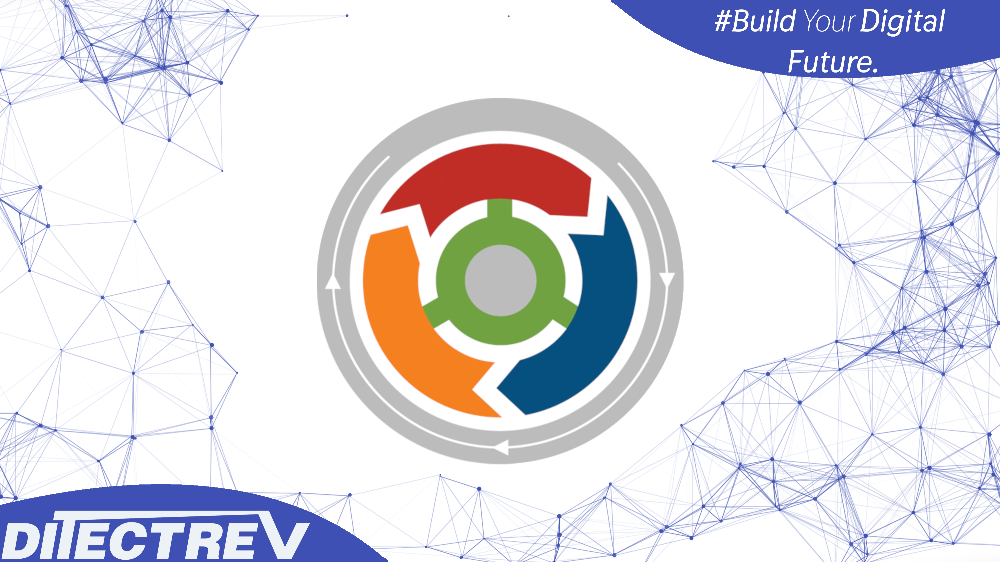

# ⬆️ ITIL 4 Foundation (IT Service Management) Practice Tests Exams Questions & Answers

## Udemy & Etsy

❣️ Please support us by purchasing this course on Udemy in an interactive version with the [discounted link](https://www.udemy.com/course/itil-4-foundation-it-service-management-practice-test-exam/?referralCode=2CB861160D2B15A2A74E). If you're working for a company, you could most probably easily claim this expense during preparation for your exam. For us, it's to be, or not to be, in the game.

🛍️ Alternatively, you can buy the PDF with those questions on [Etsy](https://ditectrev.etsy.com/listing/1471207281).

## ✨ This course is unlike any ITIL 4 Foundation (IT Service Management) course you will find online.

✋ Join a live online community and a course taught by industry experts and pass the ITIL 4 Foundation (IT Service Management) confidently. We aim to build an ecosystem of Information Technology (IT) certifications and online courses in cooperation with the technology industry. We believe it will give our students 100% confidence in the pacing market in an open-source environment. We are just at the beginning of our way, so it's even better for you to join now!

## ⌛️ Short and to the point; why should you take the course:

1. Always happy to answer your questions on Udemy's Q&A's and outside :)
2. Failed? Please submit a screenshot of your exam result and request a refund (via our upcoming platform, not possible on Udemy); we'll always accept it.
3. Learn about topics, such as:
   - Authorization;
   - Change Control;
   - Change Enablement;
   - Continual Improvement;
   - Deployment Management;
   - Emergency Changes;
   - Event Management;
   - Incident Analysis;
   - Incident Management;
   - Incident Resolution;
   - Information Security Management;
   - IT Asset Management;
   - Monitoring;
   - Prioritization;
   - Problem Management;
   - Relationship Management;
   - Release Management;
   - Service Configuration Management;
   - Service Desk;
   - Service Level Management (SLM);
   - Service Request Management;
   - Supplier Management;
   - **Much More!**
4. Questions are similar to the actual exam, without duplications (like in other courses ;-)).
5. The Practice Tests Exams simulate the actual exam's content, timing, and percentage required to pass the exam.
6. This course is **not** an ITIL 4 Foundation (IT Service Management) Exam Dump. Some people use brain dumps or exam dumps, but that's absurd, which we don't practice.
7. 487 **unique** questions.

## ☝️ Course Updates

**[v1.0.0](https://github.com/Ditectrev/ITIL-4-Foundation-IT-Service-Management-Practice-Tests-Exams-Questions-Answers/releases/tag/v1.0.0): April 28, 2023.**

- Launch of the course.

**[v2.0.0](https://github.com/Ditectrev/ITIL-4-Foundation-IT-Service-Management-Practice-Tests-Exams-Questions-Answers/releases/tag/v2.0.0): September 30, 2024.**

- Add 218 new questions.

## 🙋‍♀️ & 🙋‍♂️ Contribution

We are so thankful for every contribution, which makes sure we can deliver top-notch content. Whenever you find a missing resource, broken link in a [Table of Contents](https://github.com/Ditectrev/ITIL-4-Foundation-IT-Service-Management-Practice-Tests-Exams-Questions-Answers#table-of-contents), the wrong answer, please submit an [issue](https://github.com/Ditectrev/ITIL-4-Foundation-IT-Service-Management-Practice-Tests-Exams-Questions-Answers/issues). Even better would be a [Pull Request (PR)](https://github.com/Ditectrev/ITIL-4-Foundation-IT-Service-Management-Practice-Tests-Exams-Questions-Answers/pulls).

## Who this course is for:

- 👨‍🎓 Students preparing for the ITIL 4 Foundation (IT Service Management) Exam;
- 👨‍🎓 Amazon Web Services Engineers (AWS Engineers);
- 👨‍🎓 Azure Engineers;
- 👨‍🎓 Cloud Architects;
- 👨‍🎓 Cloud Engineers;
- 👨‍🎓 Delivery Professionals;
- 👨‍🎓 DevOps Engineers;
- 👨‍🎓 Enterprise Architects;
- 👨‍🎓 Google Cloud Platform Engineers (GCP Engineers);
- 👨‍🎓 Incident Detection Engineers;
- 👨‍🎓 Infrastructure Engineers;
- 👨‍🎓 IT Leads;
- 👨‍🎓 IT Professionals;
- 👨‍🎓 Lead Engineers;
- 👨‍🎓 Maintenance Staff;
- 👨‍🎓 Middle Management;
- 👨‍🎓 Product Architects;
- 👨‍🎓 Product Managers;
- 👨‍🎓 Product Owners;
- 👨‍🎓 Project Managers;
- 👨‍🎓 Scrum Masters;
- 👨‍🎓 Security Engineers;
- 👨‍🎓 Service Desk;
- 👨‍🎓 ServiceNow Police;
- 👨‍🎓 Site Reliability Engineers;
- 👨‍🎓 Software Developers/Engineers;
- 👨‍🎓 Software Testers;
- 👨‍🎓 Solution Architects;
- 👨‍🎓 Support Service;
- 👨‍🎓 Team Leaders.

## Requirements

- 🤩 Excitement to learn!
- 0️⃣ Prior knowledge is required;
- ✅ You can pass the ITIL 4 Foundation (IT Service Management) Exam solely based on our Practice Tests Exams.

## Table of Contents

| No. | Questions |
| --- | --------- |
| 1   | [A service is a means of enabling value co-creation by facilitating outcomes that customers want to achieve, without the customer having to manage specific [?] and risks.](#a-service-is-a-means-of-enabling-value-co-creation-by-facilitating-outcomes-that-customers-want-to-achieve-without-the-customer-having-to-manage-specific--and-risks)
| 2   | [Which statement about Service Desks is CORRECT?](#which-statement-about-service-desks-is-correct)
| 3   | [In terms of Incident Management, which value chain activity uses incident records as an input to improvement activities based on the incident frequency and severity?](#in-terms-of-incident-management-which-value-chain-activity-uses-incident-records-as-an-input-to-improvement-activities-based-on-the-incident-frequency-and-severity)
| 4   | [Which describes a set of defined steps for implementing improvements?](#which-describes-a-set-of-defined-steps-for-implementing-improvements)
| 5   | [Which practice provides a single point of contact for users?](#which-practice-provides-a-single-point-of-contact-for-users)
| 6   | [Which activity captures the demand for Incident Resolution and service requests?](#which-activity-captures-the-demand-for-incident-resolution-and-service-requests)
| 7   | [What are the types of asset management?](#what-are-the-types-of-asset-management)
| 8   | [What is typically needed to assign complex incidents to support groups?](#what-is-typically-needed-to-assign-complex-incidents-to-support-groups)
| 9   | [What type of change is MOST likely to be managed by the Service Request Management practice?](#what-type-of-change-is-most-likely-to-be-managed-by-the-service-request-management-practice)
| 10  | [Which activity is part of the Continual Improvement practice?](#which-activity-is-part-of-the-continual-improvement-practice)
| 11  | [Which statement about Emergency Changes is CORRECT?](#which-statement-about-emergency-changes-is-correct)
| 12  | [Which is a key consideration for the Guiding Principle Keep It Simple and Practical?](#which-is-a-key-consideration-for-the-guiding-principle-keep-it-simple-and-practical)
| 13  | [What should all Continual Improvement decisions be based on?](#what-should-all-continual-improvement-decisions-be-based-on)
| 14  | [Which is the purpose of the Monitoring and Event Management practice?](#which-is-the-purpose-of-the-monitoring-and-event-management-practice)
| 15  | [Which is the CORRECT approach for managing a large improvement initiative as smaller iterations?](#which-is-the-correct-approach-for-managing-a-large-improvement-initiative-as-smaller-iterations)
| 16  | [How should automation be implemented?](#how-should-automation-be-implemented)
| 17  | [What are 'engage', 'plan' and 'improve' examples of?](#what-are-engage-plan-and-improve-examples-of)
| 18  | [What is the starting point for optimization?](#what-is-the-starting-point-for-optimization)
| 19  | [Arrange the following steps of software lifecycle in correct order. *1. Retire *2. Test *3. Operate *4. Deploy *5. Ideation *6. Develop *7. Design.](#arrange-the-following-steps-of-software-lifecycle-in-correct-order-1-retire-2-test-3-operate-4-deploy-5-ideation-6-develop-7-design)
| 20  | [When should the effectiveness of a problem workaround be assessed?](#when-should-the-effectiveness-of-a-problem-workaround-be-assessed)
| 21  | [Which practice has a purpose that includes ensuring that risks have been properly assessed?](#which-practice-has-a-purpose-that-includes-ensuring-that-risks-have-been-properly-assessed)
| 22  | [What is an output?](#what-is-an-output)
| 23  | [The use of [?] should support, not replace what is observed, when using the 'Start Where You Are' Guiding Principle.](#the-use-of--should-support-not-replace-what-is-observed-when-using-the-start-where-you-are-guiding-principle)
| 24  | [Which ITIL practice has a purpose that includes reducing the likelihood of incidents?](#which-itil-practice-has-a-purpose-that-includes-reducing-the-likelihood-of-incidents)
| 25  | [What should be done for every problem?](#what-should-be-done-for-every-problem)
| 26  | [In which step of the Continual Improvement model is an improvement plan implemented?](#in-which-step-of-the-continual-improvement-model-is-an-improvement-plan-implemented)
| 27  | [Which is NOT a key focus of the 'Information and Technology' dimension?](#which-is-not-a-key-focus-of-the-information-and-technology-dimension)
| 28  | [How does Service Request Management contribute to the Obtain/Build value chain activity?](#how-does-service-request-management-contribute-to-the-obtainbuild-value-chain-activity)
| 29  | [Which describes outcomes?](#which-describes-outcomes)
| 30  | [Which of the following is an example of incident?](#which-of-the-following-is-an-example-of-incident)
| 31  | [What is a means of enabling value co-creation by facilitating outcomes that customers want to achieve, without the customer having to manage specific costs and risks?](#what-is-a-means-of-enabling-value-co-creation-by-facilitating-outcomes-that-customers-want-to-achieve-without-the-customer-having-to-manage-specific-costs-and-risks)
| 32  | [What is the purpose of the Information Security Management practice?](#what-is-the-purpose-of-the-information-security-management-practice)
| 33  | [What should be used to set user expectations for request fulfilment times?](#what-should-be-used-to-set-user-expectations-for-request-fulfilment-times)
| 34  | [Which competencies are required by the Service Level Management practice?](#which-competencies-are-required-by-the-service-level-management-practice)
| 35  | [Which is the BEST example of a standard change?](#which-is-the-best-example-of-a-standard-change)
| 36  | [Which of the following can be used to access Service Desks?](#which-of-the-following-can-be-used-to-access-service-desks)
| 37  | [Which of these should be logged and managed as a problem?](#which-of-these-should-be-logged-and-managed-as-a-problem)
| 38  | [What should be done to determine the appropriate metrics for measuring a new service?](#what-should-be-done-to-determine-the-appropriate-metrics-for-measuring-a-new-service)
| 39  | [Which Guiding Principle recommends using the minimum number of steps necessary to achieve an objective?](#which-guiding-principle-recommends-using-the-minimum-number-of-steps-necessary-to-achieve-an-objective)
| 40  | [Which dimension includes activities and workflows?](#which-dimension-includes-activities-and-workflows)
| 41  | [Which describes a CORRECT approach to change Authorization?](#which-describes-a-correct-approach-to-change-authorization)
| 42  | [How should an organization adopt Continual Improvement methods?](#how-should-an-organization-adopt-continual-improvement-methods)
| 43  | [A known error is a problem that has been [?] and has not been resolved.](#a-known-error-is-a-problem-that-has-been--and-has-not-been-resolved)
| 44  | [Which dimension includes a workflow management system?](#which-dimension-includes-a-workflow-management-system)
| 45  | [Which is a purpose of the Service Desk practice?](#which-is-a-purpose-of-the-service-desk-practice)
| 46  | [Which practice identifies metrics that reflect a customer experience of a service?](#which-practice-identifies-metrics-that-reflect-a-customer-experience-of-a-service)
| 47  | [Which statement about a service value stream is CORRECT?](#which-statement-about-a-service-value-stream-is-correct)
| 48  | [Which Guiding Principle recommends coordinating all dimensions of Service Management?](#which-guiding-principle-recommends-coordinating-all-dimensions-of-service-management)
| 49  | [Which statement about the steps to fulfill a service request is CORRECT?](#which-statement-about-the-steps-to-fulfill-a-service-request-is-correct)
| 50  | [Which practice has a purpose that includes aligning the organization's practices and services with changing business needs?](#which-practice-has-a-purpose-that-includes-aligning-the-organizations-practices-and-services-with-changing-business-needs)
| 51  | [How does Service Request Management contribute to the Design and Transition value chain activity?](#how-does-service-request-management-contribute-to-the-design-and-transition-value-chain-activity)
| 52  | [How should the workflow for a new service request be designed?](#how-should-the-workflow-for-a-new-service-request-be-designed)
| 53  | [Which statement about costs is CORRECT?](#which-statement-about-costs-is-correct)
| 54  | [Which practice uses techniques such as SWOT analysis, balanced scorecard reviews, and maturity assessments?](#which-practice-uses-techniques-such-as-swot-analysis-balanced-scorecard-reviews-and-maturity-assessments)
| 55  | [Which statement about outputs is CORRECT?](#which-statement-about-outputs-is-correct)
| 56  | [A major incident has been closed, but there is a risk that it might happen again. How should this be logged and managed?](#a-major-incident-has-been-closed-but-there-is-a-risk-that-it-might-happen-again-how-should-this-be-logged-and-managed)
| 57  | [What is described by the Service Value System?](#what-is-described-by-the-service-value-system)
| 58  | [What are the ITIL Guiding Principles used for?](#what-are-the-itil-guiding-principles-used-for)
| 59  | [Which stakeholders co-create value in a service relationship?](#which-stakeholders-co-create-value-in-a-service-relationship)
| 60  | [Which will NOT be handled as a service request?](#which-will-not-be-handled-as-a-service-request)
| 61  | [Which practice needs people who understand complex systems and have creative and analytical skills?](#which-practice-needs-people-who-understand-complex-systems-and-have-creative-and-analytical-skills)
| 62  | [Which ITIL practice recommends performing service reviews to ensure that services continue to meet the needs of the organization?](#which-itil-practice-recommends-performing-service-reviews-to-ensure-that-services-continue-to-meet-the-needs-of-the-organization)
| 63  | [Which usually requires a team of representatives from many stakeholder groups?](#which-usually-requires-a-team-of-representatives-from-many-stakeholder-groups)
| 64  | [What are typically recognized through notifications created by an IT service, CI or Monitoring tool?](#what-are-typically-recognized-through-notifications-created-by-an-it-service-ci-or-monitoring-tool)
| 65  | [Which Guiding Principle is PRIMARILY concerned with end-to-end service delivery?](#which-guiding-principle-is-primarily-concerned-with-end-to-end-service-delivery)
| 66  | [Which of these activities is carried out as part of Problem Management?](#which-of-these-activities-is-carried-out-as-part-of-problem-management)
| 67  | [Which statement about the Change Control practice is CORRECT?](#which-statement-about-the-change-control-practice-is-correct)
| 68  | [Which Guiding Principle considers the importance of customer loyalty?](#which-guiding-principle-considers-the-importance-of-customer-loyalty)
| 69  | [What actions does a Service Desk take for all issues, queries and requests that are reported to them?](#what-actions-does-a-service-desk-take-for-all-issues-queries-and-requests-that-are-reported-to-them)
| 70  | [Which is an external input to the Service Value Chain?](#which-is-an-external-input-to-the-service-value-chain)
| 71  | [What should be considered as part of the 'Partners and Suppliers' dimension?](#what-should-be-considered-as-part-of-the-partners-and-suppliers-dimension)
| 72  | [Which ITIL practice has the purpose to establish and nurture the links between the organization and its stakeholders at strategic and tactical levels?](#which-itil-practice-has-the-purpose-to-establish-and-nurture-the-links-between-the-organization-and-its-stakeholders-at-strategic-and-tactical-levels)
| 73  | [A service offering may include goods, access to resources, and service actions. Which is an example of a service action?](#a-service-offering-may-include-goods-access-to-resources-and-service-actions-which-is-an-example-of-a-service-action)
| 74  | [Which practice has a purpose to support the quality of the service by handling all agreed user-initiated service requests?](#which-practice-has-a-purpose-to-support-the-quality-of-the-service-by-handling-all-agreed-user-initiated-service-requests)
| 75  | [What is the definition of a problem?](#what-is-the-definition-of-a-problem)
| 76  | [What aspect of Service Level Management asks service consumers what their work involves and how technology helps them?](#what-aspect-of-service-level-management-asks-service-consumers-what-their-work-involves-and-how-technology-helps-them)
| 77  | [How should the seven Guiding Principles be combined when an organization is making a decision?](#how-should-the-seven-guiding-principles-be-combined-when-an-organization-is-making-a-decision)
| 78  | [Which directly assists with the diagnosis and resolution of simple incidents?](#which-directly-assists-with-the-diagnosis-and-resolution-of-simple-incidents)
| 79  | [Which activity contributes to the 'where are we now?' step of the Continual Improvement model?](#which-activity-contributes-to-the-where-are-we-now-step-of-the-continual-improvement-model)
| 80  | [Which practice provides a communications point for users to report operational issues, queries and requests?](#which-practice-provides-a-communications-point-for-users-to-report-operational-issues-queries-and-requests)
| 81  | [Which is an example of a business related measurement?](#which-is-an-example-of-a-business-related-measurement)
| 82  | [What can help to reduce resistance to a planned improvement when applying the Guiding Principle Collaborate and Promote Visibility?](#what-can-help-to-reduce-resistance-to-a-planned-improvement-when-applying-the-guiding-principle-collaborate-and-promote-visibility)
| 83  | [What is the purpose of the Incident Management practice?](#what-is-the-purpose-of-the-incident-management-practice)
| 84  | [What varies in size and complexity, and uses functions to achieve its objectives?](#what-varies-in-size-and-complexity-and-uses-functions-to-achieve-its-objectives)
| 85  | [Which BEST describes the purpose of the 'improve' value chain activity?](#which-best-describes-the-purpose-of-the-improve-value-chain-activity)
| 86  | [What takes responsibility for the outcomes of service consumption?](#what-takes-responsibility-for-the-outcomes-of-service-consumption)
| 87  | [Which practice forms a link between the service provider and the users of services?](#which-practice-forms-a-link-between-the-service-provider-and-the-users-of-services)
| 88  | [Which practice ensures that any addition, modification, or removal of anything that could have an effect on services is assessed and authorized?](#which-practice-ensures-that-any-addition-modification-or-removal-of-anything-that-could-have-an-effect-on-services-is-assessed-and-authorized)
| 89  | [Which is a purpose of Release Management?](#which-is-a-purpose-of-release-management)
| 90  | [What is recommended by the Guiding Principle Progress Iteratively with Feedback?](#what-is-recommended-by-the-guiding-principle-progress-iteratively-with-feedback)
| 91  | [Which includes governance, management practices, and Continual Improvement?](#which-includes-governance-management-practices-and-continual-improvement)
| 92  | [What term is used to describe whether a service will meet availability, capacity and security requirements?](#what-term-is-used-to-describe-whether-a-service-will-meet-availability-capacity-and-security-requirements)
| 93  | [Which Guiding Principle considers customer and user experience?](#which-guiding-principle-considers-customer-and-user-experience)
| 94  | [Which is a result of applying the Guiding Principle Progress Iteratively with Feedback?](#which-is-a-result-of-applying-the-guiding-principle-progress-iteratively-with-feedback)
| 95  | [What describes how components and activities work together to facilitate value creation?](#what-describes-how-components-and-activities-work-together-to-facilitate-value-creation)
| 96  | [Which statement about Continual Improvement is CORRECT?](#which-statement-about-continual-improvement-is-correct)
| 97  | [What are Guiding Principles?](#what-are-guiding-principles)
| 98  | [Which dimension is MOST concerned with skills, competencies, roles and responsibilities?](#which-dimension-is-most-concerned-with-skills-competencies-roles-and-responsibilities)
| 99  | [Which statement about the Change Enablement practice is CORRECT?](#which-statement-about-the-change-enablement-practice-is-correct)
| 100 | [What can be used to determine if a service is Fit for Purpose?](#what-can-be-used-to-determine-if-a-service-is-fit-for-purpose)
| 101 | [Which practice has a purpose that includes managing risks to confidentiality, integrity and availability?](#which-practice-has-a-purpose-that-includes-managing-risks-to-confidentiality-integrity-and-availability)
| 102 | [Which is a key activity carried out in the 'did we get there?' step of the Continual Improvement model?](#which-is-a-key-activity-carried-out-in-the-did-we-get-there-step-of-the-continual-improvement-model)
| 103 | [What can a service remove from the consumer and impose on the consumer?](#what-can-a-service-remove-from-the-consumer-and-impose-on-the-consumer)
| 104 | [What does Change Enablement PRIMARILY focus on?](#what-does-change-enablement-primarily-focus-on)
| 105 | [You are attempting to print a document from your workstation to the network printer in your office. The print job failed when you attempted to print, so you called the Service Desk for assistance. What term best describes your issue?](#you-are-attempting-to-print-a-document-from-your-workstation-to-the-network-printer-in-your-office-the-print-job-failed-when-you-attempted-to-print-so-you-called-the-service-desk-for-assistance-what-term-best-describes-your-issue)
| 106 | [A change is defined as the addition, modification, or removal of anything that could have a direct or indirect effect on [?].](#a-change-is-defined-as-the-addition-modification-or-removal-of-anything-that-could-have-a-direct-or-indirect-effect-on-)
| 107 | [Which is handled as a service request?](#which-is-handled-as-a-service-request)
| 108 | [Which is a key requirement for a successful Service Level Agreement (SLA)?](#which-is-a-key-requirement-for-a-successful-service-level-agreement-sla)
| 109 | [Which is considered by the 'Partners and Suppliers' dimension?](#which-is-considered-by-the-partners-and-suppliers-dimension)
| 110 | [What impact does automation have on a Service Desk?](#what-impact-does-automation-have-on-a-service-desk)
| 111 | [An organization asks a stakeholder to review a planned change. Which Guiding Principle does this demonstrate?](#an-organization-asks-a-stakeholder-to-review-a-planned-change-which-guiding-principle-does-this-demonstrate)
| 112 | [Which practice recommends using tools for collaboration and the automated matching of symptoms?](#which-practice-recommends-using-tools-for-collaboration-and-the-automated-matching-of-symptoms)
| 113 | [In service relationships, what is a benefit of identifying consumer roles?](#in-service-relationships-what-is-a-benefit-of-identifying-consumer-roles)
| 114 | [Which practice would help a user gain access to an application that they need to use?](#which-practice-would-help-a-user-gain-access-to-an-application-that-they-need-to-use)
| 115 | [What is used to link activities within the Service Value Chain?](#what-is-used-to-link-activities-within-the-service-value-chain)
| 116 | [How are target resolution times used in the Incident Management practice?](#how-are-target-resolution-times-used-in-the-incident-management-practice)
| 117 | [Which two practices use workarounds?](#which-two-practices-use-workarounds)
| 118 | [Which statement about the Service Value Chain is CORRECT?](#which-statement-about-the-service-value-chain-is-correct)
| 119 | [The Service Desk should be the entry point and single point of contact for the [?] with all of its users.](#the-service-desk-should-be-the-entry-point-and-single-point-of-contact-for-the--with-all-of-its-users)
| 120 | [Which statement about managing incidents is CORRECT?](#which-statement-about-managing-incidents-is-correct)
| 121 | [Which practice has a strong influence on the user experience and perception of the service provider?](#which-practice-has-a-strong-influence-on-the-user-experience-and-perception-of-the-service-provider)
| 122 | [Which will help solve incidents more quickly?](#which-will-help-solve-incidents-more-quickly)
| 123 | [What is the purpose of the Relationship Management practice?](#what-is-the-purpose-of-the-relationship-management-practice)
| 124 | [Which describes the utility of a service?](#which-describes-the-utility-of-a-service)
| 125 | [Why should some service requests be fulfilled with no additional approvals?](#why-should-some-service-requests-be-fulfilled-with-no-additional-approvals)
| 126 | [Which approach is CORRECT when applying the Guiding Principle Keep It Simple and Practical?](#which-approach-is-correct-when-applying-the-guiding-principle-keep-it-simple-and-practical)
| 127 | [Which dimension considers data security and privacy?](#which-dimension-considers-data-security-and-privacy)
| 128 | [Which practice involves the management of vulnerabilities that were not identified before the service went live?](#which-practice-involves-the-management-of-vulnerabilities-that-were-not-identified-before-the-service-went-live)
| 129 | [Which is a recommendation of the Guiding Principle Think and Work Holistically?](#which-is-a-recommendation-of-the-guiding-principle-think-and-work-holistically)
| 130 | [Which value chain activity ensures that products meet stakeholder expectations for quality?](#which-value-chain-activity-ensures-that-products-meet-stakeholder-expectations-for-quality)
| 131 | [What is the purpose of the Problem Management practice?](#what-is-the-purpose-of-the-problem-management-practice)
| 132 | [When is the earliest that a workaround can be documented in Problem Management?](#when-is-the-earliest-that-a-workaround-can-be-documented-in-problem-management)
| 133 | [Which value chain activity ensures that service components meet agreed specifications?](#which-value-chain-activity-ensures-that-service-components-meet-agreed-specifications)
| 134 | [What includes governance as a component?](#what-includes-governance-as-a-component)
| 135 | [What is a set of specialized organizational capabilities for enabling value for customers in the form of services?](#what-is-a-set-of-specialized-organizational-capabilities-for-enabling-value-for-customers-in-the-form-of-services)
| 136 | [Which practice makes new services available for use?](#which-practice-makes-new-services-available-for-use)
| 137 | [Which is an activity of the Problem Management practice?](#which-is-an-activity-of-the-problem-management-practice)
| 138 | [Which gives a user access to a system?](#which-gives-a-user-access-to-a-system)
| 139 | [Which is included in the purpose of the Service Level Management practice?](#which-is-included-in-the-purpose-of-the-service-level-management-practice)
| 140 | [Which term relates to service levels aligned with the needs of service consumers?](#which-term-relates-to-service-levels-aligned-with-the-needs-of-service-consumers)
| 141 | [What is the definition of a known error?](#what-is-the-definition-of-a-known-error)
| 142 | [Which statement about the use of measurement in the 'Start Where You Are' Guiding Principle is CORRECT?](#which-statement-about-the-use-of-measurement-in-the-start-where-you-are-guiding-principle-is-correct)
| 143 | [Which is the BEST description of the value of a service to a customer?](#which-is-the-best-description-of-the-value-of-a-service-to-a-customer)
| 144 | [Which practice involves the management of vulnerabilities that have been analysed but not resolved?](#which-practice-involves-the-management-of-vulnerabilities-that-have-been-analysed-but-not-resolved)
| 145 | [Which is an activity of the Incident Management practice?](#which-is-an-activity-of-the-incident-management-practice)
| 146 | [Which is NOT a component of the Service Value System?](#which-is-not-a-component-of-the-service-value-system)
| 147 | [What is defined as a cause, or potential cause, of one or more incidents?](#what-is-defined-as-a-cause-or-potential-cause-of-one-or-more-incidents)
| 148 | [Which practice is MOST likely to benefit from the use of chatbots?](#which-practice-is-most-likely-to-benefit-from-the-use-of-chatbots)
| 149 | [The purpose of the Service Configuration Management practice is to ensure that accurate and reliable information about the configuration of services, and the [?] that support them, is available when and where it is needed.](#the-purpose-of-the-service-configuration-management-practice-is-to-ensure-that-accurate-and-reliable-information-about-the-configuration-of-services-and-the--that-support-them-is-available-when-and-where-it-is-needed)
| 150 | [Which statement about outcomes is CORRECT?](#which-statement-about-outcomes-is-correct)
| 151 | [Which statement about outcomes is CORRECT?](#which-statement-about-outcomes-is-correct-1)
| 152 | [Which is a purpose of the 'engage' value chain activity?](#which-is-a-purpose-of-the-engage-value-chain-activity)
| 153 | [Which statement about service requests is CORRECT?](#which-statement-about-service-requests-is-correct)
| 154 | [Which practice is responsible for moving new or changed components to live or other environments?](#which-practice-is-responsible-for-moving-new-or-changed-components-to-live-or-other-environments)
| 155 | [Which dimension focuses on relationships with other organizations that are involved in the design, development, deployment and delivery of services?](#which-dimension-focuses-on-relationships-with-other-organizations-that-are-involved-in-the-design-development-deployment-and-delivery-of-services)
| 156 | [What must always be done before an activity is automated?](#what-must-always-be-done-before-an-activity-is-automated)
| 157 | [Which two statements about an organization's culture are CORRECT? 1. It is created from shared values based on how it carries out its work 2. It is determined by the type of technology used to support services 3. It should be based on the culture of prospective suppliers 4. It should be based on the objectives of the organization](#which-two-statements-about-an-organizations-culture-are-correct-1-it-is-created-from-shared-values-based-on-how-it-carries-out-its-work-2-it-is-determined-by-the-type-of-technology-used-to-support-services-3-it-should-be-based-on-the-culture-of-prospective-suppliers-4-it-should-be-based-on-the-objectives-of-the-organization)
| 158 | [Which statement about the automation of service requests is CORRECT?](#which-statement-about-the-automation-of-service-requests-is-correct)
| 159 | [What is the purpose of the Deployment Management practice?](#what-is-the-purpose-of-the-deployment-management-practice)
| 160 | [What is a change schedule PRIMARILY used for?](#what-is-a-change-schedule-primarily-used-for)
| 161 | [Which can act as an operating model for an organization?](#which-can-act-as-an-operating-model-for-an-organization)
| 162 | [What is an IT asset?](#what-is-an-it-asset)
| 163 | [Which is a key requirement for a successful Service Level Agreement?](#which-is-a-key-requirement-for-a-successful-service-level-agreement)
| 164 | [Which role approves the cost of services?](#which-role-approves-the-cost-of-services)
| 165 | [What is Warranty?](#what-is-warranty)
| 166 | [What are the three phases of Problem Management?](#what-are-the-three-phases-of-problem-management)
| 167 | [Where are the details of the required performance outcomes of a service defined?](#where-are-the-details-of-the-required-performance-outcomes-of-a-service-defined)
| 168 | [Which skill is an essential part of the Service Level Management practice?](#which-skill-is-an-essential-part-of-the-service-level-management-practice)
| 169 | [Which practice requires that staff demonstrate excellent customer service skills, such as empathy and emotional intelligence?](#which-practice-requires-that-staff-demonstrate-excellent-customer-service-skills-such-as-empathy-and-emotional-intelligence)
| 170 | [Which value chain activity ensures a shared understanding of the current status and required direction for all products and services?](#which-value-chain-activity-ensures-a-shared-understanding-of-the-current-status-and-required-direction-for-all-products-and-services)
| 171 | [What is defined as any component that needs to be managed in order to deliver an IT service?](#what-is-defined-as-any-component-that-needs-to-be-managed-in-order-to-deliver-an-it-service)
| 172 | [Which practice has the purpose of ensuring that the organization's suppliers and their performance are managed appropriately to support the provision of seamless, quality products and services?](#which-practice-has-the-purpose-of-ensuring-that-the-organizations-suppliers-and-their-performance-are-managed-appropriately-to-support-the-provision-of-seamless-quality-products-and-services)
| 173 | [Which practice recommends the use of event-based surveys to gather feedback from customers?](#which-practice-recommends-the-use-of-event-based-surveys-to-gather-feedback-from-customers)
| 174 | [How does information about problems and known errors contribute to Incident Management?](#how-does-information-about-problems-and-known-errors-contribute-to-incident-management)
| 175 | [Which describes a standard change?](#which-describes-a-standard-change)
| 176 | [Which service level metrics are BEST for measuring user experience?](#which-service-level-metrics-are-best-for-measuring-user-experience)
| 177 | [Which is a service request?](#which-is-a-service-request)
| 178 | [Which two practices interact the MOST with the Service Desk practice?](#which-two-practices-interact-the-most-with-the-service-desk-practice)
| 179 | [What is defined as an unplanned interruption or reduction in the quality of a service?](#what-is-defined-as-an-unplanned-interruption-or-reduction-in-the-quality-of-a-service)
| 180 | [Which describes normal changes?](#which-describes-normal-changes)
| 181 | [The management of information security incidents usually requires [?].](#the-management-of-information-security-incidents-usually-requires-)
| 182 | [Which statement about change authorities is CORRECT?](#which-statement-about-change-authorities-is-correct)
| 183 | [What defines the requirements for a service and takes responsibility for the outcomes of service consumption?](#what-defines-the-requirements-for-a-service-and-takes-responsibility-for-the-outcomes-of-service-consumption)
| 184 | [Which practice owns and manages issues, queries and requests from users?](#which-practice-owns-and-manages-issues-queries-and-requests-from-users)
| 185 | [What are the MOST important skills required by Service Desk staff?](#what-are-the-most-important-skills-required-by-service-desk-staff)
| 186 | [Which practice improves customer and user satisfaction by reducing the negative impact of service interruptions?](#which-practice-improves-customer-and-user-satisfaction-by-reducing-the-negative-impact-of-service-interruptions)
| 187 | [What is the expected outcome from using a Service Value Chain?](#what-is-the-expected-outcome-from-using-a-service-value-chain)
| 188 | [Which practice has a purpose that includes observing a service to report selected changes of state identified as events?](#which-practice-has-a-purpose-that-includes-observing-a-service-to-report-selected-changes-of-state-identified-as-events)
| 189 | [Which Guiding Principle helps to ensure that better information is available for decision making?](#which-guiding-principle-helps-to-ensure-that-better-information-is-available-for-decision-making)
| 190 | [What helps diagnose and resolve a simple incident?](#what-helps-diagnose-and-resolve-a-simple-incident)
| 191 | [A user is [?] that uses services.](#a-user-is--that-uses-services)
| 192 | [When should a change request be submitted to resolve a problem?](#when-should-a-change-request-be-submitted-to-resolve-a-problem)
| 193 | [When planning Continual Improvement, which approach for assessing the current state of a service is CORRECT?](#when-planning-continual-improvement-which-approach-for-assessing-the-current-state-of-a-service-is-correct)
| 194 | [Which is included in the purpose of the Change Enablement practice?](#which-is-included-in-the-purpose-of-the-change-enablement-practice)
| 195 | [How does a service consumer contribute to the reduction of disk?](#how-does-a-service-consumer-contribute-to-the-reduction-of-disk)
| 196 | [The purpose of the Supplier Management practice is to ensure that the organization's suppliers and their [?] are managed appropriately to support the seamless provision of quality products and services.](#the-purpose-of-the-supplier-management-practice-is-to-ensure-that-the-organizations-suppliers-and-their--are-managed-appropriately-to-support-the-seamless-provision-of-quality-products-and-services)
| 197 | [Which dimension considers how knowledge assets should be protected?](#which-dimension-considers-how-knowledge-assets-should-be-protected)
| 198 | [Which Guiding Principle recommends standardizing and streamlining manual tasks?](#which-guiding-principle-recommends-standardizing-and-streamlining-manual-tasks)
| 199 | [Which Guiding Principle recommends eliminating activities that do not contribute to the creation of value?](#which-guiding-principle-recommends-eliminating-activities-that-do-not-contribute-to-the-creation-of-value)
| 200 | [What is a recommendation of the Focus on Value Guiding Principle?](#what-is-a-recommendation-of-the-focus-on-value-guiding-principle)
| 201 | [Which is part of service provision?](#which-is-part-of-service-provision)
| 202 | [Which practice has a purpose to support the quality of the service by handling all agreed user initiated service requests?](#which-practice-has-a-purpose-to-support-the-quality-of-the-service-by-handling-all-agreed-user-initiated-service-requests)
| 203 | [When should a full risk assessment and Authorization be carried out for a standard change?](#when-should-a-full-risk-assessment-and-authorization-be-carried-out-for-a-standard-change)
| 204 | [Which statement about a Continual Improvement register is CORRECT?](#which-statement-about-a-continual-improvement-register-is-correct)
| 205 | [Which is included in the purpose of the Design and Transition value chain activity?](#which-is-included-in-the-purpose-of-the-design-and-transition-value-chain-activity)
| 206 | [Which is included in the purpose of the Deliver and Support value chain activity?](#which-is-included-in-the-purpose-of-the-deliver-and-support-value-chain-activity)
| 207 | [Which practice coordinates the classification, ownership and communication of service requests and incidents?](#which-practice-coordinates-the-classification-ownership-and-communication-of-service-requests-and-incidents)
| 208 | [Which practice updates information relating to symptoms and business impact?](#which-practice-updates-information-relating-to-symptoms-and-business-impact)
| 209 | [Which ITIL Guiding Principle recommends using existing services, processes and tools when improving services?](#which-itil-guiding-principle-recommends-using-existing-services-processes-and-tools-when-improving-services)
| 210 | [What is an incident?](#what-is-an-incident)
| 211 | [What is defined as a change of state that has significance for the management of an IT service?](#what-is-defined-as-a-change-of-state-that-has-significance-for-the-management-of-an-it-service)
| 212 | [Which dimension includes the knowledge needed for the management of services?](#which-dimension-includes-the-knowledge-needed-for-the-management-of-services)
| 213 | [What is the PRIMARY use of a change schedule?](#what-is-the-primary-use-of-a-change-schedule)
| 214 | [Which Guiding Principle focuses on reducing costs and human errors?](#which-guiding-principle-focuses-on-reducing-costs-and-human-errors)
| 215 | [Which Guiding Principle helps to ensure that each improvement effort has more focus and is easier to maintain?](#which-guiding-principle-helps-to-ensure-that-each-improvement-effort-has-more-focus-and-is-easier-to-maintain)
| 216 | [What is important for a Continual Improvement register (CIR)?](#what-is-important-for-a-continual-improvement-register-cir)
| 217 | [Which is a purpose of the Service Level Management practice?](#which-is-a-purpose-of-the-service-level-management-practice)
| 218 | [What describes the steps needed to create and deliver a specific service to a consumer?](#what-describes-the-steps-needed-to-create-and-deliver-a-specific-service-to-a-consumer)
| 219 | [Which helps to manage an incident when it is unclear which support team should be working on the incident?](#which-helps-to-manage-an-incident-when-it-is-unclear-which-support-team-should-be-working-on-the-incident)
| 220 | [Which statement about the Continual Improvement practice is CORRECT?](#which-statement-about-the-continual-improvement-practice-is-correct)
| 221 | [Which does the ITIL Service Value System discourage?](#which-does-the-itil-service-value-system-discourage)
| 222 | [An SLA is a Service Level Agreement. Which describes the 'watermelon SLA' effect?](#an-sla-is-a-service-level-agreement-which-describes-the-watermelon-sla-effect)
| 223 | [Which practice includes conducting regular reviews to ensure that services are still appropriate and relevant?](#which-practice-includes-conducting-regular-reviews-to-ensure-that-services-are-still-appropriate-and-relevant)
| 224 | [What is a service?](#what-is-a-service)
| 225 | [Which TWO are important aspects of the Service Request Management practice? 1. Standardization and automation 2. Providing a variety of channels for access 3. Establishing a shared view of targets 4. Policies for approvals](#which-two-are-important-aspects-of-the-service-request-management-practice-1-standardization-and-automation-2-providing-a-variety-of-channels-for-access-3-establishing-a-shared-view-of-targets-4-policies-for-approvals)
| 226 | [What is required by all Service Desk staff?](#what-is-required-by-all-service-desk-staff)
| 227 | [Which practice establishes a channel between the service provider and its users?](#which-practice-establishes-a-channel-between-the-service-provider-and-its-users)
| 228 | [Which practice includes the use of approaches such as Lean, Agile and DevOps with the aim of facilitating a greater amount of change at a quicker rate?](#which-practice-includes-the-use-of-approaches-such-as-lean-agile-and-devops-with-the-aim-of-facilitating-a-greater-amount-of-change-at-a-quicker-rate)
| 229 | [Which practice has a purpose that includes maximizing success by ensuring that risks have been properly assessed?](#which-practice-has-a-purpose-that-includes-maximizing-success-by-ensuring-that-risks-have-been-properly-assessed)
| 230 | [Which practice provides users with a way to get various requests arranged, explained and coordinated?](#which-practice-provides-users-with-a-way-to-get-various-requests-arranged-explained-and-coordinated)
| 231 | [Which helps to streamline the fulfilment of service requests?](#which-helps-to-streamline-the-fulfilment-of-service-requests)
| 232 | [Which statement about outcomes is CORRECT?](#which-statement-about-outcomes-is-correct-2)
| 233 | [Which Guiding Principle says that services and processes should NOT provide a solution for every exception?](#which-guiding-principle-says-that-services-and-processes-should-not-provide-a-solution-for-every-exception)
| 234 | [The purpose of the Supplier Management practice is to ensure that the organization's suppliers and their performances are [?] appropriately to support the seamless provision of quality products and services.](#the-purpose-of-the-supplier-management-practice-is-to-ensure-that-the-organizations-suppliers-and-their-performances-are--appropriately-to-support-the-seamless-provision-of-quality-products-and-services)
| 235 | [The purpose of the Service Configuration Management practice is to ensure that accurate and reliable information about the [?], and the CIs that support them, is available when and where it is needed.](#the-purpose-of-the-service-configuration-management-practice-is-to-ensure-that-accurate-and-reliable-information-about-the--and-the-cis-that-support-them-is-available-when-and-where-it-is-needed)
| 236 | [Which practice requires skills and competencies related to business analysis, Supplier Management and Relationship Management?](#which-practice-requires-skills-and-competencies-related-to-business-analysis-supplier-management-and-relationship-management)
| 237 | [When should a workaround be created?](#when-should-a-workaround-be-created)
| 238 | [What is a configuration item?](#what-is-a-configuration-item)
| 239 | [When an organization has decided to improve a service, it should start by considering [?].](#when-an-organization-has-decided-to-improve-a-service-it-should-start-by-considering-)
| 240 | [Which are elements of the Service Value System?](#which-are-elements-of-the-service-value-system)
| 241 | [Which is a use of the change schedule?](#which-is-a-use-of-the-change-schedule)
| 242 | [Which dimension of Service Management considers the workflows and controls needed to deliver services?](#which-dimension-of-service-management-considers-the-workflows-and-controls-needed-to-deliver-services)
| 243 | [Which Guiding Principle considers how the steps of a process can be performed as efficiently as possible?](#which-guiding-principle-considers-how-the-steps-of-a-process-can-be-performed-as-efficiently-as-possible)
| 244 | [Which statement about the Incident Management practice is CORRECT?](#which-statement-about-the-incident-management-practice-is-correct)
| 245 | [How should an organization prioritize incidents?](#how-should-an-organization-prioritize-incidents)
| 246 | [Which is a purpose of the Relationship Management practice?](#which-is-a-purpose-of-the-relationship-management-practice)
| 247 | [Which statement about problems is CORRECT?](#which-statement-about-problems-is-correct)
| 248 | [Which is a risk that might be removed from a service consumer by an IT service?](#which-is-a-risk-that-might-be-removed-from-a-service-consumer-by-an-it-service)
| 249 | [Which is one of the MAIN concerns of the Design and Transition value chain activity?](#which-is-one-of-the-main-concerns-of-the-design-and-transition-value-chain-activity)
| 250 | [Which should be handled by Service Request Management?](#which-should-be-handled-by-service-request-management)
| 251 | [What can be described as an operating model for the creation and management of products and services?](#what-can-be-described-as-an-operating-model-for-the-creation-and-management-of-products-and-services)
| 252 | [Which action is performed by a service provider?](#which-action-is-performed-by-a-service-provider)
| 253 | [Which step of the Continual Improvement model includes baseline assessments?](#which-step-of-the-continual-improvement-model-includes-baseline-assessments)
| 254 | [Which describes a Change Authority?](#which-describes-a-change-authority)
| 255 | [Which is NOT a component of the Service Value System?](#which-is-not-a-component-of-the-service-value-system-1)
| 256 | [Which statement about service Relationship Management is CORRECT?](#which-statement-about-service-relationship-management-is-correct)
| 257 | [What is the MOST important reason for prioritizing incidents?](#what-is-the-most-important-reason-for-prioritizing-incidents)
| 258 | [Which Service Level Management activity helps staff to deliver a more business-focused service?](#which-service-level-management-activity-helps-staff-to-deliver-a-more-business-focused-service)
| 259 | [Which practice has a purpose that includes the handling of pre-defined, user-initiated demands for service?](#which-practice-has-a-purpose-that-includes-the-handling-of-pre-defined-user-initiated-demands-for-service)
| 260 | [Which Guiding Principle considers which parts of an existing process should be kept by identifying how they contribute to value creation?](#which-guiding-principle-considers-which-parts-of-an-existing-process-should-be-kept-by-identifying-how-they-contribute-to-value-creation)
| 261 | [What is the purpose of the Monitoring and Event Management practice?](#what-is-the-purpose-of-the-monitoring-and-event-management-practice)
| 262 | [Which statement about outcomes is CORRECT?](#which-statement-about-outcomes-is-correct-3)
| 263 | [Which skill is required by the Service Level Management practice?](#which-skill-is-required-by-the-service-level-management-practice)
| 264 | [Which statement about the Continual Improvement model is CORRECT?](#which-statement-about-the-continual-improvement-model-is-correct)
| 265 | [What is the definition of Warranty?](#what-is-the-definition-of-warranty)
| 266 | [Which practice has a purpose that includes managing risks relating to confidentiality, integrity and availability?](#which-practice-has-a-purpose-that-includes-managing-risks-relating-to-confidentiality-integrity-and-availability)
| 267 | [What is the definition of a service?](#what-is-the-definition-of-a-service)
| 268 | [Utility is the [?] offered by a product or service to meet a particular need.](#utility-is-the--offered-by-a-product-or-service-to-meet-a-particular-need)
| 269 | [[?] is the practice of ensuring that risks are properly assessed, authorizing changes to proceed, and managing a change schedule in order to maximize the number of successful IT changes.](#-is-the-practice-of-ensuring-that-risks-are-properly-assessed-authorizing-changes-to-proceed-and-managing-a-change-schedule-in-order-to-maximize-the-number-of-successful-it-changes)
| 270 | [An event is any change of state that has significance for the management of a(n) [?] or other configuration items.](#an-event-is-any-change-of-state-that-has-significance-for-the-management-of-an--or-other-configuration-items)
| 271 | [What is the purpose of the Information Security Management practice?](#what-is-the-purpose-of-the-information-security-management-practice-1)
| 272 | [What is the purpose of the Monitoring and Event Management practice?](#what-is-the-purpose-of-the-monitoring-and-event-management-practice-1)
| 273 | [What is the purpose of the Incident Management practice?](#what-is-the-purpose-of-the-incident-management-practice-1)
| 274 | [What is defined as the practice of ensuring that accurate and reliable information about the configuration of services, and the configuration items that support them, is available when and where needed?](#what-is-defined-as-the-practice-of-ensuring-that-accurate-and-reliable-information-about-the-configuration-of-services-and-the-configuration-items-that-support-them-is-available-when-and-where-needed)
| 275 | [The [?] is the practice of capturing demand for incident resolution and service requests.](#the--is-the-practice-of-capturing-demand-for-incident-resolution-and-service-requests)
| 276 | [Company A has decided to offer two membership levels to their training programs. The first membership level includes all of their video courses, practice exams, and study guides for a single monthly fee. This plan does not provide the students with the actual exam voucher to take the certification exams, though. What term best describes this membership level which provides several services for a single price?](#company-a-has-decided-to-offer-two-membership-levels-to-their-training-programs-the-first-membership-level-includes-all-of-their-video-courses-practice-exams-and-study-guides-for-a-single-monthly-fee-this-plan-does-not-provide-the-students-with-the-actual-exam-voucher-to-take-the-certification-exams-though-what-term-best-describes-this-membership-level-which-provides-several-services-for-a-single-price)
| 277 | [Which describes outputs?](#which-describes-outputs)
| 278 | [What term best describes a person or a group of people that has its own functions with responsibilities, authorities, and relationships to achieve its objectives?](#what-term-best-describes-a-person-or-a-group-of-people-that-has-its-own-functions-with-responsibilities-authorities-and-relationships-to-achieve-its-objectives)
| 279 | [Which describes the nature of the Guiding Principles?](#which-describes-the-nature-of-the-guiding-principles)
| 280 | [Which Guiding Principle is most affected by the Customer Experience (CX)?](#which-guiding-principle-is-most-affected-by-the-customer-experience-cx)
| 281 | [Company A wants to build a new service to automatically fulfill exam voucher orders for students. Currently, exam vouchers are fulfilled manually by a staff member once the order is received from the student by copying and pasting the voucher number from a spreadsheet into an email template and sending out the email to the students. Before attempting to automate this fulfillment process, the team lead takes an inventory of the current services, processes, and procedures that are being used by the voucher fulfillment team to see if they might be able to be reused. What Guiding Principle best describes this scenario?](#company-a-wants-to-build-a-new-service-to-automatically-fulfill-exam-voucher-orders-for-students-currently-exam-vouchers-are-fulfilled-manually-by-a-staff-member-once-the-order-is-received-from-the-student-by-copying-and-pasting-the-voucher-number-from-a-spreadsheet-into-an-email-template-and-sending-out-the-email-to-the-students-before-attempting-to-automate-this-fulfillment-process-the-team-lead-takes-an-inventory-of-the-current-services-processes-and-procedures-that-are-being-used-by-the-voucher-fulfillment-team-to-see-if-they-might-be-able-to-be-reused-what-guiding-principle-best-describes-this-scenario)
| 282 | [Company A has decided to create an online course for the ITIL 4 Foundation exam. The company developed their curriculum and then invited 50 students to participate in live training to determine if the training was effective. During the training, some students didn't understand the concept of the Service Value Chain, so the instructor rewrote that portion of the curriculum. Which Guiding Principle is being demonstrated by this approach to curriculum development?](#company-a-has-decided-to-create-an-online-course-for-the-itil-4-foundation-exam-the-company-developed-their-curriculum-and-then-invited-50-students-to-participate-in-live-training-to-determine-if-the-training-was-effective-during-the-training-some-students-didnt-understand-the-concept-of-the-service-value-chain-so-the-instructor-rewrote-that-portion-of-the-curriculum-which-guiding-principle-is-being-demonstrated-by-this-approach-to-curriculum-development)
| 283 | [You are working to design a new service for internal use across your organization. As part of your design efforts, you form a small team with relevant stakeholders from the human resources, information technology, sales, and other relevant departments to ensure the service adequately meets each department's needs and hope this results in great acceptance of the service when delivered. Which Guiding Principle best describes this scenario?](#you-are-working-to-design-a-new-service-for-internal-use-across-your-organization-as-part-of-your-design-efforts-you-form-a-small-team-with-relevant-stakeholders-from-the-human-resources-information-technology-sales-and-other-relevant-departments-to-ensure-the-service-adequately-meets-each-departments-needs-and-hope-this-results-in-great-acceptance-of-the-service-when-delivered-which-guiding-principle-best-describes-this-scenario)
| 284 | [John is currently working to create a new service that would allow a customer to purchase a digital product online and have it delivered to the user's inbox. John is responsible for the payment portion of this service, but Sally is responsible for the digital product fulfillment portion of the service. Which of the following should John do in order to follow the principle of Think and Work Holistically?](#john-is-currently-working-to-create-a-new-service-that-would-allow-a-customer-to-purchase-a-digital-product-online-and-have-it-delivered-to-the-users-inbox-john-is-responsible-for-the-payment-portion-of-this-service-but-sally-is-responsible-for-the-digital-product-fulfillment-portion-of-the-service-which-of-the-following-should-john-do-in-order-to-follow-the-principle-of-think-and-work-holistically)
| 285 | [Which of these are a key focus of the Organization and People dimension?](#which-of-these-are-a-key-focus-of-the-organization-and-people-dimension)
| 286 | [Which of these are NOT a key focus of the Partners and Suppliers dimension?](#which-of-these-are-not-a-key-focus-of-the-partners-and-suppliers-dimension)
| 287 | [Which ITIL concept describes the Service Value Chain?](#which-itil-concept-describes-the-service-value-chain)
| 288 | [What operating model outlines the key activities required to respond to demand and facilitate value realization through the creation and management of products and services?](#what-operating-model-outlines-the-key-activities-required-to-respond-to-demand-and-facilitate-value-realization-through-the-creation-and-management-of-products-and-services)
| 289 | [Which value chain activity includes portfolio decisions for Design and Transition?](#which-value-chain-activity-includes-portfolio-decisions-for-design-and-transition)
| 290 | [Which step of the Continual Improvement model states that 'each improvement initiative should support the organization's goals and objectives'?](#which-step-of-the-continual-improvement-model-states-that-each-improvement-initiative-should-support-the-organizations-goals-and-objectives)
| 291 | [When working within the 'what is the vision' step of the Continual Improvement model, what must you ensure to occur?](#when-working-within-the-what-is-the-vision-step-of-the-continual-improvement-model-what-must-you-ensure-to-occur)
| 292 | [Bridgett is leading an improvement initiative within your company. She has been told that the company wants to have the highest customer satisfaction in the industry. Currently, the company has a customer satisfaction rating of 92% but the industry leader has an average of 94%. Bridgett decides that the company should set their goal of obtaining a 96% customer satisfaction score within the next 12 months. What step of the Continual Improvement model is Bridgett currently in?](#bridgett-is-leading-an-improvement-initiative-within-your-company-she-has-been-told-that-the-company-wants-to-have-the-highest-customer-satisfaction-in-the-industry-currently-the-company-has-a-customer-satisfaction-rating-of-92-but-the-industry-leader-has-an-average-of-94-bridgett-decides-that-the-company-should-set-their-goal-of-obtaining-a-96-customer-satisfaction-score-within-the-next-12-months-what-step-of-the-continual-improvement-model-is-bridgett-currently-in)
| 293 | [What is a normal change?](#what-is-a-normal-change)
| 294 | [Your company's external router has just malfunctioned and needs to be replaced. The entire organization's connection to the Wide Area Network will remain offline until this router is replaced. Which type of change should be initiated?](#your-companys-external-router-has-just-malfunctioned-and-needs-to-be-replaced-the-entire-organizations-connection-to-the-wide-area-network-will-remain-offline-until-this-router-is-replaced-which-type-of-change-should-be-initiated)
| 295 | [What is a change schedule NOT used for?](#what-is-a-change-schedule-not-used-for)
| 296 | [How can you ensure the incidents with the highest business impact are resolved first?](#how-can-you-ensure-the-incidents-with-the-highest-business-impact-are-resolved-first)
| 297 | [Which incidents should be logged?](#which-incidents-should-be-logged)
| 298 | [What is NOT a phase in Problem Management?](#what-is-not-a-phase-in-problem-management)
| 299 | [If a problem cannot be resolved quickly, you might wish to document and implement a temporary solution to reduce the impact of the problem. What is this known as?](#if-a-problem-cannot-be-resolved-quickly-you-might-wish-to-document-and-implement-a-temporary-solution-to-reduce-the-impact-of-the-problem-what-is-this-known-as)
| 300 | [How does Service Request Management contribute to the Improve value chain activity?](#how-does-service-request-management-contribute-to-the-improve-value-chain-activity)
| 301 | [Service requests and their fulfillment should be [?] and automated to the greatest degree possible.](#service-requests-and-their-fulfillment-should-be--and-automated-to-the-greatest-degree-possible)
| 302 | [Your smartphone isn't working properly. You call the toll-free number for your service provider's support center. Which practice would you reach that serves as the entry point for all contact between the service provider and its users?](#your-smartphone-isnt-working-properly-you-call-the-toll-free-number-for-your-service-providers-support-center-which-practice-would-you-reach-that-serves-as-the-entry-point-for-all-contact-between-the-service-provider-and-its-users)
| 303 | [Which is a recommendation of the Service Desk practice?](#which-is-a-recommendation-of-the-service-desk-practice)
| 304 | [What is a Service Level Agreement used for?](#what-is-a-service-level-agreement-used-for)
| 305 | [How does Service Level Management contribute to the 'plan' value chain activity?](#how-does-service-level-management-contribute-to-the-plan-value-chain-activity)
| 306 | [What should be included in every Service Level Agreement?](#what-should-be-included-in-every-service-level-agreement)
| 307 | [What is the definition of utility?](#what-is-the-definition-of-utility)
| 308 | [A customer is a person who defines the requirements for a service and takes responsibility for the [?] of service consumption.](#a-customer-is-a-person-who-defines-the-requirements-for-a-service-and-takes-responsibility-for-the--of-service-consumption)
| 309 | [What is the definition of an IT asset?](#what-is-the-definition-of-an-it-asset)
| 310 | [A(n) [?] is any component that needs to be managed in order to deliver an IT service.](#an--is-any-component-that-needs-to-be-managed-in-order-to-deliver-an-it-service)
| 311 | [[?] management is the practice of minimizing the negative impact of incidents by restoring normal service operation as quickly as possible.](#-management-is-the-practice-of-minimizing-the-negative-impact-of-incidents-by-restoring-normal-service-operation-as-quickly-as-possible)
| 312 | [What is defined as the practice of aligning an organization's practices and services with changing business needs through the ongoing identification and improvement of all elements involved in the effective management of products and services?](#what-is-defined-as-the-practice-of-aligning-an-organizations-practices-and-services-with-changing-business-needs-through-the-ongoing-identification-and-improvement-of-all-elements-involved-in-the-effective-management-of-products-and-services)
| 313 | [Service [?] management is the practice of setting clear business-based targets for service performance so that the delivery of a service can be properly assessed, monitored, and managed against these targets.](#service--management-is-the-practice-of-setting-clear-business-based-targets-for-service-performance-so-that-the-delivery-of-a-service-can-be-properly-assessed-monitored-and-managed-against-these-targets)
| 314 | [Company A has decided not to run their own email servers. Instead, Company A pays a monthly service fee to Google's G-Suite to provide email services to the company so that Company A can receive emails from its students. What best describes this co-creation of value by Company A and Google in order to provide email support to Company A's students?](#company-a-has-decided-not-to-run-their-own-email-servers-instead-company-a-pays-a-monthly-service-fee-to-googles-g-suite-to-provide-email-services-to-the-company-so-that-company-a-can-receive-emails-from-its-students-what-best-describes-this-co-creation-of-value-by-company-a-and-google-in-order-to-provide-email-support-to-company-as-students)
| 315 | [What term best describes the perceived benefits, usefulness, and importance of something?](#what-term-best-describes-the-perceived-benefits-usefulness-and-importance-of-something)
| 316 | [Your organization is preparing to launch a new service. Your manager is concerned that there is a possibility that something bad might happen which could cause the service to fail and the desired outcome won't be achieved. What term best describes your manager's concerns?](#your-organization-is-preparing-to-launch-a-new-service-your-manager-is-concerned-that-there-is-a-possibility-that-something-bad-might-happen-which-could-cause-the-service-to-fail-and-the-desired-outcome-wont-be-achieved-what-term-best-describes-your-managers-concerns)
| 317 | [[?] is/are defined as a recommendation that can guide an organization in all circumstances and will guide organizations when adopting Service Management.](#-isare-defined-as-a-recommendation-that-can-guide-an-organization-in-all-circumstances-and-will-guide-organizations-when-adopting-service-management)
| 318 | [You have been assigned to a team that has been asked to identify how your consumers use a particular service, what the service helps them to do, and how the service helps them to identify their goals. Which of the Guiding Principles should best be applied in your situation?](#you-have-been-assigned-to-a-team-that-has-been-asked-to-identify-how-your-consumers-use-a-particular-service-what-the-service-helps-them-to-do-and-how-the-service-helps-them-to-identify-their-goals-which-of-the-guiding-principles-should-best-be-applied-in-your-situation)
| 319 | [Your organization is currently running a web hosting service, but it is not providing sufficient utility and Warranty. In order to fix this, a team has been assembled and asked to design a new web hosting service. The team manager suggests that the team first look at the existing service and its processes before they begin to design the new service. What Guiding Principle is being followed by the team manager?](#your-organization-is-currently-running-a-web-hosting-service-but-it-is-not-providing-sufficient-utility-and-warranty-in-order-to-fix-this-a-team-has-been-assembled-and-asked-to-design-a-new-web-hosting-service-the-team-manager-suggests-that-the-team-first-look-at-the-existing-service-and-its-processes-before-they-begin-to-design-the-new-service-what-guiding-principle-is-being-followed-by-the-team-manager)
| 320 | [Which Guiding Principle is focused on involving the right people in the correct roles in order to get additional buy-in for the project and increase the likelihood of long-term success?](#which-guiding-principle-is-focused-on-involving-the-right-people-in-the-correct-roles-in-order-to-get-additional-buy-in-for-the-project-and-increase-the-likelihood-of-long-term-success)
| 321 | [During a review of the New Account Creation process at your company, you determine that the current process requires 15 steps to create a new account. As you analyze each step, you find that steps 3 and 5 provide no value to the process or the organization. Based on which Guiding Principle should you eliminate steps 3 and 5 from the process?](#during-a-review-of-the-new-account-creation-process-at-your-company-you-determine-that-the-current-process-requires-15-steps-to-create-a-new-account-as-you-analyze-each-step-you-find-that-steps-3-and-5-provide-no-value-to-the-process-or-the-organization-based-on-which-guiding-principle-should-you-eliminate-steps-3-and-5-from-the-process)
| 322 | [What refers to the use of technology to perform a step or series of steps correctly and consistently with limited or no human involvement?](#what-refers-to-the-use-of-technology-to-perform-a-step-or-series-of-steps-correctly-and-consistently-with-limited-or-no-human-involvement)
| 323 | [Which Service Management dimension is focused on the roles and responsibilities of the people involved in a process' workflow?](#which-service-management-dimension-is-focused-on-the-roles-and-responsibilities-of-the-people-involved-in-a-process-workflow)
| 324 | [Which Service Management dimension is focused on the communication systems and knowledge bases used by employees?](#which-service-management-dimension-is-focused-on-the-communication-systems-and-knowledge-bases-used-by-employees)
| 325 | [Which ITIL concept describes practices?](#which-itil-concept-describes-practices)
| 326 | [Which of the following is NOT an activity within the Service Value Chain?](#which-of-the-following-is-not-an-activity-within-the-service-value-chain)
| 327 | [Your company has recently engaged a new supplier to provide you with 3 routers that will handle 1 Gbps of throughput. They are scheduled for installation in three months. Your team is currently configuring the devices in preparation for installation into the network architecture based upon the design requirements. Which value chain activity would best categorize your configuration actions in this scenario?](#your-company-has-recently-engaged-a-new-supplier-to-provide-you-with-3-routers-that-will-handle-1-gbps-of-throughput-they-are-scheduled-for-installation-in-three-months-your-team-is-currently-configuring-the-devices-in-preparation-for-installation-into-the-network-architecture-based-upon-the-design-requirements-which-value-chain-activity-would-best-categorize-your-configuration-actions-in-this-scenario)
| 328 | [Management has set a goal to reduce the number of physical servers in the datacenter by 10% this year. Your team is responsible for creating a plan to migrate 50% of the physical servers into virtualized systems. Which step of the Continual Improvement model are you currently working on?](#management-has-set-a-goal-to-reduce-the-number-of-physical-servers-in-the-datacenter-by-10-this-year-your-team-is-responsible-for-creating-a-plan-to-migrate-50-of-the-physical-servers-into-virtualized-systems-which-step-of-the-continual-improvement-model-are-you-currently-working-on)
| 329 | [You are working as part of an improvement initiative and your team would like to release a new module into the existing Customer Relationship Management system. Which type of change should you initiate?](#you-are-working-as-part-of-an-improvement-initiative-and-your-team-would-like-to-release-a-new-module-into-the-existing-customer-relationship-management-system-which-type-of-change-should-you-initiate)
| 330 | [What is an emergency change?](#what-is-an-emergency-change)
| 331 | [Who is responsible for approving a change within the organization?](#who-is-responsible-for-approving-a-change-within-the-organization)
| 332 | [Your company has decided to install a Service Management tool that provides Incident Management as one of its functions. What is the benefit of using an Incident Management system?](#your-company-has-decided-to-install-a-service-management-tool-that-provides-incident-management-as-one-of-its-functions-what-is-the-benefit-of-using-an-incident-management-system)
| 333 | [What is usually included as part of Incident Management?](#what-is-usually-included-as-part-of-incident-management)
| 334 | [You are working as a Service Desk analyst. Within the last hour, you have received 13 calls about users being unable to log on to the network. There appears to be something wrong with the domain controller. What would you classify this scenario as?](#you-are-working-as-a-service-desk-analyst-within-the-last-hour-you-have-received-13-calls-about-users-being-unable-to-log-on-to-the-network-there-appears-to-be-something-wrong-with-the-domain-controller-what-would-you-classify-this-scenario-as)
| 335 | [The users on the fourth floor of your building keep calling the Service Desk to report that their network connectivity is not working properly. The Service Desk logs each of these incidents, but since there are multiple incidents for the same issue, they forward it to the Problem Management activity for resolution. During your analysis, you determine that the network switch that services the entire fourth floor is broken and will need to be replaced. You checked the current inventory of spares, but there are none available. It appears this problem will remain for 24 hours until a new switch can be received and installed. How would you categorize the issue described in this scenario?](#the-users-on-the-fourth-floor-of-your-building-keep-calling-the-service-desk-to-report-that-their-network-connectivity-is-not-working-properly-the-service-desk-logs-each-of-these-incidents-but-since-there-are-multiple-incidents-for-the-same-issue-they-forward-it-to-the-problem-management-activity-for-resolution-during-your-analysis-you-determine-that-the-network-switch-that-services-the-entire-fourth-floor-is-broken-and-will-need-to-be-replaced-you-checked-the-current-inventory-of-spares-but-there-are-none-available-it-appears-this-problem-will-remain-for-24-hours-until-a-new-switch-can-be-received-and-installed-how-would-you-categorize-the-issue-described-in-this-scenario)
| 336 | [How does Service Request Management contribute to the Deliver and Support value chain activity?](#how-does-service-request-management-contribute-to-the-deliver-and-support-value-chain-activity)
| 337 | [What is an example of an action a Service Request Management employee would undertake as part of the Obtain/Build activity?](#what-is-an-example-of-an-action-a-service-request-management-employee-would-undertake-as-part-of-the-obtainbuild-activity)
| 338 | [What is true about the Service Desk?](#what-is-true-about-the-service-desk)
| 339 | [What activity is the main channel for communication and collaboration with users?](#what-activity-is-the-main-channel-for-communication-and-collaboration-with-users)
| 340 | [You are in a quarterly Service Level Management review with your supervisor. The manager asks your supervisor if the Service Desk has been meeting their SLA target metrics. Your supervisor proudly proclaims that everything is 'green' (meaning, we are meeting all of the targets). Just then, another executive asks, "If everything is showing as 'green', why am I hearing other users complain that the service is always unavailable for use?" What might be the reason for this?](#you-are-in-a-quarterly-service-level-management-review-with-your-supervisor-the-manager-asks-your-supervisor-if-the-service-desk-has-been-meeting-their-sla-target-metrics-your-supervisor-proudly-proclaims-that-everything-is-green-meaning-we-are-meeting-all-of-the-targets-just-then-another-executive-asks-if-everything-is-showing-as-green-why-am-i-hearing-other-users-complain-that-the-service-is-always-unavailable-for-use-what-might-be-the-reason-for-this)
| 341 | [How does Service Level Management contribute to the Improve value chain activity?](#how-does-service-level-management-contribute-to-the-improve-value-chain-activity)
| 342 | [You are working as a Service Desk manager. One of your analysts has created a new workaround for a problem that has been causing issues for users for the last few hours. To ensure all users across the network are notified of this workaround, you decide to post the workaround on the front page of your user service portal on the intranet. During which value chain activity would this occur?](#you-are-working-as-a-service-desk-manager-one-of-your-analysts-has-created-a-new-workaround-for-a-problem-that-has-been-causing-issues-for-users-for-the-last-few-hours-to-ensure-all-users-across-the-network-are-notified-of-this-workaround-you-decide-to-post-the-workaround-on-the-front-page-of-your-user-service-portal-on-the-intranet-during-which-value-chain-activity-would-this-occur)
| 343 | [What is an example of an action a Service Request Management employee would undertake as part of the Design and Transition activity?](#what-is-an-example-of-an-action-a-service-request-management-employee-would-undertake-as-part-of-the-design-and-transition-activity)
| 344 | [What is the definition of a customer?](#what-is-the-definition-of-a-customer)
| 345 | [A sponsor is a person who authorizes [?] for service consumption.](#a-sponsor-is-a-person-who-authorizes--for-service-consumption)
| 346 | [What is defined as the addition, modification, or removal of anything that could have a direct or indirect effect on services?](#what-is-defined-as-the-addition-modification-or-removal-of-anything-that-could-have-a-direct-or-indirect-effect-on-services)
| 347 | [What is the purpose of the Service Configuration Management practice?](#what-is-the-purpose-of-the-service-configuration-management-practice)
| 348 | [What is the purpose of the Service Request Management practice?](#what-is-the-purpose-of-the-service-request-management-practice)
| 349 | [What is defined as the practice of protecting an organization by understanding and managing risks to the confidentiality, integrity, and availability of information?](#what-is-defined-as-the-practice-of-protecting-an-organization-by-understanding-and-managing-risks-to-the-confidentiality-integrity-and-availability-of-information)
| 350 | [Company A is an online training organization that provides asynchronous, on-demand video training for the ITIL 4 certifications. To provide these on-demand videos, Company A relies on a third-party service provider to host the videos securely and stream the content directly to students when requested through Company A's website. Company A is responsible for managing the amount of storage space utilized on the service provider's server, as well as determining whether a student may or may not watch a particular video. What best describes these activities?](#company-a-is-an-online-training-organization-that-provides-asynchronous-on-demand-video-training-for-the-itil-4-certifications-to-provide-these-on-demand-videos-company-a-relies-on-a-third-party-service-provider-to-host-the-videos-securely-and-stream-the-content-directly-to-students-when-requested-through-company-as-website-company-a-is-responsible-for-managing-the-amount-of-storage-space-utilized-on-the-service-providers-server-as-well-as-determining-whether-a-student-may-or-may-not-watch-a-particular-video-what-best-describes-these-activities)
| 351 | [Which describes the functionality offered by a product or service to meet a particular need?](#which-describes-the-functionality-offered-by-a-product-or-service-to-meet-a-particular-need)
| 352 | [What term best describes a service that is Fit for Use?](#what-term-best-describes-a-service-that-is-fit-for-use)
| 353 | [What are Guiding Principles considered?](#what-are-guiding-principles-considered)
| 354 | [You have been asked to investigate an email service within your organization that is failing to meet its intended outcomes. You begin by determining the intended outcome and then observe the current service with as much objectivity as possible. Based on your observations, you are able to determine that the current service is not meeting its utility and Warranty requirements. Which Guiding Principles best describes your actions in this scenario?](#you-have-been-asked-to-investigate-an-email-service-within-your-organization-that-is-failing-to-meet-its-intended-outcomes-you-begin-by-determining-the-intended-outcome-and-then-observe-the-current-service-with-as-much-objectivity-as-possible-based-on-your-observations-you-are-able-to-determine-that-the-current-service-is-not-meeting-its-utility-and-warranty-requirements-which-guiding-principles-best-describes-your-actions-in-this-scenario)
| 355 | [A small start-up in San Francisco is launching a brand new iPhone app. Their staff is small, but they have big dreams and ideas for their app. The app will perform 15 different functions when it is fully developed. Currently, the app only has 4 functions completed, but the company decided to release the app to get some initial feedback. Based on the feedback, the company changed the third function to improve the customer experience and continued to add one function every 3 weeks to the app. What Guiding Principle best describes what the company was doing?](#a-small-start-up-in-san-francisco-is-launching-a-brand-new-iphone-app-their-staff-is-small-but-they-have-big-dreams-and-ideas-for-their-app-the-app-will-perform-15-different-functions-when-it-is-fully-developed-currently-the-app-only-has-4-functions-completed-but-the-company-decided-to-release-the-app-to-get-some-initial-feedback-based-on-the-feedback-the-company-changed-the-third-function-to-improve-the-customer-experience-and-continued-to-add-one-function-every-3-weeks-to-the-app-what-guiding-principle-best-describes-what-the-company-was-doing)
| 356 | [Which value chain activity ensures Continual Improvement of products, services, and practices across all value chain activities and the Four Dimensions of Service Management?](#which-value-chain-activity-ensures-continual-improvement-of-products-services-and-practices-across-all-value-chain-activities-and-the-four-dimensions-of-service-management)
| 357 | [Betsy has been hired by your company to lead the process improvement efforts. You have shared with her the overall vision for the process improvement and she begins to analyze your current resources, processes, and metrics. What step of the Continual Improvement model is Betsy performing?](#betsy-has-been-hired-by-your-company-to-lead-the-process-improvement-efforts-you-have-shared-with-her-the-overall-vision-for-the-process-improvement-and-she-begins-to-analyze-your-current-resources-processes-and-metrics-what-step-of-the-continual-improvement-model-is-betsy-performing)
| 358 | [During which step of the Continual Improvement model is Change Management and Release Management usually performed?](#during-which-step-of-the-continual-improvement-model-is-change-management-and-release-management-usually-performed)
| 359 | [Your company has spent the last 12 months working on a new improvement to the Customer Relationship Management software in an effort to increase customer satisfaction by 4%. Janet analyzes the current metrics and compares them against the baseline metrics from 12 months ago. Which step of the Continual Improvement model is Janet working in?](#your-company-has-spent-the-last-12-months-working-on-a-new-improvement-to-the-customer-relationship-management-software-in-an-effort-to-increase-customer-satisfaction-by-4-janet-analyzes-the-current-metrics-and-compares-them-against-the-baseline-metrics-from-12-months-ago-which-step-of-the-continual-improvement-model-is-janet-working-in)
| 360 | [During which step of the Continual Improvement model do you create your objective baseline measurement?](#during-which-step-of-the-continual-improvement-model-do-you-create-your-objective-baseline-measurement)
| 361 | [Your organization was having a big problem with cybersecurity due to poor password management practices. You had led an improvement initiative to increase the security of the authentication system by implementing two-factor authentication. The original goal was to get at least 35% of the users to utilize two-factor authentication. During the first phase of your improvement initiative, using the two-factor authentication was voluntary for users. By the end of the first phase, it was determined that 43% of users chose to use the two-factor authentication. You want to continue the improvement efforts and increase usage to 100%. Which step in the Continual Improvement model should you begin with?](#your-organization-was-having-a-big-problem-with-cybersecurity-due-to-poor-password-management-practices-you-had-led-an-improvement-initiative-to-increase-the-security-of-the-authentication-system-by-implementing-two-factor-authentication-the-original-goal-was-to-get-at-least-35-of-the-users-to-utilize-two-factor-authentication-during-the-first-phase-of-your-improvement-initiative-using-the-two-factor-authentication-was-voluntary-for-users-by-the-end-of-the-first-phase-it-was-determined-that-43-of-users-chose-to-use-the-two-factor-authentication-you-want-to-continue-the-improvement-efforts-and-increase-usage-to-100-which-step-in-the-continual-improvement-model-should-you-begin-with)
| 362 | [What is usually included as part of Incident Management?](#what-is-usually-included-as-part-of-incident-management-1)
| 363 | [Your laptop was connected to the corporate wireless network this morning but when you came back from lunch, it refuses to connect to the network. What term best describes this scenario?](#your-laptop-was-connected-to-the-corporate-wireless-network-this-morning-but-when-you-came-back-from-lunch-it-refuses-to-connect-to-the-network-what-term-best-describes-this-scenario)
| 364 | [Which of the following is NOT a problem identification activity?](#which-of-the-following-is-not-a-problem-identification-activity)
| 365 | [What is NOT a phase in Problem Management?](#what-is-not-a-phase-in-problem-management-1)
| 366 | [How does Service Request Management contribute to the Engage value chain activity?](#how-does-service-request-management-contribute-to-the-engage-value-chain-activity)
| 367 | [What is an example of an action a Service Request Management employee would undertake as part of the Improve activity?](#what-is-an-example-of-an-action-a-service-request-management-employee-would-undertake-as-part-of-the-improve-activity)
| 368 | [What does a centralized Service Desk require?](#what-does-a-centralized-service-desk-require)
| 369 | [If your company is using a single Service Desk located in one office building to support users from around the world, what type of Service Desk might this be?](#if-your-company-is-using-a-single-service-desk-located-in-one-office-building-to-support-users-from-around-the-world-what-type-of-service-desk-might-this-be)
| 370 | [Which of the following is NOT a valid source of Service Level Management data to use in analyzing your Service Level Agreements?](#which-of-the-following-is-not-a-valid-source-of-service-level-management-data-to-use-in-analyzing-your-service-level-agreements)
| 371 | [Your laptop only has a 256GB of SSD storage installed. You have been traveling for work for the last 2 weeks and have downloaded a lot of video files to your internal storage device. Your computer is having issues because there is not enough free space. You called your Service Desk, but since you are out of the country, they cannot remotely back up all the files on your laptop. They recommend that you move the large files from your internal storage device (256GB SSD) to an external hard drive to free up some available space. Unfortunately, you don't have an external hard drive with you, so you will purchase one at the store later today. How would you classify this situation and the solution recommended?](#your-laptop-only-has-a-256gb-of-ssd-storage-installed-you-have-been-traveling-for-work-for-the-last-2-weeks-and-have-downloaded-a-lot-of-video-files-to-your-internal-storage-device-your-computer-is-having-issues-because-there-is-not-enough-free-space-you-called-your-service-desk-but-since-you-are-out-of-the-country-they-cannot-remotely-back-up-all-the-files-on-your-laptop-they-recommend-that-you-move-the-large-files-from-your-internal-storage-device-256gb-ssd-to-an-external-hard-drive-to-free-up-some-available-space-unfortunately-you-dont-have-an-external-hard-drive-with-you-so-you-will-purchase-one-at-the-store-later-today-how-would-you-classify-this-situation-and-the-solution-recommended)
| 372 | [How does Service Level Management contribute to the Engage value chain activity?](#how-does-service-level-management-contribute-to-the-engage-value-chain-activity)
| 373 | [Which Guiding Principle is focused on increasing communication both within the project and outside of it?](#which-guiding-principle-is-focused-on-increasing-communication-both-within-the-project-and-outside-of-it)
| 374 | [Which Guiding Principle is concerned with an understanding of how all the parts of an organization work together in an integrated way?](#which-guiding-principle-is-concerned-with-an-understanding-of-how-all-the-parts-of-an-organization-work-together-in-an-integrated-way)
| 375 | [You have just been promoted to the role of the Service Desk manager. The manager before you loved metrics, and the Service Desk is currently spending numerous hours per week creating reports based on over 150 different metrics they call 'measures of effectiveness'. You believe there are simply too many metrics being collected and begin an analysis of each one to determine if is it providing valuable information. For the ones you find without value, you eliminate the requirement to track and report on those metrics. Which Guiding Principle are you following in this scenario?](#you-have-just-been-promoted-to-the-role-of-the-service-desk-manager-the-manager-before-you-loved-metrics-and-the-service-desk-is-currently-spending-numerous-hours-per-week-creating-reports-based-on-over-150-different-metrics-they-call-measures-of-effectiveness-you-believe-there-are-simply-too-many-metrics-being-collected-and-begin-an-analysis-of-each-one-to-determine-if-is-it-providing-valuable-information-for-the-ones-you-find-without-value-you-eliminate-the-requirement-to-track-and-report-on-those-metrics-which-guiding-principle-are-you-following-in-this-scenario)
| 376 | [Which Service Management dimension is focused on an organization's relationships with other organizations in order to deliver its services?](#which-service-management-dimension-is-focused-on-an-organizations-relationships-with-other-organizations-in-order-to-deliver-its-services)
| 377 | [Which of these are a key focus of the Value Streams and Processes dimension?](#which-of-these-are-a-key-focus-of-the-value-streams-and-processes-dimension)
| 378 | [Which ITIL concept describes Continual Improvement?](#which-itil-concept-describes-continual-improvement)
| 379 | [Which of the following is NOT an activity within the Service Value Chain?](#which-of-the-following-is-not-an-activity-within-the-service-value-chain-1)
| 380 | [A company is planning to launch a new service and expects it will take them a full year to develop, test, and release the service. The project board for the project (the new service) has decided that instead of using a waterfall development method, they will use an Agile development method. This method will rely on two-week timeboxes, which means that every two weeks, the team must deliver some portion of the final service. As these smaller pieces of the new service are delivered, beta testers will be given access to the new features and functions to test and provide their initial thoughts on the new service. What Guiding Principle best describes this scenario?](#a-company-is-planning-to-launch-a-new-service-and-expects-it-will-take-them-a-full-year-to-develop-test-and-release-the-service-the-project-board-for-the-project-the-new-service-has-decided-that-instead-of-using-a-waterfall-development-method-they-will-use-an-agile-development-method-this-method-will-rely-on-two-week-timeboxes-which-means-that-every-two-weeks-the-team-must-deliver-some-portion-of-the-final-service-as-these-smaller-pieces-of-the-new-service-are-delivered-beta-testers-will-be-given-access-to-the-new-features-and-functions-to-test-and-provide-their-initial-thoughts-on-the-new-service-what-guiding-principle-best-describes-this-scenario)
| 381 | [Which Guiding Principle requires the identification and managing of all stakeholder groups in order to establish more robust communication across the staff?](#which-guiding-principle-requires-the-identification-and-managing-of-all-stakeholder-groups-in-order-to-establish-more-robust-communication-across-the-staff)
| 382 | [What refers to the process of improving and increasing the efficiency of a process or service?](#what-refers-to-the-process-of-improving-and-increasing-the-efficiency-of-a-process-or-service)
| 383 | [Your company has decided to implement a new management style that will significantly flatten the management hierarchy within the company. Which dimension of Service Management is most applicable to this change?](#your-company-has-decided-to-implement-a-new-management-style-that-will-significantly-flatten-the-management-hierarchy-within-the-company-which-dimension-of-service-management-is-most-applicable-to-this-change)
| 384 | [Company A has created an automated system that allows students to purchase their ITIL 4 Foundation exam vouchers at a discount through the Company A website. To accomplish this, the company sets up a 9-step automated series of activities that occurs once the student orders the voucher on the website. When this occurs, the automation selects a voucher for the student, emails them their unique voucher code and exam scheduling instructions, logs the purchase, remove the voucher from the inventory, and notifies the staff if the voucher inventory gets below a certain threshold. Which dimension of Service Management best represents this series of actions that is occurring through automation?](#company-a-has-created-an-automated-system-that-allows-students-to-purchase-their-itil-4-foundation-exam-vouchers-at-a-discount-through-the-company-a-website-to-accomplish-this-the-company-sets-up-a-9-step-automated-series-of-activities-that-occurs-once-the-student-orders-the-voucher-on-the-website-when-this-occurs-the-automation-selects-a-voucher-for-the-student-emails-them-their-unique-voucher-code-and-exam-scheduling-instructions-logs-the-purchase-remove-the-voucher-from-the-inventory-and-notifies-the-staff-if-the-voucher-inventory-gets-below-a-certain-threshold-which-dimension-of-service-management-best-represents-this-series-of-actions-that-is-occurring-through-automation)
| 385 | [Which ITIL concept describes Guiding Principles?](#which-itil-concept-describes-guiding-principles)
| 386 | [Which of the following is NOT an activity within the Service Value Chain?](#which-of-the-following-is-not-an-activity-within-the-service-value-chain-2)
| 387 | [What is the definition of a user?](#what-is-the-definition-of-a-user)
| 388 | [Service Management is a set of specialized organizational [?] for enabling value for customers in the form of services.](#service-management-is-a-set-of-specialized-organizational--for-enabling-value-for-customers-in-the-form-of-services)
| 389 | [What is the definition of a configuration item?](#what-is-the-definition-of-a-configuration-item)
| 390 | [An incident is a(n) [?] interruption to a service or reduction in the quality of a service.](#an-incident-is-an--interruption-to-a-service-or-reduction-in-the-quality-of-a-service)
| 391 | [What is the purpose of the Change Enablement practice?](#what-is-the-purpose-of-the-change-enablement-practice)
| 392 | [What is the purpose of the Deployment Management practice?](#what-is-the-purpose-of-the-deployment-management-practice-1)
| 393 | [What is the purpose of the Service Level Management practice?](#what-is-the-purpose-of-the-service-level-management-practice)
| 394 | [What is defined as the practice of planning and managing the full lifecycle of all IT assets?](#what-is-defined-as-the-practice-of-planning-and-managing-the-full-lifecycle-of-all-it-assets)
| 395 | [Company A has just hired three new staff members. The IT department at Company A has created new accounts for the new staff members on the domain controller and allocated 10 GB of storage on the company's internal file server per staff member. What term best describes these activities performed by the IT department?](#company-a-has-just-hired-three-new-staff-members-the-it-department-at-company-a-has-created-new-accounts-for-the-new-staff-members-on-the-domain-controller-and-allocated-10-gb-of-storage-on-the-companys-internal-file-server-per-staff-member-what-term-best-describes-these-activities-performed-by-the-it-department)
| 396 | [[?] may simultaneously be removed from a service consumer and imposed on a service provider. For example, outsourcing a service to a service provider may remove the need for the consumer to have their own IT infrastructure, but it may require them to install a faster Internet connection to reach the service provider's servers instead.](#-may-simultaneously-be-removed-from-a-service-consumer-and-imposed-on-a-service-provider-for-example-outsourcing-a-service-to-a-service-provider-may-remove-the-need-for-the-consumer-to-have-their-own-it-infrastructure-but-it-may-require-them-to-install-a-faster-internet-connection-to-reach-the-service-providers-servers-instead)
| 397 | [Your organization has recently installed a brand new accounting program. The program has many functions including one that creates a report that shows the 'Profit and Loss (P&L)' metrics for the month. What term best describes the P&L report that is produced each month?](#your-organization-has-recently-installed-a-brand-new-accounting-program-the-program-has-many-functions-including-one-that-creates-a-report-that-shows-the-profit-and-loss-pl-metrics-for-the-month-what-term-best-describes-the-pl-report-that-is-produced-each-month)
| 398 | [Your organization is currently designing a new service for implementation. The team designing the service has decided to Focus on Value during the design efforts. What best describes Focus on Value in this context?](#your-organization-is-currently-designing-a-new-service-for-implementation-the-team-designing-the-service-has-decided-to-focus-on-value-during-the-design-efforts-what-best-describes-focus-on-value-in-this-context)
| 399 | [Which Guiding Principle may best be served by understanding the cost and financial consequences that a service consumer might face when choosing to use a service?](#which-guiding-principle-may-best-be-served-by-understanding-the-cost-and-financial-consequences-that-a-service-consumer-might-face-when-choosing-to-use-a-service)
| 400 | [Which Guiding Principle states that there is likely something in the current services, processes, programs, projects, or organization that can be used to create the desired outcome for a new or redesigned service?](#which-guiding-principle-states-that-there-is-likely-something-in-the-current-services-processes-programs-projects-or-organization-that-can-be-used-to-create-the-desired-outcome-for-a-new-or-redesigned-service)
| 401 | [Which value chain activity ensures that products and services continually meet stakeholder expectations for quality, costs, and time to market?](#which-value-chain-activity-ensures-that-products-and-services-continually-meet-stakeholder-expectations-for-quality-costs-and-time-to-market)
| 402 | [During which step of the Continual Improvement model would you check to verify whether or not you have reached the desired outcome in your improvement initiative?](#during-which-step-of-the-continual-improvement-model-would-you-check-to-verify-whether-or-not-you-have-reached-the-desired-outcome-in-your-improvement-initiative)
| 403 | [What is the step after 'where do we want to be' in the Continual Improvement model?](#what-is-the-step-after-where-do-we-want-to-be-in-the-continual-improvement-model)
| 404 | [What is a normal change?](#what-is-a-normal-change-1)
| 405 | [You are working as a Service Desk analyst. You just received a change request to create a new user account. What type of change would this be considered?](#you-are-working-as-a-service-desk-analyst-you-just-received-a-change-request-to-create-a-new-user-account-what-type-of-change-would-this-be-considered)
| 406 | [What is usually NOT included as part of Incident Management?](#what-is-usually-not-included-as-part-of-incident-management)
| 407 | [Which practice would include a formalized process for logging unplanned interruptions to a service?](#which-practice-would-include-a-formalized-process-for-logging-unplanned-interruptions-to-a-service)
| 408 | [During Incident Management, what is it called when the incident is passed on to the next higher level of technician?](#during-incident-management-what-is-it-called-when-the-incident-is-passed-on-to-the-next-higher-level-of-technician)
| 409 | [What is NOT a phase in Problem Management?](#what-is-not-a-phase-in-problem-management-2)
| 410 | [Which is a recommendation of the Service Desk practice?](#which-is-a-recommendation-of-the-service-desk-practice-1)
| 411 | [Your company has decided to use work-from-home employees to fulfill its Service Desk requirements. Users call a central toll-free number and are routed to the next available Service Desk analyst, regardless of where the analyst is physically located. Many of these employees may be working from remote offices or their own home offices. What Service Desk structure does this describe?](#your-company-has-decided-to-use-work-from-home-employees-to-fulfill-its-service-desk-requirements-users-call-a-central-toll-free-number-and-are-routed-to-the-next-available-service-desk-analyst-regardless-of-where-the-analyst-is-physically-located-many-of-these-employees-may-be-working-from-remote-offices-or-their-own-home-offices-what-service-desk-structure-does-this-describe)
| 412 | [How does Service Request Management contribute to the Design and Transition value chain activity?](#how-does-service-request-management-contribute-to-the-design-and-transition-value-chain-activity-1)
| 413 | [How should measures and metrics be used to measure your Service Level Management levels?](#how-should-measures-and-metrics-be-used-to-measure-your-service-level-management-levels)
| 414 | [Which type of document should be written in easy-to-understand language to outline the expectations and requirements for both the service provider and the customer?](#which-type-of-document-should-be-written-in-easy-to-understand-language-to-outline-the-expectations-and-requirements-for-both-the-service-provider-and-the-customer)
| 415 | [What is the definition of Service Management?](#what-is-the-definition-of-service-management)
| 416 | [Identify the missing word(s) in the following sentence. A user is a person who uses [?].](#identify-the-missing-words-in-the-following-sentence-a-user-is-a-person-who-uses-)
| 417 | [What is the definition of a change?](#what-is-the-definition-of-a-change)
| 418 | [What is the purpose of the IT Asset Management practice?](#what-is-the-purpose-of-the-it-asset-management-practice)
| 419 | [What is the purpose of the Continual Improvement practice?](#what-is-the-purpose-of-the-continual-improvement-practice)
| 420 | [What is defined as the practice of ensuring that an organization's suppliers and their performance levels are managed appropriately to support the provision of seamless quality products and services?](#what-is-defined-as-the-practice-of-ensuring-that-an-organizations-suppliers-and-their-performance-levels-are-managed-appropriately-to-support-the-provision-of-seamless-quality-products-and-services)
| 421 | [Identify the missing word in the following sentence. [?] management is the practice of reducing the likelihood and impact of incidents by identifying actual and potential causes of incidents, and managing workarounds and known errors.](#identify-the-missing-word-in-the-following-sentence--management-is-the-practice-of-reducing-the-likelihood-and-impact-of-incidents-by-identifying-actual-and-potential-causes-of-incidents-and-managing-workarounds-and-known-errors)
| 422 | [Company A has outsourced the development of a mobile application to support their students' learning while on the go. Instead of paying a fixed-fee for the development though, Company A has negotiated with the developers to instead pay them a royalty fee for each student who logs into the service through their smartphone app. To control costs, Company A has decided to only allow students on their higher membership levels to be given access to the application. Which of the following terms best describes the activities performed by Company A in this example?](#company-a-has-outsourced-the-development-of-a-mobile-application-to-support-their-students-learning-while-on-the-go-instead-of-paying-a-fixed-fee-for-the-development-though-company-a-has-negotiated-with-the-developers-to-instead-pay-them-a-royalty-fee-for-each-student-who-logs-into-the-service-through-their-smartphone-app-to-control-costs-company-a-has-decided-to-only-allow-students-on-their-higher-membership-levels-to-be-given-access-to-the-application-which-of-the-following-terms-best-describes-the-activities-performed-by-company-a-in-this-example)
| 423 | [What term best describes a service that is Fit for Purpose?](#what-term-best-describes-a-service-that-is-fit-for-purpose)
| 424 | [Fill in the blank. A(n) [?] is a result for a stakeholder enabled by one or more outputs.](#fill-in-the-blank-an--is-a-result-for-a-stakeholder-enabled-by-one-or-more-outputs)
| 425 | [Fill in the blank. A Guiding Principle is defined as a(n) [?] that can guide an organization in all circumstances and will guide organizations when adopting Service Management.](#fill-in-the-blank-a-guiding-principle-is-defined-as-an--that-can-guide-an-organization-in-all-circumstances-and-will-guide-organizations-when-adopting-service-management)
| 426 | [Fill in the blank. According to the Guiding Principles, "Everything that the organization does needs to map, directly or indirectly, to [?] for the stakeholders.](#fill-in-the-blank-according-to-the-guiding-principles-everything-that-the-organization-does-needs-to-map-directly-or-indirectly-to--for-the-stakeholders)
| 427 | [Which Guiding Principle says that the current state should be investigated and observed directly to make sure it is fully understood before you attempt to create a brand new service or process?](#which-guiding-principle-says-that-the-current-state-should-be-investigated-and-observed-directly-to-make-sure-it-is-fully-understood-before-you-attempt-to-create-a-brand-new-service-or-process)
| 428 | [The Start Where You Are Guiding Principle says that the current state should be investigated and observed directly to make sure it is fully understood before you attempt to create a brand new service or process. There is usually something in the existing service or process that can be reused, saving you time, effort, and resources. Which Guiding Principle is being demonstrated by this approach to curriculum development?](#the-start-where-you-are-guiding-principle-says-that-the-current-state-should-be-investigated-and-observed-directly-to-make-sure-it-is-fully-understood-before-you-attempt-to-create-a-brand-new-service-or-process-there-is-usually-something-in-the-existing-service-or-process-that-can-be-reused-saving-you-time-effort-and-resources-which-guiding-principle-is-being-demonstrated-by-this-approach-to-curriculum-development)
| 429 | [Which Guiding Principle is focused on using the minimum number of steps to accomplish an objective?](#which-guiding-principle-is-focused-on-using-the-minimum-number-of-steps-to-accomplish-an-objective)
| 430 | [Your company currently uses a paper-based process for allocating funding for authorized business travel. This process requires the traveler to fill out a form and get 6 different signatures and approval prior to turning in the form to accounting for funding of the travel. This entire process is currently done manually, meaning, an employee is actually walking around to the various managers for their physical signature on a piece of paper. You have decided to automate this process. Based on the principle of Optimize and Automate, how should you approach the automation of this existing process?](#your-company-currently-uses-a-paper-based-process-for-allocating-funding-for-authorized-business-travel-this-process-requires-the-traveler-to-fill-out-a-form-and-get-6-different-signatures-and-approval-prior-to-turning-in-the-form-to-accounting-for-funding-of-the-travel-this-entire-process-is-currently-done-manually-meaning-an-employee-is-actually-walking-around-to-the-various-managers-for-their-physical-signature-on-a-piece-of-paper-you-have-decided-to-automate-this-process-based-on-the-principle-of-optimize-and-automate-how-should-you-approach-the-automation-of-this-existing-process)
| 431 | [Which dimension of Service Management should be considered when deciding whether or not moving the organization's web server from an on-premise solution to the cloud is a good decision in terms of compliance and security?](#which-dimension-of-service-management-should-be-considered-when-deciding-whether-or-not-moving-the-organizations-web-server-from-an-on-premise-solution-to-the-cloud-is-a-good-decision-in-terms-of-compliance-and-security)
| 432 | [Company A is an Authorized Training Organization for Axelos. Which Service Management dimension would be focused on the relationship between Company A and Axelos in regards to the company's delivery of ITIL 4 Foundation training to students?](#company-a-is-an-authorized-training-organization-for-axelos-which-service-management-dimension-would-be-focused-on-the-relationship-between-company-a-and-axelos-in-regards-to-the-companys-delivery-of-itil-4-foundation-training-to-students)
| 433 | [What is the end result of the Service Value System?](#what-is-the-end-result-of-the-service-value-system)
| 434 | [Which of the following is NOT an activity within the Service Value Chain?](#which-of-the-following-is-not-an-activity-within-the-service-value-chain-3)
| 435 | [Which value chain activity ensures that service components are available when and where they are needed and meet agreed specifications?](#which-value-chain-activity-ensures-that-service-components-are-available-when-and-where-they-are-needed-and-meet-agreed-specifications)
| 436 | [Your company is currently spending $1.2 million per year on energy to run its data center. The new CEO of the company wants the organization to become more environmentally friendly and reduce its energy consumption from commercial power sources such as coal and nuclear energy. To support this initiative, the IT Director has created a goal of reducing the power consumption in the data center to less than $1 million next year. In which step of the continual service model would the IT Director create this goal?](#your-company-is-currently-spending-12-million-per-year-on-energy-to-run-its-data-center-the-new-ceo-of-the-company-wants-the-organization-to-become-more-environmentally-friendly-and-reduce-its-energy-consumption-from-commercial-power-sources-such-as-coal-and-nuclear-energy-to-support-this-initiative-the-it-director-has-created-a-goal-of-reducing-the-power-consumption-in-the-data-center-to-less-than-1-million-next-year-in-which-step-of-the-continual-service-model-would-the-it-director-create-this-goal)
| 437 | [Your company is undergoing an improvement initiative to reduce the number of physical servers in the data center by 50%. You are working as part of the deployment team trying to achieve this goal. You are currently migrating physical servers into virtualized systems and removing the physical servers from the data center. Which step of the Continual Improvement model are you working on?](#your-company-is-undergoing-an-improvement-initiative-to-reduce-the-number-of-physical-servers-in-the-data-center-by-50-you-are-working-as-part-of-the-deployment-team-trying-to-achieve-this-goal-you-are-currently-migrating-physical-servers-into-virtualized-systems-and-removing-the-physical-servers-from-the-data-center-which-step-of-the-continual-improvement-model-are-you-working-on)
| 438 | [Your company's web server is currently experiencing a denial of service attack which is preventing external users from accessing the company's e-commerce store. In order to stop the attack, the information security team needs to add an IP block to the firewall's access control list. Normally, any changes to the firewall's access control list must be approved through Change Management first. Which type of change should be initiated by the information security team?](#your-companys-web-server-is-currently-experiencing-a-denial-of-service-attack-which-is-preventing-external-users-from-accessing-the-companys-e-commerce-store-in-order-to-stop-the-attack-the-information-security-team-needs-to-add-an-ip-block-to-the-firewalls-access-control-list-normally-any-changes-to-the-firewalls-access-control-list-must-be-approved-through-change-management-first-which-type-of-change-should-be-initiated-by-the-information-security-team)
| 439 | [What is a standard change?](#what-is-a-standard-change)
| 440 | [You are part of a team configuring a brand new email server. You want to get permission to install the server on the corporate network to continue your configuration and testing. Which type of change should you initiate?](#you-are-part-of-a-team-configuring-a-brand-new-email-server-you-want-to-get-permission-to-install-the-server-on-the-corporate-network-to-continue-your-configuration-and-testing-which-type-of-change-should-you-initiate)
| 441 | [What should NOT be included in Incident Management?](#what-should-not-be-included-in-incident-management)
| 442 | [Which practice seeks to minimize the negative impact of unplanned outages by restoring normal service operation as quickly as possible?](#which-practice-seeks-to-minimize-the-negative-impact-of-unplanned-outages-by-restoring-normal-service-operation-as-quickly-as-possible)
| 443 | [Each time users attempt to log on to the domain using their username and password, they receive an error that 'the authentication server is not responding'. This is happening to multiple users across the network. How would you categorize this issue?](#each-time-users-attempt-to-log-on-to-the-domain-using-their-username-and-password-they-receive-an-error-that-the-authentication-server-is-not-responding-this-is-happening-to-multiple-users-across-the-network-how-would-you-categorize-this-issue)
| 444 | [Your printer is currently out of toner and will not print. You ask your co-worker for help, but he says the toner is on order and won't arrive for a few days. He walks over to the printer, takes out the toner cartridge, shakes it back and forth a few times, and places it back into the printer. Suddenly, the printer begins to print again. Apparently, shaking the toner cartridge moved some of the remaining toner around and will allow a few more sheets to be printed while you are waiting for a new cartridge. What would you classify this as?](#your-printer-is-currently-out-of-toner-and-will-not-print-you-ask-your-co-worker-for-help-but-he-says-the-toner-is-on-order-and-wont-arrive-for-a-few-days-he-walks-over-to-the-printer-takes-out-the-toner-cartridge-shakes-it-back-and-forth-a-few-times-and-places-it-back-into-the-printer-suddenly-the-printer-begins-to-print-again-apparently-shaking-the-toner-cartridge-moved-some-of-the-remaining-toner-around-and-will-allow-a-few-more-sheets-to-be-printed-while-you-are-waiting-for-a-new-cartridge-what-would-you-classify-this-as)
| 445 | [What does a centralized Service Desk require?](#what-does-a-centralized-service-desk-require-1)
| 446 | [Your company has three Service Desk locations around the globe to support 24x7 operations. These locations are in England, the United States, and India. Each of these Service Desks only operates on an 8 am to 5 pm schedule in their local time. When a user calls the Service Desk, their call is routed to whichever Service Desk is operating at that time. For example, if it is 1 am in New York City and a user calls the Service Desk, they are routed to the India Service Desk because it would only be 11 am in India. What type of Service Desk model is your company using?](#your-company-has-three-service-desk-locations-around-the-globe-to-support-24x7-operations-these-locations-are-in-england-the-united-states-and-india-each-of-these-service-desks-only-operates-on-an-8-am-to-5-pm-schedule-in-their-local-time-when-a-user-calls-the-service-desk-their-call-is-routed-to-whichever-service-desk-is-operating-at-that-time-for-example-if-it-is-1-am-in-new-york-city-and-a-user-calls-the-service-desk-they-are-routed-to-the-india-service-desk-because-it-would-only-be-11-am-in-india-what-type-of-service-desk-model-is-your-company-using)
| 447 | [How does Service Level Management contribute to the Obtain/Build value chain activity?](#how-does-service-level-management-contribute-to-the-obtainbuild-value-chain-activity)
| 448 | [What is an example of an action a Service Request Management employee would undertake as part of the Engage activity?](#what-is-an-example-of-an-action-a-service-request-management-employee-would-undertake-as-part-of-the-engage-activity)
| 449 | [Which Guiding Principle recognizes the complexity of a system and seeks to understand the relationships between the various components that make up a service?](#which-guiding-principle-recognizes-the-complexity-of-a-system-and-seeks-to-understand-the-relationships-between-the-various-components-that-make-up-a-service)
| 450 | [Who can report an incident?](#who-can-report-an-incident)
| 451 | [Which statement about the value chain activities is CORRECT?](#which-statement-about-the-value-chain-activities-is-correct)
| 452 | [Which value chain activity would best be used to categorize the actions of the Service Desk when they are responding to a consumer's request for assistance?](#which-value-chain-activity-would-best-be-used-to-categorize-the-actions-of-the-service-desk-when-they-are-responding-to-a-consumers-request-for-assistance)
| 453 | [Which step of the Continual Improvement model is focused on outlining the steps that will be undertaken by the organization in order to achieve its goals and move the organization closer to achieving its vision?](#which-step-of-the-continual-improvement-model-is-focused-on-outlining-the-steps-that-will-be-undertaken-by-the-organization-in-order-to-achieve-its-goals-and-move-the-organization-closer-to-achieving-its-vision)
| 454 | [What is the step after How do we keep the momentum going in the Continual Improvement model?](#what-is-the-step-after-how-do-we-keep-the-momentum-going-in-the-continual-improvement-model)
| 455 | [Which type of change needs to be assessed, authorized, and scheduled by a change authority prior to implementing it?](#which-type-of-change-needs-to-be-assessed-authorized-and-scheduled-by-a-change-authority-prior-to-implementing-it)
| 456 | [Which statement about a change authority is CORRECT?](#which-statement-about-a-change-authority-is-correct)
| 457 | [A standard change has been initiated to create an email account for a new user. Who should authorize this change?](#a-standard-change-has-been-initiated-to-create-an-email-account-for-a-new-user-who-should-authorize-this-change)
| 458 | [What is the best description of an emergency change?](#what-is-the-best-description-of-an-emergency-change)
| 459 | [Which practice would include a formalized process for logging unplanned reduction in the quality of a service?](#which-practice-would-include-a-formalized-process-for-logging-unplanned-reduction-in-the-quality-of-a-service)
| 460 | [Fill in the blank. The purpose of the [?] is to ensure that the organization continually co-creates value with all stakeholders through the use and management of products and services.](#fill-in-the-blank-the-purpose-of-the--is-to-ensure-that-the-organization-continually-co-creates-value-with-all-stakeholders-through-the-use-and-management-of-products-and-services)
| 461 | [You are working as a part of the Problem Management team and discovered that multiple incidents are linked together due to a problem with the current version of the web browser installed on the workstations across the network. You have identified that this could be solved by upgrading the web browser to the newest available version. Your team has requested that all of the workstations in the organization receive an updated web browser through the Change Management activity to solve this problem. Which value chain activity will be responsible for upgrading all the workstations?](#you-are-working-as-a-part-of-the-problem-management-team-and-discovered-that-multiple-incidents-are-linked-together-due-to-a-problem-with-the-current-version-of-the-web-browser-installed-on-the-workstations-across-the-network-you-have-identified-that-this-could-be-solved-by-upgrading-the-web-browser-to-the-newest-available-version-your-team-has-requested-that-all-of-the-workstations-in-the-organization-receive-an-updated-web-browser-through-the-change-management-activity-to-solve-this-problem-which-value-chain-activity-will-be-responsible-for-upgrading-all-the-workstations)
| 462 | [Your printer is currently out of toner and will not print. You ask your co-worker for help, but he says the toner has already been ordered but it won't arrive for a few days. What would you classify this as?](#your-printer-is-currently-out-of-toner-and-will-not-print-you-ask-your-co-worker-for-help-but-he-says-the-toner-has-already-been-ordered-but-it-wont-arrive-for-a-few-days-what-would-you-classify-this-as)
| 463 | [Fill in the blank. Service requests and their fulfillment should be standardized and [?] to the greatest degree possible.](#fill-in-the-blank-service-requests-and-their-fulfillment-should-be-standardized-and--to-the-greatest-degree-possible)
| 464 | [Which is a recommendation of the Service Desk practice?](#which-is-a-recommendation-of-the-service-desk-practice-2)
| 465 | [What does a centralized Service Desk require?](#what-does-a-centralized-service-desk-require-2)
| 466 | [How does Service Level Management contribute to the Deliver and Support value chain activity?](#how-does-service-level-management-contribute-to-the-deliver-and-support-value-chain-activity)
| 467 | [What is a documented agreement between a service provider and a customer that identifies both the services required and the expected level of service?](#what-is-a-documented-agreement-between-a-service-provider-and-a-customer-that-identifies-both-the-services-required-and-the-expected-level-of-service)
| 468 | [Your company has five branch offices located across the country. To support each of these branch offices, a small Service Desk has been created for each office and it is co-located with the users to whom they are providing service and support. What model of Service Desk is your company using?](#your-company-has-five-branch-offices-located-across-the-country-to-support-each-of-these-branch-offices-a-small-service-desk-has-been-created-for-each-office-and-it-is-co-located-with-the-users-to-whom-they-are-providing-service-and-support-what-model-of-service-desk-is-your-company-using)
| 469 | [Fill in the blank. A service enables [?] co-creation by facilitating outcomes that customers want to achieve.](#fill-in-the-blank-a-service-enables--co-creation-by-facilitating-outcomes-that-customers-want-to-achieve)
| 470 | [Identify the missing word(s) in the following sentence. Warranty is the assurance that a product or service will meet [?] requirements.](#identify-the-missing-words-in-the-following-sentence-warranty-is-the-assurance-that-a-product-or-service-will-meet--requirements)
| 471 | [What is the definition of an incident?](#what-is-the-definition-of-an-incident)
| 472 | [Identify the missing word(s) in the following sentence. A known error is a(n) [?] that has been analyzed but has not been resolved.](#identify-the-missing-words-in-the-following-sentence-a-known-error-is-an--that-has-been-analyzed-but-has-not-been-resolved)
| 473 | [What is the purpose of the Release Management practice?](#what-is-the-purpose-of-the-release-management-practice)
| 474 | [What is defined as the practice of establishing and nurturing links between an organization and its stakeholders at strategic and tactical levels?](#what-is-defined-as-the-practice-of-establishing-and-nurturing-links-between-an-organization-and-its-stakeholders-at-strategic-and-tactical-levels)
| 475 | [What is defined as the practice of systematically observing services and service components, and recording and reporting selected changes of state identified as events?](#what-is-defined-as-the-practice-of-systematically-observing-services-and-service-components-and-recording-and-reporting-selected-changes-of-state-identified-as-events)
| 476 | [Identify the missing word(s) in the following sentence. [?] is the practice of supporting the agreed quality of a service by handling all pre-defined, user-initiated service requests in an effective and user-friendly manner.](#identify-the-missing-words-in-the-following-sentence--is-the-practice-of-supporting-the-agreed-quality-of-a-service-by-handling-all-pre-defined-user-initiated-service-requests-in-an-effective-and-user-friendly-manner)
| 477 | [As a Company A student, your desired outcome from taking the course is to pass your ITIL 4 Foundation exam. As the service provider, Company A also measures its success based on the number of students who pass the exam after taking our training. What best describes the activities performed by the service provider (Company A) and the service consumer (student) in order to co-create value and reach the desired outcome (the student passing their exam)?](#as-a-company-a-student-your-desired-outcome-from-taking-the-course-is-to-pass-your-itil-4-foundation-exam-as-the-service-provider-company-a-also-measures-its-success-based-on-the-number-of-students-who-pass-the-exam-after-taking-our-training-what-best-describes-the-activities-performed-by-the-service-provider-company-a-and-the-service-consumer-student-in-order-to-co-create-value-and-reach-the-desired-outcome-the-student-passing-their-exam)
| 478 | [What is the definition of a sponsor?](#what-is-the-definition-of-a-sponsor)
| 479 | [Which describes the assurance that a product or service will meet agreed requirements?](#which-describes-the-assurance-that-a-product-or-service-will-meet-agreed-requirements)
| 480 | [How often should the Guiding Principles be changed within your organization?](#how-often-should-the-guiding-principles-be-changed-within-your-organization)
| 481 | [What is the main benefit of following the Guiding Principle of Progress Iteratively with Feedback?](#what-is-the-main-benefit-of-following-the-guiding-principle-of-progress-iteratively-with-feedback)
| 482 | [Your team is working on developing a new service and has chosen to use an Agile method of working. As part of this, your team has created an Information Radiator in the common areas of your floor of the office. This Information Radiator contains the list of things that must be done in the project, the current status of the project, a listing of risks associated with the project, and the overall objective/goal of the project. Based on the information provided in this scenario, which Guiding Principle is being demonstrated through the use of this Information Radiator?](#your-team-is-working-on-developing-a-new-service-and-has-chosen-to-use-an-agile-method-of-working-as-part-of-this-your-team-has-created-an-information-radiator-in-the-common-areas-of-your-floor-of-the-office-this-information-radiator-contains-the-list-of-things-that-must-be-done-in-the-project-the-current-status-of-the-project-a-listing-of-risks-associated-with-the-project-and-the-overall-objectivegoal-of-the-project-based-on-the-information-provided-in-this-scenario-which-guiding-principle-is-being-demonstrated-through-the-use-of-this-information-radiator)
| 483 | [Which Guiding Principle requires coordination across the organization in order to best understand how a complicated service works?](#which-guiding-principle-requires-coordination-across-the-organization-in-order-to-best-understand-how-a-complicated-service-works)
| 484 | [You have been asked to create a stand create a process for the most common three types of account creation which account for 99% of all requests made. Then, create a blanket rule at the end of the process that says, 'If the account doesn't belong to one of the above three categories, elevate the request to your supervisor'. This will allow the supervisors to handle the exception, which only accounts for 1% of all account requests, and you can create that process in just a few hours." What Guiding Principle is Nancy recommending you to follow with her approach to solving this problem?](#you-have-been-asked-to-create-a-stand-create-a-process-for-the-most-common-three-types-of-account-creation-which-account-for-99-of-all-requests-made-then-create-a-blanket-rule-at-the-end-of-the-process-that-says-if-the-account-doesnt-belong-to-one-of-the-above-three-categories-elevate-the-request-to-your-supervisor-this-will-allow-the-supervisors-to-handle-the-exception-which-only-accounts-for-1-of-all-account-requests-and-you-can-create-that-process-in-just-a-few-hours-what-guiding-principle-is-nancy-recommending-you-to-follow-with-her-approach-to-solving-this-problem)
| 485 | [Which Guiding Principle should you use to maximize the value of the work carried out by the human and technical resources within an organization?](#which-guiding-principle-should-you-use-to-maximize-the-value-of-the-work-carried-out-by-the-human-and-technical-resources-within-an-organization)
| 486 | [Company A has two departments within the company: Training and Operations. Which dimension of Service Management is focused on how a company structures its human resources?](#company-a-has-two-departments-within-the-company-training-and-operations-which-dimension-of-service-management-is-focused-on-how-a-company-structures-its-human-resources)
| 487 | [Your company has recently decided to install a Microsoft SharePoint server to serve as the organization's knowledge base. Which dimension of Service Management would this decision best be considered?](#your-company-has-recently-decided-to-install-a-microsoft-sharepoint-server-to-serve-as-the-organizations-knowledge-base-which-dimension-of-service-management-would-this-decision-best-be-considered)

### A service is a means of enabling value co-creation by facilitating outcomes that customers want to achieve, without the customer having to manage specific [?] and risks.

- [ ] Information.
- [ ] Utility.
- [ ] Warranty.
- [x] Costs.

**[⬆ Back to Top](#table-of-contents)**

### Which statement about Service Desks is CORRECT?

- [x] The Service Desk should work in close collaboration with support and development teams.
- [ ] The Service Desk should rely on self-service portals instead of escalation to support teams.
- [ ] The Service Desk should remain isolated from technical support teams.
- [ ] The Service Desk should escalate all technical issues to support and development teams.

**[⬆ Back to Top](#table-of-contents)**

### In terms of Incident Management, which value chain activity uses incident records as an input to improvement activities based on the incident frequency and severity?

- [ ] Engage.
- [x] Improve.
- [ ] Design and Transition.
- [ ] Deliver and Support.

**[⬆ Back to Top](#table-of-contents)**

### Which describes a set of defined steps for implementing improvements?

- [ ] The 'improve' value chain activity.
- [ ] The Continual Improvement register.
- [x] The Continual Improvement model.
- [ ] The 'engage' value chain activity.

**[⬆ Back to Top](#table-of-contents)**

### Which practice provides a single point of contact for users?

- [ ] Incident Management.
- [ ] Change Control.
- [x] Service Desk.
- [ ] Service Request Management.

**[⬆ Back to Top](#table-of-contents)**

### Which activity captures the demand for Incident Resolution and service requests?

- [ ] Change Control.
- [ ] Problem Management.
- [x] Service Desk.
- [ ] Service catalogue management.

**[⬆ Back to Top](#table-of-contents)**

### What are the types of asset management?

- [x] IT Asset Management and software asset management.
- [ ] Operational and technical management.
- [ ] IT Asset Management and technical management.
- [ ] Operational management and IT Asset Management.

**[⬆ Back to Top](#table-of-contents)**

### What is typically needed to assign complex incidents to support groups?

- [ ] The incident priority.
- [x] The incident category.
- [ ] A change schedule.
- [ ] A self-help tool.

**[⬆ Back to Top](#table-of-contents)**

### What type of change is MOST likely to be managed by the Service Request Management practice?

- [ ] An Emergency Change.
- [ ] A normal change.
- [ ] An application change.
- [x] A standard change.

**[⬆ Back to Top](#table-of-contents)**

### Which activity is part of the Continual Improvement practice?

- [ ] Identifying the cause of incidents and recommending related improvements.
- [ ] Authorizing changes to implement improvements.
- [ ] Logging and managing incidents that result in improvement opportunities.
- [x] Making business cases for improvement action.

**[⬆ Back to Top](#table-of-contents)**

### Which statement about Emergency Changes is CORRECT?

- [ ] The testing of emergency can be eliminated in order to implement the change quickly.
- [x] The assessment and Authorization of Emergency Changes is expedited to ensure they can be implemented quickly.
- [ ] Emergency Changes should be authorized and implemented as service requests.
- [ ] Emergency Changes must be fully documented before Authorization and implementation.

**[⬆ Back to Top](#table-of-contents)**

### Which is a key consideration for the Guiding Principle Keep It Simple and Practical?

- [ ] Try to create a solution for every exception.
- [ ] Start with a complex solution, then simplify.
- [x] Understand how each element contributes to value creation.
- [ ] Ignore the conflicting objectives of different stakeholders.

**[⬆ Back to Top](#table-of-contents)**

### What should all Continual Improvement decisions be based on?

- [x] Accurate and carefully analysed data.
- [ ] Details of how services are measured.
- [ ] A recent maturity assessment.
- [ ] An up-to-date balanced scorecard.

**[⬆ Back to Top](#table-of-contents)**

### Which is the purpose of the Monitoring and Event Management practice?

- [ ] To ensure that accurate and reliable information about the configuration of services is available when and where it is needed.
- [x] To systematically observe services and service components, and record and report selected changes of state.
- [ ] To protect the information needed by the organization to conduct its business.
- [ ] To minimize the negative impact of incidents by restoring normal service operation as quickly as possible.

**[⬆ Back to Top](#table-of-contents)**

### Which is the CORRECT approach for managing a large improvement initiative as smaller iterations?

- [ ] Each iteration should be designed before starting the initiative and implemented without feedback.
- [ ] Feedback should only be taken into account when one iteration fails to meet its objective.
- [ ] Feedback should be reduced for large improvements as it is unlikely that circumstances will change.
- [x] Each iteration should be continually re-evaluated based on feedback.

**[⬆ Back to Top](#table-of-contents)**

### How should automation be implemented?

- [ ] By initially concentrating on the most complex tasks.
- [ ] By optimizing as much as possible first.
- [x] By replacing human intervention wherever possible.
- [ ] By replacing the existing tools first..

**[⬆ Back to Top](#table-of-contents)**

### What are 'engage', 'plan' and 'improve' examples of?

- [x] Service Value Chain activities.
- [ ] Service Level Management.
- [ ] Service Value Chain inputs.
- [ ] Change Control.

**[⬆ Back to Top](#table-of-contents)**

### What is the starting point for optimization?

- [ ] Standardizing practices and services.
- [ ] Determining where the most positive impact would be.
- [ ] Securing stakeholder engagement.
- [x] Understanding the vision and objectives of the organization.

**[⬆ Back to Top](#table-of-contents)**

### Arrange the following steps of software lifecycle in correct order. *1. Retire *2. Test *3. Operate *4. Deploy *5. Ideation *6. Develop *7. Design.

- [x] Ideation, Design, Develop, Deploy, Test, Operate, Retire.
- [ ] Retire, Test, Operate, Deploy, Ideation, Develop, Design.
- [ ] None of the above.
- [ ] Ideation, Test, Develop, Deploy, Design, Operate, Retire.

**[⬆ Back to Top](#table-of-contents)**

### When should the effectiveness of a problem workaround be assessed?

- [x] Whenever the workaround is used.
- [ ] Whenever the problem is resolved.
- [ ] Whenever the workaround becomes a known error.
- [ ] Whenever the problem is prioritized.

**[⬆ Back to Top](#table-of-contents)**

### Which practice has a purpose that includes ensuring that risks have been properly assessed?

- [ ] Service Configuration Management.
- [ ] Problem Management.
- [ ] Service Level Management.
- [x] Change Control.

**[⬆ Back to Top](#table-of-contents)**

### What is an output?

- [ ] A possible event that could cause harm or loss.
- [x] Something created by carrying out an activity.
- [ ] A result for a stakeholder.
- [ ] A change of state that has significance for the management of a configuration item.

**[⬆ Back to Top](#table-of-contents)**

### The use of [?] should support, not replace what is observed, when using the 'Start Where You Are' Guiding Principle.

- [ ] Plans.
- [x] Measurement.
- [ ] Process.
- [ ] Tools.

**[⬆ Back to Top](#table-of-contents)**

### Which ITIL practice has a purpose that includes reducing the likelihood of incidents?

- [ ] Change Control.
- [ ] Continual Improvement.
- [x] Problem Management.
- [ ] Service Desk.

**[⬆ Back to Top](#table-of-contents)**

### What should be done for every problem?

- [ ] It should have a workaround to reduce the impact.
- [x] It should be prioritized based on its potential impact and probability.
- [ ] It should be resolved so that it can be closed.
- [ ] It should be diagnosed to identify possible solutions.

**[⬆ Back to Top](#table-of-contents)**

### In which step of the Continual Improvement model is an improvement plan implemented?

- [ ] What is the vision?
- [ ] How do we get there?
- [x] Take action.
- [ ] Did we get there?

**[⬆ Back to Top](#table-of-contents)**

### Which is NOT a key focus of the 'Information and Technology' dimension?

- [ ] Workflow management and inventory systems.
- [ ] Communication systems and knowledge bases.
- [x] Roles and responsibilities.
- [ ] Security and compliance.

**[⬆ Back to Top](#table-of-contents)**

### How does Service Request Management contribute to the Obtain/Build value chain activity?

- [ ] It analyzes data to identify opportunities to provide new service request options.
- [ ] It collects user-specific requirements, sets expectations, and provides status updates.
- [ ] By initiating standard changes to fulfill service requests.
- [x] It acquires pre-approved service components to help fulfill service requests.

**[⬆ Back to Top](#table-of-contents)**

### Which describes outcomes?

- [ ] Tangible or intangible deliverables.
- [x] Results desired by a stakeholder.
- [ ] Configuration of an organization's resources.
- [ ] Functionality offered by a product or service.

**[⬆ Back to Top](#table-of-contents)**

### Which of the following is an example of incident?

- [ ] A backup server is being rebooted while services are running on the primary server.
- [x] An application is not available during the business hours.
- [ ] A user has requested access to a shared repository.
- [ ] A user wants to reset the password of a server.

**[⬆ Back to Top](#table-of-contents)**

### What is a means of enabling value co-creation by facilitating outcomes that customers want to achieve, without the customer having to manage specific costs and risks?

- [ ] Service Management.
- [ ] Continual Improvement.
- [x] A service.
- [ ] An IT asset.

**[⬆ Back to Top](#table-of-contents)**

### What is the purpose of the Information Security Management practice?

- [x] To protect the information needed by the organization to conduct its business.
- [ ] To observe services and service components.
- [ ] To ensure that accurate and reliable information about the configuration of services is available when and where it is needed.
- [ ] To plan and manage the full lifecycle of all IT assets.

**[⬆ Back to Top](#table-of-contents)**

### What should be used to set user expectations for request fulfilment times?

- [ ] The consumer demand for the service.
- [ ] The time that the customer indicates for service delivery.
- [ ] The service levels of the supplier.
- [x] The time needed to realistically deliver the service.

**[⬆ Back to Top](#table-of-contents)**

### Which competencies are required by the Service Level Management practice?

- [ ] Problem investigation and resolution.
- [ ] Incident Analysis and Prioritization.
- [x] Business analysis and commercial management.
- [ ] Balanced scorecard reviews and maturity assessment.

**[⬆ Back to Top](#table-of-contents)**

### Which is the BEST example of a standard change?

- [ ] The review and Authorization of a change requested by a customer.
- [ ] The implementation of a critical software patch in response to a vendor security issue.
- [x] The installation of a software application in response to a service request.
- [ ] The replacement of a component in response to a major incident.

**[⬆ Back to Top](#table-of-contents)**

### Which of the following can be used to access Service Desks?

- [ ] Phone calls.
- [x] All of the above.
- [ ] Text and social media messaging.
- [ ] Email.

**[⬆ Back to Top](#table-of-contents)**

### Which of these should be logged and managed as a problem?

- [x] Trend analysis shows a large number of similar incidents.
- [ ] A user requests delivery of a laptop.
- [ ] A Monitoring tool detects a change of state for a service.
- [ ] Continual Improvement needs to prioritize an improvement opportunity.

**[⬆ Back to Top](#table-of-contents)**

### What should be done to determine the appropriate metrics for measuring a new service?

- [ ] Measuring the performance over the first six months, and basing a solution on the results.
- [ ] Asking customers to provide numerical targets that meet their needs.
- [x] Using operational data to provide detailed service reports.
- [ ] Asking customers open questions to establish their requirements.

**[⬆ Back to Top](#table-of-contents)**

### Which Guiding Principle recommends using the minimum number of steps necessary to achieve an objective?

- [ ] Progress Iteratively with Feedback.
- [ ] Think and Work Holistically.
- [x] Keep It Simple and Practical.
- [ ] Focus on Value.

**[⬆ Back to Top](#table-of-contents)**

### Which dimension includes activities and workflows?

- [x] Value Streams and Processes.
- [ ] Partners and Suppliers.
- [ ] Information and Technology.
- [ ] Organizations and People.

**[⬆ Back to Top](#table-of-contents)**

### Which describes a CORRECT approach to change Authorization?

- [ ] Changes included in the change schedule are pre-authorized and do not need additional Authorization.
- [x] Normal changes should be assessed and authorized before they are deployed.
- [ ] Emergency Changes should be authorized by as many people as possible to reduce risk.
- [ ] Normal changes are typically implemented as service requests and authorized by the Service Desk.

**[⬆ Back to Top](#table-of-contents)**

### How should an organization adopt Continual Improvement methods?

- [ ] Use a new method for each improvement the organization handles.
- [x] Select a few key methods for the types of improvement that the organization handles.
- [ ] Build the capability to use as many improvement methods as possible.
- [ ] Select a single method for all improvements that the organization handles.

**[⬆ Back to Top](#table-of-contents)**

### A known error is a problem that has been [?] and has not been resolved.

- [ ] Closed.
- [ ] Logged.
- [x] Analysed.
- [ ] Escalated.

**[⬆ Back to Top](#table-of-contents)**

### Which dimension includes a workflow management system?

- [x] Value Streams and Processes.
- [ ] Partners and Suppliers.
- [ ] Information and Technology.
- [ ] Organizations and People.

**[⬆ Back to Top](#table-of-contents)**

### Which is a purpose of the Service Desk practice?

- [ ] To reduce the likelihood and impact of incidents by identifying actual and potential causes of incidents.
- [x] To capture demand for Incident Resolution and service requests.
- [ ] To set clear business-based targets for service performance.
- [ ] To maximize the number of successful IT changes by ensuring risks are properly assessed.

**[⬆ Back to Top](#table-of-contents)**

### Which practice identifies metrics that reflect a customer experience of a service?

- [ ] Continual Improvement.
- [x] Service Level Management.
- [ ] Service Desk.
- [ ] Problem Management.

**[⬆ Back to Top](#table-of-contents)**

### Which statement about a service value stream is CORRECT?

- [ ] It uses prescriptive inputs and outputs.
- [ ] It is a value chain activity.
- [x] It integrates practices for a specific scenario.
- [ ] It is used to provide governance.

**[⬆ Back to Top](#table-of-contents)**

### Which Guiding Principle recommends coordinating all dimensions of Service Management?

- [ ] Start Where You Are.
- [x] Think and Work Holistically.
- [ ] Keep It Simple and Practical.
- [ ] Progress Iteratively with Feedback.

**[⬆ Back to Top](#table-of-contents)**

### Which statement about the steps to fulfill a service request is CORRECT?

- [ ] They should be complex and detailed.
- [x] They should be well-known and proven.
- [ ] They should include incident handling.
- [ ] They should be brief and simple.

**[⬆ Back to Top](#table-of-contents)**

### Which practice has a purpose that includes aligning the organization's practices and services with changing business needs?

- [ ] Relationship Management.
- [x] Continual Improvement.
- [ ] Service Configuration Management.
- [ ] Service Level Management.

**[⬆ Back to Top](#table-of-contents)**

### How does Service Request Management contribute to the Design and Transition value chain activity?

- [ ] By collecting user-specific request requirements.
- [x] By initiating standard changes to fulfill service requests.
- [ ] By providing service request trend and quality information.
- [ ] It acquires pre-approved service components to help fulfill service requests.

**[⬆ Back to Top](#table-of-contents)**

### How should the workflow for a new service request be designed?

- [ ] Use a single workflow for all types of service request.
- [x] Leverage existing workflows whenever possible.
- [ ] Use different workflows for each type of service request.
- [ ] Avoid workflows for simple service requests.

**[⬆ Back to Top](#table-of-contents)**

### Which statement about costs is CORRECT?

- [ ] Costs removed from the consumer are part of service consumption.
- [ ] Costs imposed on the consumer are costs of service utility.
- [x] Costs removed from the consumer are part of the value proposition.
- [ ] Costs imposed on the consumer are costs of service Warranty.

**[⬆ Back to Top](#table-of-contents)**

### Which practice uses techniques such as SWOT analysis, balanced scorecard reviews, and maturity assessments?

- [ ] Incident Management.
- [x] Continual Improvement.
- [ ] Service Request Management.
- [ ] Problem Management.

**[⬆ Back to Top](#table-of-contents)**

### Which statement about outputs is CORRECT?

- [ ] They consist of several outcomes.
- [ ] They capture customer demand for services.
- [x] They contribute to the achievement of outcomes.
- [ ] They describe how the service performs.

**[⬆ Back to Top](#table-of-contents)**

### A major incident has been closed, but there is a risk that it might happen again. How should this be logged and managed?

- [ ] As an event.
- [x] As a problem.
- [ ] As a service request.
- [ ] As a change request.

**[⬆ Back to Top](#table-of-contents)**

### What is described by the Service Value System?

- [x] How all the components and activities of the organization work together as a system to enable value creation.
- [ ] Services based on one or more products, designed to address needs of a target consumer group.
- [ ] Joint activities performed by a service provider and a service consumer to ensure continual value co­creation.
- [ ] How to apply the systems approach of the Guiding Principle think and work holistically.

**[⬆ Back to Top](#table-of-contents)**

### What are the ITIL Guiding Principles used for?

- [x] To help an organization make good decisions.
- [ ] To direct and control an organization.
- [ ] To identify activities that an organization must perform in order to deliver a valuable service.
- [ ] To ensure that an organization's performance continually meets stakeholders' expectations.

**[⬆ Back to Top](#table-of-contents)**

### Which stakeholders co-create value in a service relationship?

- [ ] Investor and supplier.
- [x] Consumer and provider.
- [ ] Provider and supplier.
- [ ] Investor and consumer.

**[⬆ Back to Top](#table-of-contents)**

### Which will NOT be handled as a service request?

- [x] The degradation of a service.
- [ ] The replacement of a toner cartridge.
- [ ] The provision of a laptop.
- [ ] A complaint about a support team.

**[⬆ Back to Top](#table-of-contents)**

### Which practice needs people who understand complex systems and have creative and analytical skills?

- [ ] Change Control.
- [ ] Service Level Management.
- [ ] Service Request Management.
- [x] Problem Management.

**[⬆ Back to Top](#table-of-contents)**

### Which ITIL practice recommends performing service reviews to ensure that services continue to meet the needs of the organization?

- [ ] Service Desk.
- [ ] Service Request Management.
- [x] Service Level Management.
- [ ] Service Configuration Management.

**[⬆ Back to Top](#table-of-contents)**

### Which usually requires a team of representatives from many stakeholder groups?

- [ ] Fulfilling a service request.
- [ ] Authorizing an Emergency Change.
- [ ] Logging a new problem.
- [x] Investigating a major incident.

**[⬆ Back to Top](#table-of-contents)**

### What are typically recognized through notifications created by an IT service, CI or Monitoring tool?

- [ ] Incidents.
- [ ] Problems.
- [x] Events.
- [ ] Requests.

**[⬆ Back to Top](#table-of-contents)**

### Which Guiding Principle is PRIMARILY concerned with end-to-end service delivery?

- [ ] Focus on Value.
- [x] Think and Work Holistically.
- [ ] Optimize and Automate.
- [ ] Collaborate and Promote Visibility.

**[⬆ Back to Top](#table-of-contents)**

### Which of these activities is carried out as part of Problem Management?

- [ ] Creating incident records.
- [ ] Diagnosing and resolving incidents.
- [ ] Escalating incidents to a support team for resolution.
- [x] Trend analysis of incident records.

**[⬆ Back to Top](#table-of-contents)**

### Which statement about the Change Control practice is CORRECT?

- [ ] Standard changes are those that need to be scheduled, assessed and authorized following a standard process.
- [x] Normal changes are triggered by the creation of a change request which can be created manually or automated.
- [ ] Assessment and Authorization of normal changes should be expedited to ensure they can be implemented quickly.
- [ ] There should be a separate change authority for standard changes which includes senior managers who understand the risks involved.

**[⬆ Back to Top](#table-of-contents)**

### Which Guiding Principle considers the importance of customer loyalty?

- [ ] Progress Iteratively with Feedback.
- [x] Focus on Value.
- [ ] Optimize and Automate.
- [ ] Start Where You Are.

**[⬆ Back to Top](#table-of-contents)**

### What actions does a Service Desk take for all issues, queries and requests that are reported to them?

- [ ] Schedule, assess, authorize.
- [ ] Diagnose, investigate, resolve.
- [ ] Initiate, approve, fulfil.
- [x] Acknowledge, classify, own.

**[⬆ Back to Top](#table-of-contents)**

### Which is an external input to the Service Value Chain?

- [ ] The 'improve' value chain activity.
- [ ] An overall plan.
- [x] Customer requirements.
- [ ] Feedback loops.

**[⬆ Back to Top](#table-of-contents)**

### What should be considered as part of the 'Partners and Suppliers' dimension?

- [x] The level of integration and formality involved in the relationships between organizations.
- [ ] The activities, workflows, controls and procedures needed to achieve the agreed objectives.
- [ ] The information created, managed and used in the course of service provision and consumption.
- [ ] The required skills and competencies of teams and individual members of the organization.

**[⬆ Back to Top](#table-of-contents)**

### Which ITIL practice has the purpose to establish and nurture the links between the organization and its stakeholders at strategic and tactical levels?

- [ ] Supplier Management.
- [ ] Change Control.
- [x] Relationship Management.
- [ ] Service Desk.

**[⬆ Back to Top](#table-of-contents)**

### A service offering may include goods, access to resources, and service actions. Which is an example of a service action?

- [ ] A mobile phone enables a user to work remotely.
- [ ] A password allows a user connect to a WiFi network.
- [ ] A license allows a user to install a software product.
- [x] A Service Desk agent provides support to a user.

**[⬆ Back to Top](#table-of-contents)**

### Which practice has a purpose to support the quality of the service by handling all agreed user-initiated service requests?

- [ ] Change Control.
- [ ] IT Asset Management.
- [ ] Service Desk.
- [x] Service Request Management.

**[⬆ Back to Top](#table-of-contents)**

### What is the definition of a problem?

- [ ] An unplanned interruption to a service, or reduction in the quality of a service.
- [x] A cause, or potential cause, of one or more incidents.
- [ ] An incident for which a full resolution is not yet available.
- [ ] Any change of state that has significance for the management of a configuration item (CI).

**[⬆ Back to Top](#table-of-contents)**

### What aspect of Service Level Management asks service consumers what their work involves and how technology helps them?

- [x] Customer engagement.
- [ ] Operational metrics.
- [ ] Business metrics.
- [ ] Customer feedback.

**[⬆ Back to Top](#table-of-contents)**

### How should the seven Guiding Principles be combined when an organization is making a decision?

- [ ] By using all the Guiding Principles equally when making any decision.
- [ ] By using the one or two Guiding Principles that are most relevant to the specific decision.
- [ ] By using the Focus on Value principle and one or two others that are relevant to the specific decision.
- [x] Review each Guiding Principle to decide how relevant it is to the specific decision.

**[⬆ Back to Top](#table-of-contents)**

### Which directly assists with the diagnosis and resolution of simple incidents?

- [x] Scripts for collecting user information.
- [ ] Use of shift working patterns.
- [ ] Fulfilment of service requests.
- [ ] Creation of a temporary team.

**[⬆ Back to Top](#table-of-contents)**

### Which activity contributes to the 'where are we now?' step of the Continual Improvement model?

- [ ] Executing improvement actions.
- [x] Performing baseline assessments.
- [ ] Defining the improvement plan.
- [ ] Understanding the business mission.

**[⬆ Back to Top](#table-of-contents)**

### Which practice provides a communications point for users to report operational issues, queries and requests?

- [ ] Incident Management.
- [ ] Continual Improvement.
- [x] Service Desk.
- [ ] Relationship Management.

**[⬆ Back to Top](#table-of-contents)**

### Which is an example of a business related measurement?

- [x] The number of passengers checked in.
- [ ] The average time to respond to change requests.
- [ ] The average resolution time for incidents.
- [ ] The number of problems resolved.

**[⬆ Back to Top](#table-of-contents)**

### What can help to reduce resistance to a planned improvement when applying the Guiding Principle Collaborate and Promote Visibility?

- [ ] Restricting information about the improvement to essential stakeholders only.
- [x] Increasing collaboration and visibility for the improvement.
- [ ] Involving customers after all planning has been completed.
- [ ] Engaging every stakeholder group in the same way, with the same communication.

**[⬆ Back to Top](#table-of-contents)**

### What is the purpose of the Incident Management practice?

- [x] To minimize the negative impact of incidents by restoring normal service operation as quickly as possible.
- [ ] To capture demand for Incident Resolution and service requests.
- [ ] To reduce the likelihood and impact of incidents by identifying actual and potential causes of incidents.
- [ ] To support the agreed service quality by effective handling of all agreed user-initiated service requests.

**[⬆ Back to Top](#table-of-contents)**

### What varies in size and complexity, and uses functions to achieve its objectives?

- [ ] A risk.
- [x] An organization.
- [ ] A practice.
- [ ] An outcome.

**[⬆ Back to Top](#table-of-contents)**

### Which BEST describes the purpose of the 'improve' value chain activity?

- [ ] To organize a major improvement initiative into several smaller initiatives.
- [ ] To make new and improved services and features available for use.
- [ ] To ensure a shared understanding of the vision and improvement direction for all products and services.
- [x] To continually improve all products and services across all value chain activities.

**[⬆ Back to Top](#table-of-contents)**

### What takes responsibility for the outcomes of service consumption?

- [ ] Organization.
- [ ] Sponsor.
- [x] Customer.
- [ ] Service provider.

**[⬆ Back to Top](#table-of-contents)**

### Which practice forms a link between the service provider and the users of services?

- [ ] Change Control.
- [ ] Service Level Management.
- [ ] Problem Management.
- [x] Service Desk.

**[⬆ Back to Top](#table-of-contents)**

### Which practice ensures that any addition, modification, or removal of anything that could have an effect on services is assessed and authorized?

- [ ] Deployment Management.
- [ ] Release Management.
- [x] Change Control.
- [ ] Service Configuration Management.

**[⬆ Back to Top](#table-of-contents)**

### Which is a purpose of Release Management?

- [ ] To protect the organization's information.
- [ ] To handle user-initiated service requests.
- [x] To make new and changed services available for use.
- [ ] To move hardware and software to live environments.

**[⬆ Back to Top](#table-of-contents)**

### What is recommended by the Guiding Principle Progress Iteratively with Feedback?

- [ ] A current state assessment that is carried out at the start of an improvement initiative.
- [ ] The identification of all interested parts at the start of an improvement initiative.
- [x] An improvement initiative that is broken into a number of manageable sections.
- [ ] An assessment of how all the parts of an organization will affect an improvement initiative.

**[⬆ Back to Top](#table-of-contents)**

### Which includes governance, management practices, and Continual Improvement?

- [x] The Service Value System.
- [ ] The Deliver and Support value chain activity.
- [ ] The Focus on Value Guiding Principle.
- [ ] The 'value stream and processes' dimension.

**[⬆ Back to Top](#table-of-contents)**

### What term is used to describe whether a service will meet availability, capacity and security requirements?

- [ ] Outcomes.
- [ ] Value.
- [ ] Utility.
- [x] Warranty.

**[⬆ Back to Top](#table-of-contents)**

### Which Guiding Principle considers customer and user experience?

- [ ] Collaborate and Promote Visibility.
- [x] Focus on Value.
- [ ] Start Where You Are.
- [ ] Keep It Simple and Practical.

**[⬆ Back to Top](#table-of-contents)**

### Which is a result of applying the Guiding Principle Progress Iteratively with Feedback?

- [x] The ability to discover and respond to failure earlier.
- [ ] Standardization of practices and services.
- [ ] Understanding the customer's perception of value.
- [ ] Understanding the current state and identifying what can be reused.

**[⬆ Back to Top](#table-of-contents)**

### What describes how components and activities work together to facilitate value creation?

- [x] The ITIL Service Value System.
- [ ] The ITIL Guiding Principles.
- [ ] The Four Dimensions of Service Management.
- [ ] A service relationship.

**[⬆ Back to Top](#table-of-contents)**

### Which statement about Continual Improvement is CORRECT?

- [ ] All improvement ideas should be logged in a single Continual Improvement register.
- [ ] A single team should carry out Continual Improvement across the organization.
- [ ] Continual Improvement should have minimal interaction with other practices.
- [x] Everyone in the organization is responsible for some aspects of Continual Improvement.

**[⬆ Back to Top](#table-of-contents)**

### What are Guiding Principles?

- [ ] A set of interconnected activities that help an organization deliver a valuable service.
- [ ] A description of one or more services that help address the needs of a target consumer group.
- [ ] A set of specialized organizational capabilities for enabling value for customers.
- [x] Recommendations that help an organization when adopting a Service Management approach.

**[⬆ Back to Top](#table-of-contents)**

### Which dimension is MOST concerned with skills, competencies, roles and responsibilities?

- [x] Organizations and People.
- [ ] Information and Technology.
- [ ] Partners and Suppliers.
- [ ] Value Streams and Processes.

**[⬆ Back to Top](#table-of-contents)**

### Which statement about the Change Enablement practice is CORRECT?

- [ ] Service requests are usually normal changes that can be implemented quickly without Authorization.
- [ ] Emergency Changes are changes that must be fully tested and fully documented prior to implementation.
- [ ] Standard changes are changes that need to be scheduled, assessed and authorized following a standard process.
- [x] Emergency Changes are changes that must be implemented as soon as possible and therefore Authorization is expedited.

**[⬆ Back to Top](#table-of-contents)**

### What can be used to determine if a service is Fit for Purpose?

- [ ] Availability.
- [ ] Tarranty.
- [ ] Outcome.
- [x] Utility.

**[⬆ Back to Top](#table-of-contents)**

### Which practice has a purpose that includes managing risks to confidentiality, integrity and availability?

- [x] Information security management.
- [ ] Continual Improvement.
- [ ] Monitoring and Event Management.
- [ ] Service Level Management.

**[⬆ Back to Top](#table-of-contents)**

### Which is a key activity carried out in the 'did we get there?' step of the Continual Improvement model?

- [ ] Define measurable targets.
- [ ] Perform baseline assessments.
- [ ] Execute improvement actions.
- [x] Evaluate measurements and metrics.

**[⬆ Back to Top](#table-of-contents)**

### What can a service remove from the consumer and impose on the consumer?

- [ ] Utility.
- [ ] Asset.
- [x] Cost.
- [ ] Outcome.

**[⬆ Back to Top](#table-of-contents)**

### What does Change Enablement PRIMARILY focus on?

- [ ] Changes to service levels.
- [x] Changes to products and services.
- [ ] Changes to organizational structure.
- [ ] Changes to skills and competencies.

**[⬆ Back to Top](#table-of-contents)**

### You are attempting to print a document from your workstation to the network printer in your office. The print job failed when you attempted to print, so you called the Service Desk for assistance. What term best describes your issue?

- [ ] Problem.
- [ ] Event.
- [x] Incident.
- [ ] Resolution.

**[⬆ Back to Top](#table-of-contents)**

### A change is defined as the addition, modification, or removal of anything that could have a direct or indirect effect on [?].

- [ ] Assets.
- [ ] Values.
- [ ] Elements.
- [x] Services.

**[⬆ Back to Top](#table-of-contents)**

### Which is handled as a service request?

- [ ] The failure of an IT service.
- [ ] An Emergency Change to implement a security patch.
- [ ] An investigation to identify the cause of an incident.
- [x] A compliment about an IT support team.

**[⬆ Back to Top](#table-of-contents)**

### Which is a key requirement for a successful Service Level Agreement (SLA)?

- [ ] Using individual metrics that relate to the service catalogue.
- [x] Using bundled metrics to relate performance to outcomes.
- [ ] Using single-system-based metrics that relate to outputs.
- [ ] Using an agreement between the service provider and service supplier.

**[⬆ Back to Top](#table-of-contents)**

### Which is considered by the 'Partners and Suppliers' dimension?

- [ ] Using artificial intelligence.
- [ ] Defining controls and procedures.
- [ ] Using formal roles and responsibilities.
- [x] Working with an integrator to manage relationships.

**[⬆ Back to Top](#table-of-contents)**

### What impact does automation have on a Service Desk?

- [x] Less low level work and a greater ability to focus on user experience.
- [ ] Increased phone contact and a reduced ability to focus on user experience.
- [ ] Ability to work from multiple locations, geographically dispersed.
- [ ] Ability to work from a single centralised location.

**[⬆ Back to Top](#table-of-contents)**

### An organization asks a stakeholder to review a planned change. Which Guiding Principle does this demonstrate?

- [x] Collaborate and Promote Visibility.
- [ ] Start Where You Are.
- [ ] Focus on Value.
- [ ] Keep It Simple and Practical.

**[⬆ Back to Top](#table-of-contents)**

### Which practice recommends using tools for collaboration and the automated matching of symptoms?

- [ ] Problem Management.
- [ ] Service Level Management.
- [x] Incident Management.
- [ ] Service Request Management.

**[⬆ Back to Top](#table-of-contents)**

### In service relationships, what is a benefit of identifying consumer roles?

- [x] It enables effective stakeholder management.
- [ ] It provides shared service expectations.
- [ ] It removes constraints from the customer.
- [ ] It enables a common definition of value.

**[⬆ Back to Top](#table-of-contents)**

### Which practice would help a user gain access to an application that they need to use?

- [ ] Service Configuration Management.
- [ ] Change Enablement.
- [x] Service Request Management.
- [ ] Service Level Management.

**[⬆ Back to Top](#table-of-contents)**

### What is used to link activities within the Service Value Chain?

- [ ] Service level agreements.
- [x] Inputs, outputs and triggers.
- [ ] Opportunity, demand and value.
- [ ] Service Desk.

**[⬆ Back to Top](#table-of-contents)**

### How are target resolution times used in the Incident Management practice?

- [x] They are agreed, documented, and communicated to help set user expectations.
- [ ] They are established, reviewed, and reported to ensure that customers are happy with the service.
- [ ] They are initiated, approved, and managed to ensure that predictable responses are achieved.
- [ ] They are scheduled, assessed and authorized to reduce the risk of service failures.

**[⬆ Back to Top](#table-of-contents)**

### Which two practices use workarounds?

- [ ] Change Enablement and Continual Improvement.
- [ ] Change Enablement and Problem Management.
- [x] Problem Management and Incident Management.
- [ ] Incident Management and Continual Improvement.

**[⬆ Back to Top](#table-of-contents)**

### Which statement about the Service Value Chain is CORRECT?

- [ ] The Service Value Chain converts value into demand.
- [x] Each value chain activity uses different combinations of practices to convert inputs into outputs.
- [ ] Each value chain activity identifies a requirement for resources from an external supplier.
- [ ] The Service Value Chain uses value streams to describe a combination of consumers and providers.

**[⬆ Back to Top](#table-of-contents)**

### The Service Desk should be the entry point and single point of contact for the [?] with all of its users.

- [ ] Service consumer.
- [x] Service provider.
- [ ] Customer.
- [ ] Supplier.

**[⬆ Back to Top](#table-of-contents)**

### Which statement about managing incidents is CORRECT?

- [ ] Low impact incidents should be resolved efficiently, making logging unnecessary.
- [ ] The Incident Management practice should use a single process regardless of the impact of the incident.
- [x] Low impact incidents should be resolved efficiently so the resource required is reduced.
- [ ] Incidents with the lowest impact should be resolved first.

**[⬆ Back to Top](#table-of-contents)**

### Which practice has a strong influence on the user experience and perception of the service provider?

- [x] Service Desk.
- [ ] Change Enablement.
- [ ] Service Level Management.
- [ ] Supplier Management.

**[⬆ Back to Top](#table-of-contents)**

### Which will help solve incidents more quickly?

- [ ] Target resolution times.
- [ ] Escalating all incidents to support teams.
- [x] Collaboration between teams.
- [ ] Detailed procedural steps for incident investigation.

**[⬆ Back to Top](#table-of-contents)**

### What is the purpose of the Relationship Management practice?

- [x] To establish and nurture the links between the organization and its stakeholders.
- [ ] To align the organization's practices and services with changing business needs.
- [ ] To set clear business-based targets for service performance.
- [ ] To support the agreed quality of a service handling all agreed, user-initiated service requests.

**[⬆ Back to Top](#table-of-contents)**

### Which describes the utility of a service?

- [ ] A service that is Fit for Use.
- [ ] A service that meets its service level targets.
- [ ] A service that increases constraints on the consumer.
- [x] A service that supports the performance of the consumer.

**[⬆ Back to Top](#table-of-contents)**

### Why should some service requests be fulfilled with no additional approvals?

- [ ] To ensure that spending is properly accounted for.
- [ ] To ensure that information security requirements are met.
- [x] To streamline the fulfilment workflow.
- [ ] To set user expectations for fulfilment times.

**[⬆ Back to Top](#table-of-contents)**

### Which approach is CORRECT when applying the Guiding Principle Keep It Simple and Practical?

- [ ] Only add controls and metrics when they are needed.
- [x] Design controls and metrics first, then remove those not adding value.
- [ ] Design controls and metrics and add them individually until all are implemented.
- [ ] Only add controls and metrics that are required for compliance.

**[⬆ Back to Top](#table-of-contents)**

### Which dimension considers data security and privacy?

- [ ] Organizations and People.
- [x] Information and Technology.
- [ ] Partners and Suppliers.
- [ ] Value Streams and Processes.

**[⬆ Back to Top](#table-of-contents)**

### Which practice involves the management of vulnerabilities that were not identified before the service went live?

- [ ] Service Request Management.
- [x] Problem Management.
- [ ] Change Control.
- [ ] Service Level Management.

**[⬆ Back to Top](#table-of-contents)**

### Which is a recommendation of the Guiding Principle Think and Work Holistically?

- [ ] Conduct a review of existing Service Management practices and decide what to keep and what to discard.
- [ ] Review how an improvement initiative can be organized into smaller, manageable sections that can be completed in a timely manner.
- [ ] Review Service Management practices and remove any unnecessary complexity.
- [x] Use the Four Dimensions of Service Management to ensure coordination of all aspects of an improvement initiative.

**[⬆ Back to Top](#table-of-contents)**

### Which value chain activity ensures that products meet stakeholder expectations for quality?

- [x] Design and Transition.
- [ ] Engage.
- [ ] Obtain/Build.
- [ ] Plan.

**[⬆ Back to Top](#table-of-contents)**

### What is the purpose of the Problem Management practice?

- [ ] To protect the information needed by the organization to conduct its business.
- [x] To reduce the likelihood and impact of incidents by identifying actual and potential causes of incidents, and managing workarounds and known errors.
- [ ] To align the organization's practices and services with changing business needs through the ongoing identification and improvement of services.
- [ ] To minimize the negative impact of incidents by restoring normal service operation as quickly as possible.

**[⬆ Back to Top](#table-of-contents)**

### When is the earliest that a workaround can be documented in Problem Management?

- [x] After the problem has been logged.
- [ ] After the problem has been prioritized.
- [ ] After the problem has been analyzed.
- [ ] After the problem has been resolved.

**[⬆ Back to Top](#table-of-contents)**

### Which value chain activity ensures that service components meet agreed specifications?

- [ ] Plan.
- [ ] Design and Transition.
- [x] Obtain/Build.
- [ ] Deliver and Support.

**[⬆ Back to Top](#table-of-contents)**

### What includes governance as a component?

- [ ] Practices.
- [ ] The Service Value Chain.
- [x] The Service Value System.
- [ ] The Guiding Principles.

**[⬆ Back to Top](#table-of-contents)**

### What is a set of specialized organizational capabilities for enabling value for customers in the form of services?

- [ ] Service offering.
- [ ] Service provision.
- [x] Service Management.
- [ ] Service consumption.

**[⬆ Back to Top](#table-of-contents)**

### Which practice makes new services available for use?

- [ ] Change Control.
- [x] Release Management.
- [ ] Deployment Management.
- [ ] IT Asset Management.

**[⬆ Back to Top](#table-of-contents)**

### Which is an activity of the Problem Management practice?

- [ ] Restoration of normal service operation as quickly as possible.
- [x] Prioritization of problems based on the risk that they pose.
- [ ] Authorization of changes to resolve the cause of problems.
- [ ] Resolution of incidents in a time that meets customer expectations.

**[⬆ Back to Top](#table-of-contents)**

### Which gives a user access to a system?

- [ ] Service requirement.
- [ ] Service agreement.
- [ ] Service consumption.
- [x] Service provision.

**[⬆ Back to Top](#table-of-contents)**

### Which is included in the purpose of the Service Level Management practice?

- [ ] To maximize the number of successful service and product changes.
- [ ] To ensure accurate information about the configuration of services is available.
- [x] To set clear business-based targets for service levels.
- [ ] To ensure that suppliers and their performance are managed appropriately.

**[⬆ Back to Top](#table-of-contents)**

### Which term relates to service levels aligned with the needs of service consumers?

- [ ] Service Management.
- [x] Warranty.
- [ ] Cost.
- [ ] Utility.

**[⬆ Back to Top](#table-of-contents)**

### What is the definition of a known error?

- [ ] An unplanned interruption to a service, or reduction in the quality of a service.
- [ ] A cause, or potential cause, of one or more incidents.
- [x] A problem that has been analysed and has not been resolved.
- [ ] Any change of state that has significance for the management of a service or other configuration item (CI).

**[⬆ Back to Top](#table-of-contents)**

### Which statement about the use of measurement in the 'Start Where You Are' Guiding Principle is CORRECT?

- [x] It should always be used to support direct observation.
- [ ] It should always be used instead of direct observation.
- [ ] Measured data is always more accurate than direct observation.
- [ ] The act of measuring always positively impacts results.

**[⬆ Back to Top](#table-of-contents)**

### Which is the BEST description of the value of a service to a customer?

- [ ] The amount of money the customer pays for using the service.
- [ ] The financial return the customer gets from using the service.
- [ ] The outcomes the customer receives by using the service.
- [x] The customer's perception of the benefits of using the service.

**[⬆ Back to Top](#table-of-contents)**

### Which practice involves the management of vulnerabilities that have been analysed but not resolved?

- [ ] Change Control.
- [ ] Service Request Management.
- [x] Problem Management.
- [ ] Service Level Management.

**[⬆ Back to Top](#table-of-contents)**

### Which is an activity of the Incident Management practice?

- [ ] Assessing and prioritizing improvement opportunities.
- [ ] Performing service reviews with customers.
- [x] Providing good-quality updates when expected.
- [ ] Automating service requests to the greatest degree possible.

**[⬆ Back to Top](#table-of-contents)**

### Which is NOT a component of the Service Value System?

- [ ] The Guiding Principles.
- [ ] Governance.
- [ ] Practices.
- [x] The Four Dimensions of Service Management.

**[⬆ Back to Top](#table-of-contents)**

### What is defined as a cause, or potential cause, of one or more incidents?

- [ ] Change.
- [ ] Event.
- [ ] Known error.
- [x] Problem.

**[⬆ Back to Top](#table-of-contents)**

### Which practice is MOST likely to benefit from the use of chatbots?

- [ ] Service Level Management.
- [ ] Change Enablement.
- [ ] Continual Improvement.
- [x] Service Desk.

**[⬆ Back to Top](#table-of-contents)**

### The purpose of the Service Configuration Management practice is to ensure that accurate and reliable information about the configuration of services, and the [?] that support them, is available when and where it is needed.

- [ ] Suppliers.
- [x] CIs.
- [ ] Customers.
- [ ] Assets.

**[⬆ Back to Top](#table-of-contents)**

### Which statement about outcomes is CORRECT?

- [ ] Outcomes are one or more services that fulfill the needs of a service consumer.
- [x] Service providers help service consumers achieve outcomes.
- [ ] Outcomes help service consumers achieve outputs.
- [ ] Helping service consumers achieve outcomes reduces service provider costs.

**[⬆ Back to Top](#table-of-contents)**

### Which statement about outcomes is CORRECT?

- [x] An outcome can be enabled by more than one output.
- [ ] Outcomes are how the service performs.
- [ ] An output can be enabled by one or more outcomes.
- [ ] An outcome is a tangible or intangible activity.

**[⬆ Back to Top](#table-of-contents)**

### Which is a purpose of the 'engage' value chain activity?

- [ ] Meeting expectations for quality, costs and time-to-market.
- [x] Providing transparency and good relationships.
- [ ] Ensuring the Continual Improvement of services.
- [ ] Ensuring that the organization's vision is understood.

**[⬆ Back to Top](#table-of-contents)**

### Which statement about service requests is CORRECT?

- [ ] Complex service requests should be dealt with as normal changes.
- [ ] Service requests that require simple workflows should be dealt with as incidents.
- [ ] Service requests require workflows that should use manual procedures and avoid automation.
- [x] Service requests are usually formalized using standard procedures for initiation, approval and fulfilment.

**[⬆ Back to Top](#table-of-contents)**

### Which practice is responsible for moving new or changed components to live or other environments?

- [ ] Release Management.
- [x] Deployment Management.
- [ ] Change Enablement.
- [ ] Supplier Management.

**[⬆ Back to Top](#table-of-contents)**

### Which dimension focuses on relationships with other organizations that are involved in the design, development, deployment and delivery of services?

- [ ] Organizations and People.
- [ ] Information and Technology.
- [x] Partners and Suppliers.
- [ ] Value Streams and Processes.

**[⬆ Back to Top](#table-of-contents)**

### What must always be done before an activity is automated?

- [x] Check that the activity has already been optimized.
- [ ] Check that suitable new technology has been purchased.
- [ ] Ensure that DevOps has been successfully implemented.
- [ ] Ensure the solution removes the need for human intervention.

**[⬆ Back to Top](#table-of-contents)**

### Which two statements about an organization's culture are CORRECT? 1. It is created from shared values based on how it carries out its work 2. It is determined by the type of technology used to support services 3. It should be based on the culture of prospective suppliers 4. It should be based on the objectives of the organization

- [ ] 1 and 2.
- [ ] 2 and 3.
- [ ] 3 and 4.
- [x] 1 and 4.

**[⬆ Back to Top](#table-of-contents)**

### Which statement about the automation of service requests is CORRECT?

- [ ] Service requests that cannot be automated should be handled as incidents.
- [x] Service requests and their fulfilment should be automated as much as possible.
- [ ] Service requests that cannot be automated should be handled as problems.
- [ ] Service requests and their fulfilment should be carried out by Service Desk staff without automation.

**[⬆ Back to Top](#table-of-contents)**

### What is the purpose of the Deployment Management practice?

- [ ] To ensure services achieve agreed and expected performance.
- [ ] To make new or changed services available for use.
- [x] To move new or changed components to live environments.
- [ ] To set clear business-based targets for service performance.

**[⬆ Back to Top](#table-of-contents)**

### What is a change schedule PRIMARILY used for?

- [ ] To help plan Emergency Changes.
- [ ] To help authorize standard changes.
- [ ] To help assign a change authority.
- [x] To help manage normal changes.

**[⬆ Back to Top](#table-of-contents)**

### Which can act as an operating model for an organization?

- [ ] The Four Dimensions of Service Management.
- [x] The Service Value Chain.
- [ ] The ITIL Guiding Principles.
- [ ] Continual Improvement.

**[⬆ Back to Top](#table-of-contents)**

### What is an IT asset?

- [x] Any financially valuable component that can contribute to delivery of an IT product or service.
- [ ] Any component that needs to be managed in order to deliver a service.
- [ ] A request from a user mat initiates a service action.
- [ ] The removal of anything that could have a direct or indirect effect on services.

**[⬆ Back to Top](#table-of-contents)**

### Which is a key requirement for a successful Service Level Agreement?

- [ ] It should be written in legal language.
- [x] It should be simply written and easy to understand.
- [ ] It should be based on the service provider's view of the service.
- [ ] It should relate to simple operational metrics.

**[⬆ Back to Top](#table-of-contents)**

### Which role approves the cost of services?

- [ ] User.
- [ ] Change authority.
- [x] Sponsor.
- [ ] Customer.

**[⬆ Back to Top](#table-of-contents)**

### What is Warranty?

- [x] Assurance that a product or service will meet agreed requirements.
- [ ] The amount of money spent on a specific activity or resource.
- [ ] The functionality offered by a product or service to meet a particular need.
- [ ] The perceived benefits, usefulness and importance of something.

**[⬆ Back to Top](#table-of-contents)**

### What are the three phases of Problem Management?

- [ ] Problem logging, problem classification, problem resolution.
- [ ] Incident Management, Problem Management, Change Enablement.
- [x] Problem identification, problem control, error control.
- [ ] Problem analysis, error identification, Incident Resolution.

**[⬆ Back to Top](#table-of-contents)**

### Where are the details of the required performance outcomes of a service defined?

- [x] Service level agreements.
- [ ] Service requests.
- [ ] Service components.
- [ ] Service offerings.

**[⬆ Back to Top](#table-of-contents)**

### Which skill is an essential part of the Service Level Management practice?

- [ ] Technical knowledge.
- [x] Listening.
- [ ] Diagnosis.
- [ ] Problem analysis.

**[⬆ Back to Top](#table-of-contents)**

### Which practice requires that staff demonstrate excellent customer service skills, such as empathy and emotional intelligence?

- [ ] Problem Management.
- [ ] Supplier Management.
- [ ] Release Management.
- [x] Service Desk.

**[⬆ Back to Top](#table-of-contents)**

### Which value chain activity ensures a shared understanding of the current status and required direction for all products and services?

- [x] Plan.
- [ ] Improve.
- [ ] Design and Transition.
- [ ] Deliver and Support.

**[⬆ Back to Top](#table-of-contents)**

### What is defined as any component that needs to be managed in order to deliver an IT service?

- [ ] A service request.
- [x] A configuration item (CI).
- [ ] An incident.
- [ ] An IT asset.

**[⬆ Back to Top](#table-of-contents)**

### Which practice has the purpose of ensuring that the organization's suppliers and their performance are managed appropriately to support the provision of seamless, quality products and services?

- [ ] Release Management.
- [x] Supplier Management.
- [ ] Service Management.
- [ ] Relationship Management.

**[⬆ Back to Top](#table-of-contents)**

### Which practice recommends the use of event-based surveys to gather feedback from customers?

- [x] Service Level Management.
- [ ] Change Enablement.
- [ ] Service Request Management.
- [ ] Problem Management.

**[⬆ Back to Top](#table-of-contents)**

### How does information about problems and known errors contribute to Incident Management?

- [x] It enables quick and efficient diagnosis of incidents.
- [ ] It removes the need for regular customer updates.
- [ ] It removes the need for collaboration during Incident Resolution.
- [ ] It enables the reassessment of known errors.

**[⬆ Back to Top](#table-of-contents)**

### Which describes a standard change?

- [ ] A change that needs to be scheduled, assessed and authorized following a defined process.
- [x] A change that is typically implemented as a service request.
- [ ] A high-risk change that needs very thorough assessment.
- [ ] A change that must be implemented as soon as possible.

**[⬆ Back to Top](#table-of-contents)**

### Which service level metrics are BEST for measuring user experience?

- [ ] Single system-based metrics.
- [ ] Metrics for the percentage of uptime of a service.
- [ ] Operational metrics.
- [x] Metrics linked to defined outcomes.

**[⬆ Back to Top](#table-of-contents)**

### Which is a service request?

- [ ] Requesting a workaround for an issue.
- [x] Requesting information about how to create a document.
- [ ] Requesting an enhancement to an application.
- [ ] Requesting investigation of a degraded service.

**[⬆ Back to Top](#table-of-contents)**

### Which two practices interact the MOST with the Service Desk practice?

- [x] Incident Management and Service Request Management.
- [ ] Service Request Management and Deployment Management.
- [ ] Deployment Management and Change Enablement.
- [ ] Change Enablement and Incident Management.

**[⬆ Back to Top](#table-of-contents)**

### What is defined as an unplanned interruption or reduction in the quality of a service?

- [x] An incident.
- [ ] A problem.
- [ ] A change.
- [ ] An event.

**[⬆ Back to Top](#table-of-contents)**

### Which describes normal changes?

- [ ] Changes that are low-risk and pre-authorized.
- [x] Changes that need to be scheduled and assessed following a process.
- [ ] Changes that are typically initiated as service requests.
- [ ] Changes that must be implemented as soon as possible.

**[⬆ Back to Top](#table-of-contents)**

### The management of information security incidents usually requires [?].

- [ ] Immediate escalation.
- [ ] Specialist teams.
- [x] A separate process.
- [ ] Third party support.

**[⬆ Back to Top](#table-of-contents)**

### Which statement about change authorities is CORRECT?

- [ ] Change authorities are only required for authorizing Emergency Changes.
- [ ] Change authorities are assigned when each change is deployed.
- [ ] Change authorities are only required for authorizing normal changes.
- [x] Change authorities are assigned for each type of change and change model.

**[⬆ Back to Top](#table-of-contents)**

### What defines the requirements for a service and takes responsibility for the outcomes of service consumption?

- [ ] An IT asset.
- [x] A customer.
- [ ] A configuration item (CI).
- [ ] A user.

**[⬆ Back to Top](#table-of-contents)**

### Which practice owns and manages issues, queries and requests from users?

- [ ] Incident Management.
- [x] Service Desk.
- [ ] Change Control.
- [ ] Problem Management.

**[⬆ Back to Top](#table-of-contents)**

### What are the MOST important skills required by Service Desk staff?

- [x] Incident Analysis skills.
- [ ] Technical skills.
- [ ] Problem resolution skills.
- [ ] Supplier Management skills.

**[⬆ Back to Top](#table-of-contents)**

### Which practice improves customer and user satisfaction by reducing the negative impact of service interruptions?

- [ ] Service Request Management.
- [ ] Service Level Management.
- [x] Incident Management.
- [ ] Change Enablement.

**[⬆ Back to Top](#table-of-contents)**

### What is the expected outcome from using a Service Value Chain?

- [ ] Service value streams.
- [ ] Customer engagement.
- [x] Value realization.
- [ ] The application of practices.

**[⬆ Back to Top](#table-of-contents)**

### Which practice has a purpose that includes observing a service to report selected changes of state identified as events?

- [ ] Information security management.
- [x] Monitoring and Event Management.
- [ ] Incident Management.
- [ ] Change Control.

**[⬆ Back to Top](#table-of-contents)**

### Which Guiding Principle helps to ensure that better information is available for decision making?

- [ ] Keep It Simple and Practical.
- [ ] Think and Work Holistically.
- [ ] Optimize and Automate.
- [x] Collaborate and Promote Visibility.

**[⬆ Back to Top](#table-of-contents)**

### What helps diagnose and resolve a simple incident?

- [ ] Rapid escalation.
- [ ] Formation of a temporary team.
- [x] The use of scripts.
- [ ] Problem Prioritization.

**[⬆ Back to Top](#table-of-contents)**

### A user is [?] that uses services.

- [ ] An organization.
- [x] A role.
- [ ] A team.
- [ ] A supplier.

**[⬆ Back to Top](#table-of-contents)**

### When should a change request be submitted to resolve a problem?

- [ ] As soon as a solution for the problem has been identified.
- [ ] As soon as a workaround for the problem has been identified.
- [ ] As soon as the analysis of the frequency and impact of incidents justifies the change.
- [x] As soon as the analysis of cost, risks and benefits justifies the change.

**[⬆ Back to Top](#table-of-contents)**

### When planning Continual Improvement, which approach for assessing the current state of a service is CORRECT?

- [ ] An organization should always use a single technique to ensure metrics are consistent.
- [ ] An organization should always use a strength, weakness, opportunity and threat (SWOT) analysis.
- [x] An organization should always develop competencies in methodologies and techniques that will meet their needs.
- [ ] An organization should always use an approach that combines Lean, Agile and DevOps methodologies.

**[⬆ Back to Top](#table-of-contents)**

### Which is included in the purpose of the Change Enablement practice?

- [ ] Make new and changed services available for use.
- [x] Ensure that risks have been properly assessed.
- [ ] Record and report selected changes of state.
- [ ] Plan and manage the full lifecycle of all IT assets.

**[⬆ Back to Top](#table-of-contents)**

### How does a service consumer contribute to the reduction of disk?

- [ ] By paying for the service.
- [ ] By managing server hardware.
- [x] By communicating constraints.
- [ ] By managing staff availability.

**[⬆ Back to Top](#table-of-contents)**

###  The purpose of the Supplier Management practice is to ensure that the organization's suppliers and their [?] are managed appropriately to support the seamless provision of quality products and services.

- [ ] Costs.
- [ ] Users.
- [ ] Value.
- [x] Performances.

**[⬆ Back to Top](#table-of-contents)**

### Which dimension considers how knowledge assets should be protected?

- [ ] Organizations and People.
- [ ] Partners and Suppliers.
- [x] Information and Technology.
- [ ] Value Streams and Processes.

**[⬆ Back to Top](#table-of-contents)**

### Which Guiding Principle recommends standardizing and streamlining manual tasks?

- [x] Optimize and Automate.
- [ ] Collaborate and Promote Visibility.
- [ ] Focus on Value.
- [ ] Think and Work Holistically.

**[⬆ Back to Top](#table-of-contents)**

### Which Guiding Principle recommends eliminating activities that do not contribute to the creation of value?

- [ ] Start Where You Are.
- [ ] Collaborate and Promote Visibility.
- [x] Keep It Simple and Practical.
- [ ] Optimize and Automate.

**[⬆ Back to Top](#table-of-contents)**

### What is a recommendation of the Focus on Value Guiding Principle?

- [ ] Make Focus on Value a responsibility of the management.
- [ ] Focus on the value of new and significant projects first.
- [ ] Focus on Value for the service provider first.
- [x] Focus on Value at every step of the improvement.

**[⬆ Back to Top](#table-of-contents)**

### Which is part of service provision?

- [x] The management of resources configured to deliver the service.
- [ ] The management of resources needed to consume the service.
- [ ] The grouping of one or more services based on one or more products.
- [ ] The joint activities performed to ensure continual value co-creation.

**[⬆ Back to Top](#table-of-contents)**

### Which practice has a purpose to support the quality of the service by handling all agreed user initiated service requests?

- [ ] Change Control.
- [ ] IT Asset Management.
- [ ] Service Desk.
- [x] Service Request Management.

**[⬆ Back to Top](#table-of-contents)**

### When should a full risk assessment and Authorization be carried out for a standard change?

- [ ] Each time the standard change is implemented.
- [x] When the procedure for the standard change is created.
- [ ] At least once a year.
- [ ] When an Emergency Change is requested.

**[⬆ Back to Top](#table-of-contents)**

### Which statement about a Continual Improvement register is CORRECT?

- [ ] It should be managed at the senior level of the organization.
- [ ] It should be used to capture user demand.
- [ ] There should only be one for the whole organization.
- [x] It should be re-prioritized as ideas are documented.

**[⬆ Back to Top](#table-of-contents)**

### Which is included in the purpose of the Design and Transition value chain activity?

- [ ] Ensuring that service components are available when needed.
- [ ] Providing transparency and good stakeholder relationships.
- [ ] Supporting services according to specifications.
- [x] Continually meeting stakeholder expectations for costs.

**[⬆ Back to Top](#table-of-contents)**

### Which is included in the purpose of the Deliver and Support value chain activity?

- [ ] Meeting stakeholder expectations for time to market.
- [ ] Understanding the organization's service vision.
- [ ] Understanding stakeholder needs.
- [x] Providing services to agreed specifications.

**[⬆ Back to Top](#table-of-contents)**

### Which practice coordinates the classification, ownership and communication of service requests and incidents?

- [ ] Supplier Management.
- [x] Service Desk.
- [ ] Problem Management.
- [ ] Relationship Management.

**[⬆ Back to Top](#table-of-contents)**

### Which practice updates information relating to symptoms and business impact?

- [ ] Service Level Management.
- [ ] Change Control.
- [ ] Service Request Management.
- [x] Incident Management.

**[⬆ Back to Top](#table-of-contents)**

### Which ITIL Guiding Principle recommends using existing services, processes and tools when improving services?

- [ ] Progress Iteratively with Feedback.
- [ ] Keep is simple and practical.
- [x] Start Where You Are.
- [ ] Focus on Value.

**[⬆ Back to Top](#table-of-contents)**

### What is an incident?

- [ ] The planned removal of an item that might affect a service.
- [ ] A result enabled by one or more outputs.
- [ ] A possible future event that could cause harm.
- [x] A service interruption resolved by the use of self-help tools.

**[⬆ Back to Top](#table-of-contents)**

### What is defined as a change of state that has significance for the management of an IT service?

- [x] Event.
- [ ] Incident.
- [ ] Problem.
- [ ] Known error.

**[⬆ Back to Top](#table-of-contents)**

### Which dimension includes the knowledge needed for the management of services?

- [ ] Organizations and People.
- [ ] Partners and Suppliers.
- [ ] Value Streams and Processes.
- [x] Information and Technology.

**[⬆ Back to Top](#table-of-contents)**

### What is the PRIMARY use of a change schedule?

- [ ] To support the Incident Management practice and improvement planning.
- [ ] To manage Emergency Changes.
- [ ] To manage standard changes.
- [x] To plan changes and help avoid conflicts.

**[⬆ Back to Top](#table-of-contents)**

### Which Guiding Principle focuses on reducing costs and human errors?

- [ ] Focus on Value.
- [ ] Collaborate and Promote Visibility.
- [x] Optimize and Automate.
- [ ] Think and Work Holistically.

**[⬆ Back to Top](#table-of-contents)**

### Which Guiding Principle helps to ensure that each improvement effort has more focus and is easier to maintain?

- [ ] Start Where You Are.
- [ ] Collaborate and Promote Visibility.
- [ ] Think and Work Holistically.
- [x] Progress Iteratively with Feedback.

**[⬆ Back to Top](#table-of-contents)**

### What is important for a Continual Improvement register (CIR)?

- [ ]  Improvement ideas are tested, funded and agreed.
- [ ]  Improvement ideas that are not being actioned immediately are removed from the CIR.
- [ ]  Improvement ideas from many sources are kept in a single CIR.
- [x]  Improvement ideas are documented, assessed and prioritized.

**[⬆ Back to Top](#table-of-contents)**

### Which is a purpose of the Service Level Management practice?

- [ ] To establish and nurture the links between the organization and its stakeholders.
- [ ] To ensure that the organization's suppliers and their performance are managed appropriately.
- [ ] To support the agreed quality of a service by handling all agreed, user-initiated service requests.
- [x] To set clear business-based targets for service levels.

**[⬆ Back to Top](#table-of-contents)**

### What describes the steps needed to create and deliver a specific service to a consumer?

- [ ] Service Management.
- [ ] Practices.
- [x] A value stream.
- [ ] Service Level Management.

**[⬆ Back to Top](#table-of-contents)**

### Which helps to manage an incident when it is unclear which support team should be working on the incident?

- [ ] Disaster recovery plans.
- [x] Swarming.
- [ ] Target resolution times.
- [ ] Self-help.

**[⬆ Back to Top](#table-of-contents)**

### Which statement about the Continual Improvement practice is CORRECT?

- [ ] Continual Improvement participation should be limited to a small dedicated team.
- [x] It is the role of senior management to authorize improvement initiatives.
- [ ] Training should be provided to those involved in Continual Improvement.
- [ ] A single Continual Improvement register should be maintained by senior management.

**[⬆ Back to Top](#table-of-contents)**

### Which does the ITIL Service Value System discourage?

- [ ] Organizational agility.
- [ ] Interfaces among practices.
- [ ] Coordinated authorities and responsibilities.
- [x] Organizational silos.

**[⬆ Back to Top](#table-of-contents)**

### An SLA is a Service Level Agreement. Which describes the 'watermelon SLA' effect?

- [ ] Introducing SLAs for a service enables customers to see that the service provider is doing a really good job, so this improves satisfaction.
- [ ] SLA targets change very frequently, so that each report includes new measures and trends cannot be analyzed.
- [ ] A single SLA defines target service levels for multiple customers, so every customer sees reports about other customers' experiences.
- [x] The metrics in an SLA are focused on internal measures, so that reports show everything is good, while the customer is not satisfied.

**[⬆ Back to Top](#table-of-contents)**

### Which practice includes conducting regular reviews to ensure that services are still appropriate and relevant?

- [ ] Change Enablement.
- [ ] Continual Improvement.
- [ ] Service Desk.
- [x] Service Level Management.

**[⬆ Back to Top](#table-of-contents)**

### What is a service?

- [ ] Joint activities performed by a service provider and a service consumer to ensure continual value co-creation based on agreed and available service offerings.
- [ ] A tangible or intangible deliverable of an activity.
- [ ] A possible event that could cause harm or loss, or make it more difficult to achieve objectives.
- [x] A means of enabling value co-creation by facilitating outcomes that customers want to achieve, without the customer having to manage specific costs and risks.

**[⬆ Back to Top](#table-of-contents)**

### Which TWO are important aspects of the Service Request Management practice? 1. Standardization and automation 2. Providing a variety of channels for access 3. Establishing a shared view of targets 4. Policies for approvals

- [ ] 1 and 2.
- [ ] 2 and 3.
- [ ] 3 and 4.
- [x] 1 and 4.

**[⬆ Back to Top](#table-of-contents)**

### What is required by all Service Desk staff?

- [ ] Excellent technical knowledge.
- [ ] Root cause analysis skills.
- [x] Demonstration of emotional intelligence.
- [ ] Knowledge of telephony technology.

**[⬆ Back to Top](#table-of-contents)**

### Which practice establishes a channel between the service provider and its users?

- [ ] Relationship Management.
- [ ] Change Enablement.
- [ ] Supplier Management.
- [x] Service Desk.

**[⬆ Back to Top](#table-of-contents)**

### Which practice includes the use of approaches such as Lean, Agile and DevOps with the aim of facilitating a greater amount of change at a quicker rate?

- [ ] Service Desk.
- [ ] Monitoring and Event Management.
- [ ] Service Level Management.
- [x] Continual Improvement.

**[⬆ Back to Top](#table-of-contents)**

### Which practice has a purpose that includes maximizing success by ensuring that risks have been properly assessed?

- [ ] Monitoring and Event Management.
- [ ] Release Management.
- [ ] Relationship Management.
- [x] Change Enablement.

**[⬆ Back to Top](#table-of-contents)**

### Which practice provides users with a way to get various requests arranged, explained and coordinated?

- [ ] Service Level Management.
- [ ] Relationship Management.
- [ ] Continual Improvement.
- [x] Service Desk.

**[⬆ Back to Top](#table-of-contents)**

### Which helps to streamline the fulfilment of service requests?

- [ ] Eliminating service requests which have complex workflows.
- [ ] Separating requests relating to service failures from the degradation of services.
- [ ] Creating new workflows for every service request.
- [x] Understanding which service requests can be accomplished with limited approvals.

**[⬆ Back to Top](#table-of-contents)**

### Which statement about outcomes is CORRECT?

- [ ] They are deliverables provided to service consumers.
- [ ] They provide products to service providers based on outputs.
- [ ] They co-create value for service providers by reducing costs and risks.
- [x] They allow service consumers to achieve a desired result.

**[⬆ Back to Top](#table-of-contents)**

### Which Guiding Principle says that services and processes should NOT provide a solution for every exception?

- [ ] Optimize and Automate.
- [ ] Think and Work Holistically.
- [ ] Collaborate and Promote Visibility.
- [x] Keep It Simple and Practical.

**[⬆ Back to Top](#table-of-contents)**

### The purpose of the Supplier Management practice is to ensure that the organization's suppliers and their performances are [?] appropriately to support the seamless provision of quality products and services.

- [ ] Measured.
- [ ] Rewarded.
- [ ] Defined.
- [x] Managed.

**[⬆ Back to Top](#table-of-contents)**

### The purpose of the Service Configuration Management practice is to ensure that accurate and reliable information about the [?], and the CIs that support them, is available when and where it is needed.

- [ ] Relationships with suppliers.
- [ ] Authorization of changes.
- [ ] Skills of people.
- [x] Configuration of services.

**[⬆ Back to Top](#table-of-contents)**

### Which practice requires skills and competencies related to business analysis, Supplier Management and Relationship Management?

- [ ] Incident Management.
- [ ] Monitoring and Event Management.
- [ ] IT Asset Management.
- [x] Service Level Management.

**[⬆ Back to Top](#table-of-contents)**

### When should a workaround be created?

- [ ] As soon as possible, once the incident is logged.
- [ ] After the resolution of a problem.
- [ ] When a potential permanent solution has been identified.
- [x] When a problem cannot be resolved quickly.

**[⬆ Back to Top](#table-of-contents)**

### What is a configuration item?

- [ ] Any financially valuable component that can contribute to the delivery of an IT product or service.
- [ ] Any change of state that has significance for the management of a service.
- [x] Any component that needs to be managed in order to deliver an IT service.
- [ ] A problem that has been analyzed but has not been resolved.

**[⬆ Back to Top](#table-of-contents)**

### When an organization has decided to improve a service, it should start by considering [?].

- [ ] Revised processes.
- [ ] Additional measurements.
- [ ] New methods.
- [x] Existing information.

**[⬆ Back to Top](#table-of-contents)**

### Which are elements of the Service Value System?

- [ ] Service provision, service consumption, service Relationship Management.
- [x] Governance, Service Value Chain, practices.
- [ ] Outcomes, utility, Warranty.
- [ ] Customer value, stakeholder value, organization.

**[⬆ Back to Top](#table-of-contents)**

### Which is a use of the change schedule?

- [x] Assigning resources to changes.
- [ ] Deciding the approval authority for changes.
- [ ] Automating the change process.
- [ ] Creating change models.

**[⬆ Back to Top](#table-of-contents)**

### Which dimension of Service Management considers the workflows and controls needed to deliver services?

- [ ] Organizations and People.
- [ ] Information and Technology.
- [ ] Partners and Suppliers.
- [x] Value Streams and Processes.

**[⬆ Back to Top](#table-of-contents)**

### Which Guiding Principle considers how the steps of a process can be performed as efficiently as possible?

- [x] Optimize and Automate.
- [ ] Think and Work Holistically.
- [ ] Start Where You Are.
- [ ] Focus on Value.

**[⬆ Back to Top](#table-of-contents)**

### Which statement about the Incident Management practice is CORRECT?

- [x] It resolves the highest impact incidents first.
- [ ] It maintains detailed procedures for diagnosing incidents.
- [ ] It authorizes changes to resolve incidents.
- [ ] It identifies the cause of major incidents.

**[⬆ Back to Top](#table-of-contents)**

### How should an organization prioritize incidents?

- [x] Use an agreed classification which is based on the business impact of the incident.
- [ ] Assess the availability of the appropriate support team.
- [ ] Ask the user for their preferred resolution timeframe.
- [ ] Create an order of incidents based on the dates and times when they were logged.

**[⬆ Back to Top](#table-of-contents)**

### Which is a purpose of the Relationship Management practice?

- [x] To identify, analyze, monitor, and continually improve links with stakeholders.
- [ ] To systematically observe services and service components.
- [ ] To protect the information needed by the organization to conduct its business.
- [ ] To be the entry point and single point of contact for the service provider with all of its users.

**[⬆ Back to Top](#table-of-contents)**

### Which statement about problems is CORRECT?

- [x] Problem Prioritization involves risk assessment.
- [ ] Problem analysis should focus on one of the four dimensions to achieve a fast diagnosis.
- [ ] Problems must be resolved quickly in order to restore normal business activity.
- [ ] Problems are not related to incidents.

**[⬆ Back to Top](#table-of-contents)**

### Which is a risk that might be removed from a service consumer by an IT service?

- [ ] Security breach.
- [ ] Service provider ceasing to trade.
- [x] Failure of server hardware.
- [ ] Cost of purchasing servers.

**[⬆ Back to Top](#table-of-contents)**

### Which is one of the MAIN concerns of the Design and Transition value chain activity?

- [x] Meeting stakeholder expectations.
- [ ] Understanding the organization's vision.
- [ ] Understanding stakeholder needs.
- [ ] Ensuring service components are available.

**[⬆ Back to Top](#table-of-contents)**

### Which should be handled by Service Request Management?

- [x] A request to provide a laptop.
- [ ] A request to implement a security patch.
- [ ] A request to resolve an error in a service.
- [ ] A request to change a target in a Service Level Agreement.

**[⬆ Back to Top](#table-of-contents)**

### What can be described as an operating model for the creation and management of products and services?

- [x] Service Value Chain.
- [ ] Governance.
- [ ] Guiding Principles.
- [ ] Practices.

**[⬆ Back to Top](#table-of-contents)**

### Which action is performed by a service provider?

- [x] Ensuring access to agreed resources.
- [ ] Requesting required service actions.
- [ ] Authorizing budget for service consumption.
- [ ] Receiving of the agreed goods.

**[⬆ Back to Top](#table-of-contents)**

### Which step of the Continual Improvement model includes baseline assessments?

- [x] Where are we now?
- [ ] Did we get there?
- [ ] What is the vision?
- [ ] Where do we want to be?

**[⬆ Back to Top](#table-of-contents)**

### Which describes a Change Authority?

- [x] A person who approves a change.
- [ ] A model used to determine who will assess a change.
- [ ] A tool used to help plan changes.
- [ ] A way to manage the people aspects of change.

**[⬆ Back to Top](#table-of-contents)**

### Which is NOT a component of the Service Value System?

- [x] Opportunity and demand.
- [ ] The Service Value Chain.
- [ ] Continual Improvement.
- [ ] Governance.

**[⬆ Back to Top](#table-of-contents)**

### Which statement about service Relationship Management is CORRECT?

- [x] It requires co-operation of both the service provider and service consumer.
- [ ] It focuses on the service actions performed by users.
- [ ] It requires the service consumer to create resources for the service provider.
- [ ] It focuses on the fulfilment of the agreed service actions.

**[⬆ Back to Top](#table-of-contents)**

### What is the MOST important reason for prioritizing incidents?

- [x] To ensure that incidents with highest impact are resolved first.
- [ ] To ensure that user expectations are realistic.
- [ ] To help information-sharing and learning.
- [ ] To provide links to related changes and known errors.

**[⬆ Back to Top](#table-of-contents)**

### Which Service Level Management activity helps staff to deliver a more business-focused service?

- [x] Understanding the ongoing requirements of customers.
- [ ] Creating targets based on the percentage of uptime of a service.
- [ ] Using complex technical terminology in Service Level Agreements (SLAs).
- [ ] Measuring low-level operational activities.

**[⬆ Back to Top](#table-of-contents)**

### Which practice has a purpose that includes the handling of pre-defined, user-initiated demands for service?

- [x] Service Request Management.
- [ ] Service Configuration Management.
- [ ] Deployment Management.
- [ ] Change Enablement.

**[⬆ Back to Top](#table-of-contents)**

### Which Guiding Principle considers which parts of an existing process should be kept by identifying how they contribute to value creation?

- [x] Keep It Simple and Practical.
- [ ] Think and Work Holistically.
- [ ] Collaborate and Promote Visibility.
- [ ] Progress Iteratively with Feedback.

**[⬆ Back to Top](#table-of-contents)**

### What is the purpose of the Monitoring and Event Management practice?

- [x] To systematically observe services and service components.
- [ ] To capture demand for Incident Resolution and service requests.
- [ ] To manage workarounds and known errors.
- [ ] To restore normal service operation as quickly as possible.

**[⬆ Back to Top](#table-of-contents)**

### Which statement about outcomes is CORRECT?

- [x] Outcomes rely on outputs to deliver results for a stakeholder.
- [ ] Outcomes use activities to produce tangible or intangible deliverables.
- [ ] Outcomes give service consumers assurance of products or services.
- [ ] Outcomes help a service consumer to assess the cost of a specific activity.

**[⬆ Back to Top](#table-of-contents)**

### Which skill is required by the Service Level Management practice?

- [x] Supplier Management.
- [ ] Technical expertise.
- [ ] Event Monitoring.
- [ ] Problem Management.

**[⬆ Back to Top](#table-of-contents)**

### Which statement about the Continual Improvement model is CORRECT?

- [x] Organizations should work through the steps of the model in the sequence in which they are presented.
- [ ] The flow of the model helps organizations to link improvements to its goals.
- [ ] The model is applicable to only certain parts of the Service Value System.
- [ ] Organizations should use an additional model or method to link improvements to customer value.

**[⬆ Back to Top](#table-of-contents)**

### What is the definition of Warranty?

- [x] A means of determining whether a service is Fit for Use.
- [ ] A means of identifying a result for a stakeholder.
- [ ] A means of determining whether a service is Fit for Purpose.
- [ ] A means of identifying events that could cause harm or loss.

**[⬆ Back to Top](#table-of-contents)**

### Which practice has a purpose that includes managing risks relating to confidentiality, integrity and availability?

- [x] Information security management.
- [ ] Problem Management.
- [ ] Change Enablement.
- [ ] Service Configuration Management.

**[⬆ Back to Top](#table-of-contents)**

### What is the definition of a service?

- [ ] The means by which an organization is directed and controlled.
- [ ] A set of specialized organizational capabilities for enabling value to customers.
- [ ] A method for visualizing work, identifying potential blockages and resource conflicts, and managing work in progress.
- [x] A means of enabling value co-creation by facilitating outcomes that customers want to achieve, without the customer having to manage specific costs and risks.

**[⬆ Back to Top](#table-of-contents)**

### Utility is the [?] offered by a product or service to meet a particular need.

- [ ] Assurance.
- [ ] Promise.
- [x] Functionality.
- [ ] Outcome.

**[⬆ Back to Top](#table-of-contents)**

### [?] is the practice of ensuring that risks are properly assessed, authorizing changes to proceed, and managing a change schedule in order to maximize the number of successful IT changes.

- [ ] IT Asset Management.
- [ ] Service Configuration Management.
- [x] Change Enablement.
- [ ] Service Level Management.

**[⬆ Back to Top](#table-of-contents)**

### An event is any change of state that has significance for the management of a(n) [?] or other configuration items.

- [ ] Output.
- [ ] Product.
- [x] Service.
- [ ] Outcome.

**[⬆ Back to Top](#table-of-contents)**

### What is the purpose of the Information Security Management practice?

- [x] Protecting an organization by understanding and managing risks to the confidentiality, integrity, and availability of information.
- [ ] Ensuring that services achieve agreed and expected performance levels, satisfying current and future demand in a cost-effective way.
- [ ] Ensuring that services deliver agreed levels of availability or that change can be assessed.
- [ ] Systematically observing services and service components and recording and reporting selected changes of state identified as events.

**[⬆ Back to Top](#table-of-contents)**

### What is the purpose of the Monitoring and Event Management practice?

- [ ] Supporting the agreed quality of a service by handling all pre-defined, user-initiated service requests in an effective and user-friendly manner.
- [x] Systematically observing services and service components and recording and reporting selected changes of state identified as events.
- [ ] Minimizing the negative impact of incidents by restoring normal service operation as quickly as possible.
- [ ] Ensuring that all an organization's projects are successfully delivered.

**[⬆ Back to Top](#table-of-contents)**

### What is the purpose of the Incident Management practice?

- [ ] Supporting the agreed quality of a service by handling all pre-defined, user-initiated service requests in an effective and user-friendly manner.
- [ ] Ensuring that services deliver agreed levels of availability or that change can be assessed.
- [ ] Ensuring that all an organization's projects are successfully delivered.
- [x] Minimizing the negative impact of incidents by restoring normal service operation as quickly as possible.

**[⬆ Back to Top](#table-of-contents)**

### What is defined as the practice of ensuring that accurate and reliable information about the configuration of services, and the configuration items that support them, is available when and where needed?

- [ ] Change Enablement.
- [ ] IT Asset Management.
- [x] Service Configuration Management.
- [ ] Service Level Management.

**[⬆ Back to Top](#table-of-contents)**

### The [?] is the practice of capturing demand for incident resolution and service requests.

- [ ] Incident Management.
- [ ] Service Level Management.
- [ ] Service Request Management.
- [x] Service Desk.

**[⬆ Back to Top](#table-of-contents)**

### Company A has decided to offer two membership levels to their training programs. The first membership level includes all of their video courses, practice exams, and study guides for a single monthly fee. This plan does not provide the students with the actual exam voucher to take the certification exams, though. What term best describes this membership level which provides several services for a single price?

- [ ] An outcome.
- [ ] Value.
- [x] A service offering.
- [ ] An output.

**[⬆ Back to Top](#table-of-contents)**

### Which describes outputs?

- [x] Tangible or intangible deliverables.
- [ ] Results for stakeholders.
- [ ] Configuration of an organization's resources.
- [ ] Functionality offered by a product or service.

**[⬆ Back to Top](#table-of-contents)**

### What term best describes a person or a group of people that has its own functions with responsibilities, authorities, and relationships to achieve its objectives?

- [ ] Consumer.
- [ ] Service provider.
- [ ] Customer.
- [x] Organization.

**[⬆ Back to Top](#table-of-contents)**

### Which describes the nature of the Guiding Principles?

- [ ] A Guiding Principle is mandatory and must be used when adopting a new service within the organization.
- [ ] A Guiding Principle is specific and only applies to one initiative within the organization.
- [ ] An organization must implement the Guiding Principles exactly as defined by the ITIL4 Foundation manual.
- [x] A Guiding Principle is a recommendation used as guidance in all circumstances.

**[⬆ Back to Top](#table-of-contents)**

### Which Guiding Principle is most affected by the Customer Experience (CX)?

- [ ] Progress Iteratively with Feedback.
- [x] Focus on Value.
- [ ] Think and Work Holistically.
- [ ] Start Where You Are.

**[⬆ Back to Top](#table-of-contents)**

### Company A wants to build a new service to automatically fulfill exam voucher orders for students. Currently, exam vouchers are fulfilled manually by a staff member once the order is received from the student by copying and pasting the voucher number from a spreadsheet into an email template and sending out the email to the students. Before attempting to automate this fulfillment process, the team lead takes an inventory of the current services, processes, and procedures that are being used by the voucher fulfillment team to see if they might be able to be reused. What Guiding Principle best describes this scenario?

- [ ] Focus on Value.
- [ ] Collaborate and Promote Visibility.
- [x] Start Where You Are.
- [ ] Keep It Simple and Practical.

**[⬆ Back to Top](#table-of-contents)**

### Company A has decided to create an online course for the ITIL 4 Foundation exam. The company developed their curriculum and then invited 50 students to participate in live training to determine if the training was effective. During the training, some students didn't understand the concept of the Service Value Chain, so the instructor rewrote that portion of the curriculum. Which Guiding Principle is being demonstrated by this approach to curriculum development?

- [ ] Focus on Value.
- [ ] Collaborate and Promote Visibility.
- [ ] Optimize and Automate.
- [x] Progress Iteratively with Feedback.

**[⬆ Back to Top](#table-of-contents)**

### You are working to design a new service for internal use across your organization. As part of your design efforts, you form a small team with relevant stakeholders from the human resources, information technology, sales, and other relevant departments to ensure the service adequately meets each department's needs and hope this results in great acceptance of the service when delivered. Which Guiding Principle best describes this scenario?

- [ ] Focus on Value.
- [x] Collaborate and Promote Visibility.
- [ ] Start Where You Are.
- [ ] Keep It Simple and Practical.

**[⬆ Back to Top](#table-of-contents)**

### John is currently working to create a new service that would allow a customer to purchase a digital product online and have it delivered to the user's inbox. John is responsible for the payment portion of this service, but Sally is responsible for the digital product fulfillment portion of the service. Which of the following should John do in order to follow the principle of Think and Work Holistically?

- [ ] John should optimize his code to ensure it runs efficiently.
- [x] John should meet with Sally to determine how the digital product fulfillment will occur.
- [ ] John should wait until Sally's portion is complete before beginning his to ensure they work together properly.
- [ ] John should tell Sally to wait until his portion is done before starting hers to ensure compatibility.

**[⬆ Back to Top](#table-of-contents)**

### Which of these are a key focus of the Organization and People dimension?

- [ ] Security and compliance.
- [ ] Activities that transform inputs into outputs.
- [x] Roles and responsibilities.
- [ ] Contracts and agreements.

**[⬆ Back to Top](#table-of-contents)**

### Which of these are NOT a key focus of the Partners and Suppliers dimension?

- [x] Workflow management and inventory systems.
- [ ] Roles and responsibilities.
- [ ] Contracts and agreements.
- [ ] Security and compliance.

**[⬆ Back to Top](#table-of-contents)**

### Which ITIL concept describes the Service Value Chain?

- [ ] Seven Guiding Principles.
- [ ] Four Dimensions of Service Management.
- [x] Service Value System.
- [ ] Practices.

**[⬆ Back to Top](#table-of-contents)**

### What operating model outlines the key activities required to respond to demand and facilitate value realization through the creation and management of products and services?

- [ ] Continual Improvement.
- [x] Service Value Chain.
- [ ] Practices.
- [ ] Guiding Principles.

**[⬆ Back to Top](#table-of-contents)**

### Which value chain activity includes portfolio decisions for Design and Transition?

- [ ] Engage.
- [ ] Improve.
- [x] Plan.
- [ ] Deliver and Support.

**[⬆ Back to Top](#table-of-contents)**

### Which step of the Continual Improvement model states that 'each improvement initiative should support the organization's goals and objectives'?

- [ ] Where are we now?
- [x] What is the vision?
- [ ] Where do we want to be?
- [ ] How do we get there?

**[⬆ Back to Top](#table-of-contents)**

### When working within the 'what is the vision' step of the Continual Improvement model, what must you ensure to occur?

- [x] The high-level direction of the initiative has been understood.
- [ ] The detailed steps of how to achieve your objectives.
- [ ] What metrics you will use to measure success.
- [ ] The current processes being used.

**[⬆ Back to Top](#table-of-contents)**

### Bridgett is leading an improvement initiative within your company. She has been told that the company wants to have the highest customer satisfaction in the industry. Currently, the company has a customer satisfaction rating of 92% but the industry leader has an average of 94%. Bridgett decides that the company should set their goal of obtaining a 96% customer satisfaction score within the next 12 months. What step of the Continual Improvement model is Bridgett currently in?

- [ ] What is the vision?
- [x] Where do we want to be?
- [ ] How do we get there?
- [ ] Where are we now?

**[⬆ Back to Top](#table-of-contents)**

### What is a normal change?

- [ ] A change that doesn't need risk assessment because the procedure has been pre-authorized.
- [x] A change that needs to be assessed, authorized, and scheduled by a change authority.
- [ ] A change that doesn't need risk assessment because it is required to resolve an incident.
- [ ] A change that is routine in nature, is fully documented, and the risks are well understood.

**[⬆ Back to Top](#table-of-contents)**

### Your company's external router has just malfunctioned and needs to be replaced. The entire organization's connection to the Wide Area Network will remain offline until this router is replaced. Which type of change should be initiated?

- [ ] Standard.
- [ ] Normal.
- [x] Emergency.
- [ ] Routine.

**[⬆ Back to Top](#table-of-contents)**

### What is a change schedule NOT used for?

- [x] Developing features.
- [ ] Planning changes.
- [ ] Avoiding contacts.
- [ ] Assigning resources.

**[⬆ Back to Top](#table-of-contents)**

### How can you ensure the incidents with the highest business impact are resolved first?

- [x] Implement incident classification.
- [ ] Use automation.
- [ ] Utilize self-help tools.
- [ ] Utilize Problem Management.

**[⬆ Back to Top](#table-of-contents)**

### Which incidents should be logged?

- [ ] Only an incident that cannot be immediately resolved.
- [x] Every incident should be logged.
- [ ] Any incident that occurs more than once.
- [ ] Only incidents that are not solved using self-help tools.

**[⬆ Back to Top](#table-of-contents)**

### What is NOT a phase in Problem Management?

- [ ] Problem identification.
- [x] Problem classification.
- [ ] Problem control.
- [ ] Error control.

**[⬆ Back to Top](#table-of-contents)**

### If a problem cannot be resolved quickly, you might wish to document and implement a temporary solution to reduce the impact of the problem. What is this known as?

- [ ] Incident.
- [ ] Solution.
- [x] Workaround.
- [ ] Known error.

**[⬆ Back to Top](#table-of-contents)**

### How does Service Request Management contribute to the Improve value chain activity?

- [ ] It ensures that users continue to be productive when they need assistance from the service provider.
- [ ] It collects user-specific requirements, sets expectations, and provides status updates.
- [x] It analyzes data to identify opportunities to provide new service request options.
- [ ] It acquires pre-approved service components to help fulfill service requests.

**[⬆ Back to Top](#table-of-contents)**

### Service requests and their fulfillment should be [?] and automated to the greatest degree possible.

- [ ] Uniquely handled.
- [x] Standardized.
- [ ] Creatively solved.
- [ ] Ignored.

**[⬆ Back to Top](#table-of-contents)**

### Your smartphone isn't working properly. You call the toll-free number for your service provider's support center. Which practice would you reach that serves as the entry point for all contact between the service provider and its users?

- [ ] Problem Management.
- [x] Service Desk.
- [ ] Service Request Management.
- [ ] Incident Management.

**[⬆ Back to Top](#table-of-contents)**

### Which is a recommendation of the Service Desk practice?

- [ ] Service Desks should never use technologies such as SMS and chat functions.
- [ ] Service Desks should be highly technical functions.
- [x] Service Desks should have a practical understanding of the business practices across the organization.
- [ ] Service Desks should always use a virtual Service Desk.

**[⬆ Back to Top](#table-of-contents)**

### What is a Service Level Agreement used for?

- [x] To measure the performance of services from a customer's point of view.
- [ ] To measure the performance of the service availability.
- [ ] To measure the performance of the service capability.
- [ ] To measure the performance of the service from the service provider's point of view.

**[⬆ Back to Top](#table-of-contents)**

### How does Service Level Management contribute to the 'plan' value chain activity?

- [ ] Uses feedback from users about the service and requirements from customers to make the service better.
- [x] Provides information about the actual service performance and trends.
- [ ] Collects and processes feedback from customers and users.
- [ ] Collects feedback during interactions and communicates service performance objectives to the operations and support teams.

**[⬆ Back to Top](#table-of-contents)**

### What should be included in every Service Level Agreement?

- [ ] Detailed metrics to capture availability of the system.
- [ ] Metrics for system response time.
- [x] Clearly defined service outcomes.
- [ ] Number of emails sent per hour.

**[⬆ Back to Top](#table-of-contents)**

### What is the definition of utility?

- [ ] The assurance that a product or service will meet agreed requirements.
- [ ] A possible event that could cause harm or loss, or make it more difficult to achieve objectives.
- [x] The functionality offered by a product or service to meet a particular need.
- [ ] A tangible or intangible deliverable that is produced by carrying out an activity.

**[⬆ Back to Top](#table-of-contents)**

### A customer is a person who defines the requirements for a service and takes responsibility for the [?] of service consumption.

- [x] Outcomes.
- [ ] Cost.
- [ ] Outputs.
- [ ] Benefits.

**[⬆ Back to Top](#table-of-contents)**

### What is the definition of an IT asset?

- [ ] A particular set of settings or options on a given piece of equipment.
- [x] Any valuable component that can contribute to the delivery of an IT product or service.
- [ ] A means of enabling value co-creation by facilitating outcomes that customers want to achieve, without the customer having to manage specific costs and risks.
- [ ] Any component that needs to be managed in order to deliver an IT service.

**[⬆ Back to Top](#table-of-contents)**

### A(n) [?] is any component that needs to be managed in order to deliver an IT service.

- [ ] Product.
- [ ] Outputs.
- [ ] Asset.
- [x] Configuration item.

**[⬆ Back to Top](#table-of-contents)**

### [?] management is the practice of minimizing the negative impact of incidents by restoring normal service operation as quickly as possible.

- [ ] Availability.
- [ ] Event.
- [x] Incident.
- [ ] Problem.

**[⬆ Back to Top](#table-of-contents)**

### What is defined as the practice of aligning an organization's practices and services with changing business needs through the ongoing identification and improvement of all elements involved in the effective management of products and services?

- [ ] Service Level Management.
- [ ] Service Request Management.
- [x] Continual Improvement.
- [ ] Capacity and Performance Management.

**[⬆ Back to Top](#table-of-contents)**

### Service [?] management is the practice of setting clear business-based targets for service performance so that the delivery of a service can be properly assessed, monitored, and managed against these targets.

- [ ] Capacity.
- [ ] Availability.
- [ ] Request.
- [x] Level.

**[⬆ Back to Top](#table-of-contents)**

### Company A has decided not to run their own email servers. Instead, Company A pays a monthly service fee to Google's G-Suite to provide email services to the company so that Company A can receive emails from its students. What best describes this co-creation of value by Company A and Google in order to provide email support to Company A's students?

- [ ] Service Offering.
- [x] Service Relationship Management.
- [ ] Service Provision.
- [ ] Service Consumption.

**[⬆ Back to Top](#table-of-contents)**

### What term best describes the perceived benefits, usefulness, and importance of something?

- [ ] Utility.
- [ ] Warranty.
- [ ] Outcome.
- [x] Value.

**[⬆ Back to Top](#table-of-contents)**

### Your organization is preparing to launch a new service. Your manager is concerned that there is a possibility that something bad might happen which could cause the service to fail and the desired outcome won't be achieved. What term best describes your manager's concerns?

- [ ] Outputs.
- [x] Risks.
- [ ] Costs.
- [ ] Utility.

**[⬆ Back to Top](#table-of-contents)**

### [?] is/are defined as a recommendation that can guide an organization in all circumstances and will guide organizations when adopting Service Management.

- [x] Guiding Principles.
- [ ] Service Value Chain.
- [ ] Focus on Value.
- [ ] Governance.

**[⬆ Back to Top](#table-of-contents)**

### You have been assigned to a team that has been asked to identify how your consumers use a particular service, what the service helps them to do, and how the service helps them to identify their goals. Which of the Guiding Principles should best be applied in your situation?

- [x] Focus on Value.
- [ ] Progress Iteratively with Feedback.
- [ ] Collaborate and Promote Visibility.
- [ ] Think and Work Holistically.

**[⬆ Back to Top](#table-of-contents)**

### Your organization is currently running a web hosting service, but it is not providing sufficient utility and Warranty. In order to fix this, a team has been assembled and asked to design a new web hosting service. The team manager suggests that the team first look at the existing service and its processes before they begin to design the new service. What Guiding Principle is being followed by the team manager?

- [ ] Focus on Value.
- [x] Start Where You Are.
- [ ] Keep It Simple and Practical.
- [ ] Optimize and Automate.

**[⬆ Back to Top](#table-of-contents)**

### Which Guiding Principle is focused on involving the right people in the correct roles in order to get additional buy-in for the project and increase the likelihood of long-term success?

- [x] Collaborate and Promote Visibility.
- [ ] Focus on Value.
- [ ] Progress Iteratively with Feedback.
- [ ] Optimize and Automate.

**[⬆ Back to Top](#table-of-contents)**

### During a review of the New Account Creation process at your company, you determine that the current process requires 15 steps to create a new account. As you analyze each step, you find that steps 3 and 5 provide no value to the process or the organization. Based on which Guiding Principle should you eliminate steps 3 and 5 from the process?

- [ ] Think and Work Holistically.
- [x] Keep It Simple and Practical.
- [ ] Optimize and Automate.
- [ ] Focus on Value.

**[⬆ Back to Top](#table-of-contents)**

### What refers to the use of technology to perform a step or series of steps correctly and consistently with limited or no human involvement?

- [x] Automation.
- [ ] Optimization.
- [ ] Value.
- [ ] Utility.

**[⬆ Back to Top](#table-of-contents)**

### Which Service Management dimension is focused on the roles and responsibilities of the people involved in a process' workflow?

- [x] Organizations and People.
- [ ] Information and Technology.
- [ ] Partners and Suppliers.
- [ ] Value Streams and Processes.

**[⬆ Back to Top](#table-of-contents)**

### Which Service Management dimension is focused on the communication systems and knowledge bases used by employees?

- [ ] Organizations and People.
- [x] Information and Technology.
- [ ] Partners and Suppliers.
- [ ] Value Streams and Processes.

**[⬆ Back to Top](#table-of-contents)**

### Which ITIL concept describes practices?

- [ ] Seven Guiding Principles.
- [x] Service Value System.
- [ ] Service Value Chain.
- [ ] Four Dimensions of Service Management.

**[⬆ Back to Top](#table-of-contents)**

### Which of the following is NOT an activity within the Service Value Chain?

- [ ] Plan.
- [ ] Engage.
- [ ] Delivery and Support.
- [x] Practice.

**[⬆ Back to Top](#table-of-contents)**

### Your company has recently engaged a new supplier to provide you with 3 routers that will handle 1 Gbps of throughput. They are scheduled for installation in three months. Your team is currently configuring the devices in preparation for installation into the network architecture based upon the design requirements. Which value chain activity would best categorize your configuration actions in this scenario?

- [ ] Design and Transition.
- [ ] Engage.
- [x] Obtain/Build.
- [ ] Deliver and Support.

**[⬆ Back to Top](#table-of-contents)**

### Management has set a goal to reduce the number of physical servers in the datacenter by 10% this year. Your team is responsible for creating a plan to migrate 50% of the physical servers into virtualized systems. Which step of the Continual Improvement model are you currently working on?

- [ ] Where do we want to be?
- [x] How do we get there?
- [ ] Where are we now?
- [ ] Take action.

**[⬆ Back to Top](#table-of-contents)**

### You are working as part of an improvement initiative and your team would like to release a new module into the existing Customer Relationship Management system. Which type of change should you initiate?

- [ ] Standard.
- [x] Normal.
- [ ] Emergency.
- [ ] Routine.

**[⬆ Back to Top](#table-of-contents)**

### What is an emergency change?

- [ ] A change that doesn't need risk assessment because the procedure has been pre-authorized.
- [ ] A change that needs to be assessed, authorized, and scheduled by a change authority.
- [x] A change that must be implemented as soon as possible because it is required to resolve an incident or security issue.
- [ ] A change that is assessed, authorized, and scheduled as part of Continual Improvement.

**[⬆ Back to Top](#table-of-contents)**

### Who is responsible for approving a change within the organization?

- [ ] CEO.
- [ ] IT Director.
- [ ] Service Desk analyst.
- [x] Change Authority.

**[⬆ Back to Top](#table-of-contents)**

### Your company has decided to install a Service Management tool that provides Incident Management as one of its functions. What is the benefit of using an Incident Management system?

- [ ] It can provide automated resolution and closure of complex incidents.
- [ ] It can ensure that incidents are resolved within the agreed upon timeframe in the Service Level Agreement (SLA).
- [x] It can provide automated matching of incidents to problems or known errors.
- [ ] The system can provide specialized knowledge for solving complicated incidents.

**[⬆ Back to Top](#table-of-contents)**

### What is usually included as part of Incident Management?

- [x] Scripts for collecting initial information about incidents.
- [ ] Detailed procedures for the diagnosis of incidents.
- [ ] Authority to implement changes to a system.
- [ ] Observation of all services and service components to identify any change in state.

**[⬆ Back to Top](#table-of-contents)**

### You are working as a Service Desk analyst. Within the last hour, you have received 13 calls about users being unable to log on to the network. There appears to be something wrong with the domain controller. What would you classify this scenario as?

- [ ] Incident.
- [ ] Workaround.
- [x] Problem.
- [ ] Event.

**[⬆ Back to Top](#table-of-contents)**

### The users on the fourth floor of your building keep calling the Service Desk to report that their network connectivity is not working properly. The Service Desk logs each of these incidents, but since there are multiple incidents for the same issue, they forward it to the Problem Management activity for resolution. During your analysis, you determine that the network switch that services the entire fourth floor is broken and will need to be replaced. You checked the current inventory of spares, but there are none available. It appears this problem will remain for 24 hours until a new switch can be received and installed. How would you categorize the issue described in this scenario?

- [x] Known error.
- [ ] Workaround.
- [ ] Problem.
- [ ] Incident.

**[⬆ Back to Top](#table-of-contents)**

### How does Service Request Management contribute to the Deliver and Support value chain activity?

- [x] It ensures that users continue to be productive when they need assistance from the service provider.
- [ ] It collects user-specific requirements, sets expectations, and provides status updates.
- [ ] By initiating standard changes to fulfill service requests.
- [ ] It acquires pre-approved service components to help fulfull service requests.

**[⬆ Back to Top](#table-of-contents)**

### What is an example of an action a Service Request Management employee would undertake as part of the Obtain/Build activity?

- [ ] Analyzing data to identify opportunities to provide new service request options.
- [ ] Ensuring users continue to be productive when they need assistance from the service provider.
- [x] Acquiring pre-approved service components to help fulfill service requests.
- [ ] Initiating standard changes to fulfill service requests.

**[⬆ Back to Top](#table-of-contents)**

### What is true about the Service Desk?

- [ ] Service Desks should always be a physical team in a single fixed location.
- [x] Service Desks should be designed based on your organization, its business processes, and the user requirements.
- [ ] Service Desks should always use a virtual Service Desk to save money.
- [ ] Service Desks should always be local to the organization they support.

**[⬆ Back to Top](#table-of-contents)**

### What activity is the main channel for communication and collaboration with users?

- [ ] Service Level Management.
- [x] Service Desk.
- [ ] Incident Management.
- [ ] Service Request Management.

**[⬆ Back to Top](#table-of-contents)**

### You are in a quarterly Service Level Management review with your supervisor. The manager asks your supervisor if the Service Desk has been meeting their SLA target metrics. Your supervisor proudly proclaims that everything is 'green' (meaning, we are meeting all of the targets). Just then, another executive asks, "If everything is showing as 'green', why am I hearing other users complain that the service is always unavailable for use?" What might be the reason for this?

- [ ] Your supervisor's data is based on operational metrics.
- [ ] Your supervisor's data is based on business metrics.
- [ ] Your supervisor's data is based on availability metrics.
- [x] Your supervisor's data is not based on business outcomes.

**[⬆ Back to Top](#table-of-contents)**

### How does Service Level Management contribute to the Improve value chain activity?

- [x] Uses feedback from users about the service and requirements from customers to make the service better.
- [ ] Provides feedback from interactions with customers into new or changed services.
- [ ] Provides information about the actual service performance and trends.
- [ ] Collects feedback during interactions and communicates service performance objectives to the operations and support teams.

**[⬆ Back to Top](#table-of-contents)**

### You are working as a Service Desk manager. One of your analysts has created a new workaround for a problem that has been causing issues for users for the last few hours. To ensure all users across the network are notified of this workaround, you decide to post the workaround on the front page of your user service portal on the intranet. During which value chain activity would this occur?

- [ ] Plan.
- [ ] Improve.
- [x] Engage.
- [ ] Obtain/Build.

**[⬆ Back to Top](#table-of-contents)**

### What is an example of an action a Service Request Management employee would undertake as part of the Design and Transition activity?

- [ ] Ensuring users continue to be productive when they need assistance from the service provider.
- [ ] Collecting user-specific requirements, setting expectations, and providing status updates.
- [ ] Acquiring pre-approved service components to help fulfill service requests.
- [x] Initiating standard changes to fulfill service requests.

**[⬆ Back to Top](#table-of-contents)**

### What is the definition of a customer?

- [ ] A person who authorizes budget for service consumption.
- [ ] A person who works for an organization other than the service provider.
- [ ] A person who uses services.
- [x] A person who defines the requirements for a service and takes responsibility for the outcomes of service consumption.

**[⬆ Back to Top](#table-of-contents)**

### A sponsor is a person who authorizes [?] for service consumption.

- [ ] Outcomes.
- [ ] Requirements.
- [ ] Outputs.
- [x] Budget.

**[⬆ Back to Top](#table-of-contents)**

### What is defined as the addition, modification, or removal of anything that could have a direct or indirect effect on services?

- [x] Change.
- [ ] Event.
- [ ] Incident.
- [ ] Problem.

**[⬆ Back to Top](#table-of-contents)**

### What is the purpose of the Service Configuration Management practice?

- [ ] Supporting the agreed quality of a service by handling all pre-defined, user-initiated service requests in an effective and user-friendly manner.
- [ ] Setting clear business-based targets for service performance so that the delivery of a service can be properly assessed, monitored, and managed against these targets.
- [x] Ensuring that accurate and reliable information about the configuration of services and the configuration items that support them are available when and where needed.
- [ ] Ensuring that risks are properly assessed, authorizing changes to proceed and managing a change schedule in order to maximize the number of successful IT changes.

**[⬆ Back to Top](#table-of-contents)**

### What is the purpose of the Service Request Management practice?

- [ ] Establishing and nurturing links between an organization and its stakeholders at strategic and tactical levels.
- [ ] Setting clear business-based targets for service performance so that the delivery of a service can be properly assessed, monitored, and managed against these targets.
- [ ] Ensuring that an organization's suppliers and their performance levels are managed appropriately to support the provision of seamless quality products and services.
- [x] Supporting the agreed quality of a service by handling all pre-defined, user-initiated service requests in an effective and user-friendly manner.

**[⬆ Back to Top](#table-of-contents)**

### What is defined as the practice of protecting an organization by understanding and managing risks to the confidentiality, integrity, and availability of information?

- [x] Information Security Management.
- [ ] Availability Management.
- [ ] Service Continuity Management.
- [ ] Change Enablement.

**[⬆ Back to Top](#table-of-contents)**

### Company A is an online training organization that provides asynchronous, on-demand video training for the ITIL 4 certifications. To provide these on-demand videos, Company A relies on a third-party service provider to host the videos securely and stream the content directly to students when requested through Company A's website. Company A is responsible for managing the amount of storage space utilized on the service provider's server, as well as determining whether a student may or may not watch a particular video. What best describes these activities?

- [x] Service consumption.
- [ ] Service provision.
- [ ] Service offering.
- [ ] Warranty of a service.

**[⬆ Back to Top](#table-of-contents)**

### Which describes the functionality offered by a product or service to meet a particular need?

- [x] Utility.
- [ ] Warranty.
- [ ] Value.
- [ ] Outcome.

**[⬆ Back to Top](#table-of-contents)**

### What term best describes a service that is Fit for Use?

- [ ] Utility.
- [ ] Value.
- [x] Warranty.
- [ ] Outcome.

**[⬆ Back to Top](#table-of-contents)**

### What are Guiding Principles considered?

- [ ] Mandatory actions.
- [ ] Prescriptive requirements.
- [x] Recommendations.
- [ ] Governance.

**[⬆ Back to Top](#table-of-contents)**

### You have been asked to investigate an email service within your organization that is failing to meet its intended outcomes. You begin by determining the intended outcome and then observe the current service with as much objectivity as possible. Based on your observations, you are able to determine that the current service is not meeting its utility and Warranty requirements. Which Guiding Principles best describes your actions in this scenario?

- [ ] Optimize and Automate.
- [ ] Keep It Simple and Practical.
- [ ] Collaborate and Promote Visibility.
- [x] Start Where You Are.

**[⬆ Back to Top](#table-of-contents)**

### A small start-up in San Francisco is launching a brand new iPhone app. Their staff is small, but they have big dreams and ideas for their app. The app will perform 15 different functions when it is fully developed. Currently, the app only has 4 functions completed, but the company decided to release the app to get some initial feedback. Based on the feedback, the company changed the third function to improve the customer experience and continued to add one function every 3 weeks to the app. What Guiding Principle best describes what the company was doing?

- [ ] Optimize and Automate.
- [ ] Start Where You Are.
- [x] Progress Iteratively with Feedback.
- [ ] Keep It Simple and Practical.

**[⬆ Back to Top](#table-of-contents)**

### Which value chain activity ensures Continual Improvement of products, services, and practices across all value chain activities and the Four Dimensions of Service Management?

- [x] Improve.
- [ ] Plan.
- [ ] Deliver and Support.
- [ ] Obtain/Build.

**[⬆ Back to Top](#table-of-contents)**

### Betsy has been hired by your company to lead the process improvement efforts. You have shared with her the overall vision for the process improvement and she begins to analyze your current resources, processes, and metrics. What step of the Continual Improvement model is Betsy performing?

- [ ] What is the vision?
- [ ] Where do we want to be?
- [ ] How do we get there?
- [x] Where are we now?

**[⬆ Back to Top](#table-of-contents)**

### During which step of the Continual Improvement model is Change Management and Release Management usually performed?

- [ ] Where do we want to be?
- [x] Take action.
- [ ] Where are we now?
- [ ] What is the vision?

**[⬆ Back to Top](#table-of-contents)**

### Your company has spent the last 12 months working on a new improvement to the Customer Relationship Management software in an effort to increase customer satisfaction by 4%. Janet analyzes the current metrics and compares them against the baseline metrics from 12 months ago. Which step of the Continual Improvement model is Janet working in?

- [x] Did we get there?
- [ ] Where are we now?
- [ ] How do we get there?
- [ ] Take action.

**[⬆ Back to Top](#table-of-contents)**

### During which step of the Continual Improvement model do you create your objective baseline measurement?

- [ ] What is the vision?
- [x] Where are we now?
- [ ] How do we get there?
- [ ] Where do we want to be?

**[⬆ Back to Top](#table-of-contents)**

### Your organization was having a big problem with cybersecurity due to poor password management practices. You had led an improvement initiative to increase the security of the authentication system by implementing two-factor authentication. The original goal was to get at least 35% of the users to utilize two-factor authentication. During the first phase of your improvement initiative, using the two-factor authentication was voluntary for users. By the end of the first phase, it was determined that 43% of users chose to use the two-factor authentication. You want to continue the improvement efforts and increase usage to 100%. Which step in the Continual Improvement model should you begin with?

- [ ] Where are we now?
- [ ] What is the vision?
- [x] How do we keep the momentum going?
- [ ] How do we get there?

**[⬆ Back to Top](#table-of-contents)**

### What is usually included as part of Incident Management?

- [ ] Detailed procedures for the diagnosis of incidents.
- [x] Formalized processes for logging incidents.
- [ ] Observation of all services and service components to identify any change in state.
- [ ] Authority to implement changes to a system.

**[⬆ Back to Top](#table-of-contents)**

### Your laptop was connected to the corporate wireless network this morning but when you came back from lunch, it refuses to connect to the network. What term best describes this scenario?

- [ ] Event.
- [ ] Problem.
- [x] Incident.
- [ ] Request.

**[⬆ Back to Top](#table-of-contents)**

### Which of the following is NOT a problem identification activity?

- [ ] Detecting duplicate and recurring issues.
- [x] Logging an incident.
- [ ] Performing trend analysis of incident records.
- [ ] Analysis of multiple incidents that may be linked together.

**[⬆ Back to Top](#table-of-contents)**

### What is NOT a phase in Problem Management?

- [ ] Problem identification.
- [ ] Error control.
- [ ] Problem control.
- [x] Incident logging.

**[⬆ Back to Top](#table-of-contents)**

### How does Service Request Management contribute to the Engage value chain activity?

- [ ] It ensures that users continue to be productive when they need assistance from the service provider.
- [x] It collects user-specific requirements, sets expectations, and provides status updates.
- [ ] By initiating standard changes to fulfill service requests.
- [ ] It acquires pre-approved service components to help fulfill service requests.

**[⬆ Back to Top](#table-of-contents)**

### What is an example of an action a Service Request Management employee would undertake as part of the Improve activity?

- [ ] Communicate with consumers to understand their requirements.
- [ ] Initiate and fulfill standard changes.
- [x] Provide trend, quality, and feedback information about requests.
- [ ] Fulfill the consumer's service requests through acquisition of service components.

**[⬆ Back to Top](#table-of-contents)**

### What does a centralized Service Desk require?

- [x] Knowledge base.
- [ ] Walk-in service hours.
- [ ] 24x7 support.
- [ ] Outsourced employees.

**[⬆ Back to Top](#table-of-contents)**

### If your company is using a single Service Desk located in one office building to support users from around the world, what type of Service Desk might this be?

- [ ] Virtual.
- [x] Centralized.
- [ ] Follow-the-sun.
- [ ] Local.

**[⬆ Back to Top](#table-of-contents)**

### Which of the following is NOT a valid source of Service Level Management data to use in analyzing your Service Level Agreements?

- [ ] Customer feedback.
- [x] Competitor's metrics.
- [ ] Operational metrics.
- [ ] Business metrics.

**[⬆ Back to Top](#table-of-contents)**

### Your laptop only has a 256GB of SSD storage installed. You have been traveling for work for the last 2 weeks and have downloaded a lot of video files to your internal storage device. Your computer is having issues because there is not enough free space. You called your Service Desk, but since you are out of the country, they cannot remotely back up all the files on your laptop. They recommend that you move the large files from your internal storage device (256GB SSD) to an external hard drive to free up some available space. Unfortunately, you don't have an external hard drive with you, so you will purchase one at the store later today. How would you classify this situation and the solution recommended?

- [ ] Incident.
- [ ] Workaround.
- [ ] Problem.
- [x] Known error.

**[⬆ Back to Top](#table-of-contents)**

### How does Service Level Management contribute to the Engage value chain activity?

- [ ] Collects feedback during interactions and communicates service performance objectives to the operations and support teams.
- [ ] Provides feedback from interactions with customers into new or changed services.
- [x] Collects and processes feedback from customers and users.
- [ ] Provides information about the actual service performance and trends.

**[⬆ Back to Top](#table-of-contents)**

### Which Guiding Principle is focused on increasing communication both within the project and outside of it?

- [ ] Keep It Simple and Practical.
- [x] Collaborate and Promote Visibility.
- [ ] Progress Iteratively with Feedback.
- [ ] Optimize and Automate.

**[⬆ Back to Top](#table-of-contents)**

### Which Guiding Principle is concerned with an understanding of how all the parts of an organization work together in an integrated way?

- [ ] Focus on Value.
- [ ] Keep It Simple and Practical.
- [x] Think and Work Holistically.
- [ ] Optimize and Automate.

**[⬆ Back to Top](#table-of-contents)**

### You have just been promoted to the role of the Service Desk manager. The manager before you loved metrics, and the Service Desk is currently spending numerous hours per week creating reports based on over 150 different metrics they call 'measures of effectiveness'. You believe there are simply too many metrics being collected and begin an analysis of each one to determine if is it providing valuable information. For the ones you find without value, you eliminate the requirement to track and report on those metrics. Which Guiding Principle are you following in this scenario?

- [ ] Optimize and Automate.
- [ ] Progress Iteratively with Feedback.
- [x] Keep It Simple and Practical.
- [ ] Collaborate and Promote Visibility.

**[⬆ Back to Top](#table-of-contents)**

### Which Service Management dimension is focused on an organization's relationships with other organizations in order to deliver its services?

- [ ] Organizations and People.
- [ ] Information and Technology.
- [x] Partners and Suppliers.
- [ ] Value Streams and Processes.

**[⬆ Back to Top](#table-of-contents)**

### Which of these are a key focus of the Value Streams and Processes dimension?

- [ ] Workflow management and inventory systems.
- [x] Activities that transform inputs into outputs.
- [ ] Roles and responsibilities.
- [ ] Contracts and agreements.

**[⬆ Back to Top](#table-of-contents)**

### Which ITIL concept describes Continual Improvement?

- [x] Service Value System.
- [ ] Four Dimensions of Service Management.
- [ ] Service Value Chain.
- [ ] Practices.

**[⬆ Back to Top](#table-of-contents)**

### Which of the following is NOT an activity within the Service Value Chain?

- [x] Service relationships.
- [ ] Improve.
- [ ] Design and Transition.
- [ ] Obtain/Build.

**[⬆ Back to Top](#table-of-contents)**

### A company is planning to launch a new service and expects it will take them a full year to develop, test, and release the service. The project board for the project (the new service) has decided that instead of using a waterfall development method, they will use an Agile development method. This method will rely on two-week timeboxes, which means that every two weeks, the team must deliver some portion of the final service. As these smaller pieces of the new service are delivered, beta testers will be given access to the new features and functions to test and provide their initial thoughts on the new service. What Guiding Principle best describes this scenario?

- [x] Progress Iteratively with Feedback.
- [ ] Optimize and Automate.
- [ ] Start Where You Are.
- [ ] Focus on Value.

**[⬆ Back to Top](#table-of-contents)**

### Which Guiding Principle requires the identification and managing of all stakeholder groups in order to establish more robust communication across the staff?

- [ ] Keep It Simple and Practical.
- [ ] Focus on Value.
- [x] Collaborate and Promote Visibility.
- [ ] Start Where You Are.

**[⬆ Back to Top](#table-of-contents)**

### What refers to the process of improving and increasing the efficiency of a process or service?

- [ ] Automation.
- [x] Optimization.
- [ ] Value.
- [ ] Warranty.

**[⬆ Back to Top](#table-of-contents)**

### Your company has decided to implement a new management style that will significantly flatten the management hierarchy within the company. Which dimension of Service Management is most applicable to this change?

- [ ] Information and Technology.
- [x] Organization and people.
- [ ] Partners and Suppliers.
- [ ] Value Streams and Processes.

**[⬆ Back to Top](#table-of-contents)**

### Company A has created an automated system that allows students to purchase their ITIL 4 Foundation exam vouchers at a discount through the Company A website. To accomplish this, the company sets up a 9-step automated series of activities that occurs once the student orders the voucher on the website. When this occurs, the automation selects a voucher for the student, emails them their unique voucher code and exam scheduling instructions, logs the purchase, remove the voucher from the inventory, and notifies the staff if the voucher inventory gets below a certain threshold. Which dimension of Service Management best represents this series of actions that is occurring through automation?

- [ ] Organization and people.
- [ ] Information and Technology.
- [x] Value Streams and Processes.
- [ ] Partners and Suppliers.

**[⬆ Back to Top](#table-of-contents)**

### Which ITIL concept describes Guiding Principles?

- [x] Service Value System.
- [ ] Four Dimensions of Service Management.
- [ ] Service Value Chain.
- [ ] Practices.

**[⬆ Back to Top](#table-of-contents)**

### Which of the following is NOT an activity within the Service Value Chain?

- [ ] Plan.
- [ ] Obtain/Build.
- [x] Continual Improvement.
- [ ] Engage.

**[⬆ Back to Top](#table-of-contents)**

### What is the definition of a user?

- [x] A person who uses services.
- [ ] A person who defines the requirements for a service and takes responsibility for the outcomes of service consumption.
- [ ] A person who authorizes budget for service consumption.
- [ ] A person who works for an organization other than the service provider.

**[⬆ Back to Top](#table-of-contents)**

### Service Management is a set of specialized organizational [?] for enabling value for customers in the form of services.

- [ ] Requirements.
- [ ] Functions.
- [x] Capabilities.
- [ ] Products.

**[⬆ Back to Top](#table-of-contents)**

### What is the definition of a configuration item?

- [ ] A means of enabling value co-creation by facilitating outcomes that customers want to achieve, without the customer having to manage specific costs and risks.
- [ ] Any valuable component that can contribute to the delivery of an IT product or service.
- [ ] A particular set of settings or options on a given piece of equipment
- [x] Any component that needs to be managed in order to deliver an IT service.

**[⬆ Back to Top](#table-of-contents)**

### An incident is a(n) [?] interruption to a service or reduction in the quality of a service.

- [ ] Planned.
- [x] Unplanned.
- [ ] Scheduled.
- [ ] Expected.

**[⬆ Back to Top](#table-of-contents)**

### What is the purpose of the Change Enablement practice?

- [ ] Supporting the agreed quality of a service by handling all pre-defined, user-initiated service requests in an effective and user-friendly manner.
- [ ] Making new and changed services and features available for use.
- [x] Ensuring that risks are properly assessed, authorizing changes to proceed and managing a change schedule in order to maximize the number of successful IT changes.
- [ ] Aligning an organization's practices and services with changing business needs through the ongoing identification and improvement of all elements involved in the effective management of products and services.

**[⬆ Back to Top](#table-of-contents)**

### What is the purpose of the Deployment Management practice?

- [ ] Ensuring that risks are properly assessed, authorizing changes to proceed and managing a change schedule in order to maximize the number of successful IT changes.
- [ ] Making new and changed services and features available for use.
- [x] Moving new or changed hardware, software, documentation, processes, or any other service component to live environments.
- [ ] Supporting the agreed quality of a service by handling all pre-defined, user-initiated service requests in an effective and user-friendly manner.

**[⬆ Back to Top](#table-of-contents)**

### What is the purpose of the Service Level Management practice?

- [ ] Establishing and nurturing links between an organization and its stakeholders at strategic and tactical levels.
- [ ] Supporting the agreed quality of a service by handling all pre-defined, user-initiated service requests in an effective and user-friendly manner.
- [ ] Ensuring that an organization's suppliers and their performance levels are managed appropriately to support the provision of seamless quality products and services.
- [x] Setting clear business-based targets for service performance so that the delivery of a service can be properly assessed, monitored, and managed against these targets.

**[⬆ Back to Top](#table-of-contents)**

### What is defined as the practice of planning and managing the full lifecycle of all IT assets?

- [ ] Change Enablement.
- [x] IT Asset Management.
- [ ] Release Management.
- [ ] Deployment Management.

**[⬆ Back to Top](#table-of-contents)**

### Company A has just hired three new staff members. The IT department at Company A has created new accounts for the new staff members on the domain controller and allocated 10 GB of storage on the company's internal file server per staff member. What term best describes these activities performed by the IT department?

- [ ] Service consumption.
- [x] Service provision.
- [ ] Service offering.
- [ ] Warranty of a service.

**[⬆ Back to Top](#table-of-contents)**

### [?] may simultaneously be removed from a service consumer and imposed on a service provider. For example, outsourcing a service to a service provider may remove the need for the consumer to have their own IT infrastructure, but it may require them to install a faster Internet connection to reach the service provider's servers instead.

- [ ] Value.
- [ ] Outputs.
- [ ] Outcomes.
- [x] Costs.

**[⬆ Back to Top](#table-of-contents)**

### Your organization has recently installed a brand new accounting program. The program has many functions including one that creates a report that shows the 'Profit and Loss (P&L)' metrics for the month. What term best describes the P&L report that is produced each month?

- [x] Output.
- [ ] Value.
- [ ] Cost.
- [ ] Outcome.

**[⬆ Back to Top](#table-of-contents)**

### Your organization is currently designing a new service for implementation. The team designing the service has decided to Focus on Value during the design efforts. What best describes Focus on Value in this context?

- [ ] Mandatory actions.
- [x] Guiding Principle.
- [ ] Governance.
- [ ] Value.

**[⬆ Back to Top](#table-of-contents)**

### Which Guiding Principle may best be served by understanding the cost and financial consequences that a service consumer might face when choosing to use a service?

- [ ] Collaborate and Promote Visibility.
- [ ] Think and Work Holistically.
- [x] Focus on Value.
- [ ] Progress Iteratively with Feedback.

**[⬆ Back to Top](#table-of-contents)**

### Which Guiding Principle states that there is likely something in the current services, processes, programs, projects, or organization that can be used to create the desired outcome for a new or redesigned service?

- [x] Start Where You Are.
- [ ] Focus on Value.
- [ ] Optimize and Automate.
- [ ] Progress Iteratively with Feedback.

**[⬆ Back to Top](#table-of-contents)**

### Which value chain activity ensures that products and services continually meet stakeholder expectations for quality, costs, and time to market?

- [ ] Deliver and Support.
- [ ] Obtain/Build.
- [x] Design and Transition.
- [ ] Plan.

**[⬆ Back to Top](#table-of-contents)**

### During which step of the Continual Improvement model would you check to verify whether or not you have reached the desired outcome in your improvement initiative?

- [ ] What is the vision?
- [ ] Where do we want to be?
- [x] Did we get there?
- [ ] Where are we now?

**[⬆ Back to Top](#table-of-contents)**

### What is the step after 'where do we want to be' in the Continual Improvement model?

- [ ] What is the vision?
- [x] How do we get there?
- [ ] Did we get there?
- [ ] Where do we want to be?

**[⬆ Back to Top](#table-of-contents)**

### What is a normal change?

- [ ] A change that doesn't need risk assessment because the procedure has been pre-authorized.
- [ ] A change that is routine in nature, is fully documented, and the risks are well understood.
- [ ] A change that doesn't need risk assessment because it is required to resolve an incident.
- [x] A change that is scheduled, assessed, and authorized using a standard process.

**[⬆ Back to Top](#table-of-contents)**

### You are working as a Service Desk analyst. You just received a change request to create a new user account. What type of change would this be considered?

- [x] Standard.
- [ ] Normal.
- [ ] Emergency.
- [ ] Routine.

**[⬆ Back to Top](#table-of-contents)**

### What is usually NOT included as part of Incident Management?

- [ ] Ensure expected performance levels are maintained.
- [ ] Observation of all services and service components to identify any change in state.
- [x] Detailed procedures for the diagnosis of incidents.
- [ ] Use of specialized knowledge for complicated incidents.

**[⬆ Back to Top](#table-of-contents)**

### Which practice would include a formalized process for logging unplanned interruptions to a service?

- [x] Incident Management.
- [ ] Change Management.
- [ ] Problem Management.
- [ ] Service Level Management.

**[⬆ Back to Top](#table-of-contents)**

### During Incident Management, what is it called when the incident is passed on to the next higher level of technician?

- [ ] Promotion.
- [x] Escalation.
- [ ] Postponement.
- [ ] Reduction.

**[⬆ Back to Top](#table-of-contents)**

### What is NOT a phase in Problem Management?

- [ ] Problem identification.
- [ ] Problem control.
- [x] Incident Analysis.
- [ ] Error control.

**[⬆ Back to Top](#table-of-contents)**

### Which is a recommendation of the Service Desk practice?

- [ ] Service Desks should never use technologies such as SMS and chat functions.
- [ ] Service Desks should be highly technical functions.
- [x] Service Desks should have a practical understanding of users and their needs.
- [ ] Service Desks should always be local to the organization they support.

**[⬆ Back to Top](#table-of-contents)**

### Your company has decided to use work-from-home employees to fulfill its Service Desk requirements. Users call a central toll-free number and are routed to the next available Service Desk analyst, regardless of where the analyst is physically located. Many of these employees may be working from remote offices or their own home offices. What Service Desk structure does this describe?

- [x] Virtual.
- [ ] Centralized.
- [ ] Follow-the-sun.
- [ ] Local.

**[⬆ Back to Top](#table-of-contents)**

### How does Service Request Management contribute to the Design and Transition value chain activity?

- [ ] Collects feedback during interactions and communicates service performance objectives to the operations and support teams.
- [x] Provides feedback from interactions with customers into new or changed services.
- [ ] Provides information about the actual service performance and trends.
- [ ] Provides objectives for component and service performance for products and services.

**[⬆ Back to Top](#table-of-contents)**

### How should measures and metrics be used to measure your Service Level Management levels?

- [ ] To measure the performance of a component in the system.
- [ ] To measure the performance of the entire system.
- [ ] To measure the availability of a network.
- [x] To provide a representation of the actual customer's experience.

**[⬆ Back to Top](#table-of-contents)**

### Which type of document should be written in easy-to-understand language to outline the expectations and requirements for both the service provider and the customer?

- [ ] Business Partnership Agreement.
- [x] Service Level Agreement.
- [ ] Interconnection Service Agreement.
- [ ] Memorandum of Understanding.

**[⬆ Back to Top](#table-of-contents)**

### What is the definition of Service Management?

- [x] A set of specialized organizational capabilities for enabling value to customers.
- [ ] The means by which an organization is directed and controlled.
- [ ] A method for visualizing work, identifying potential blockages and resource conflicts, and managing work in progress.
- [ ] A means of enabling value co-creation by facilitating outcomes that customers want to achieve, without the customer having to manage specific costs and risks.

**[⬆ Back to Top](#table-of-contents)**

### Identify the missing word(s) in the following sentence. A user is a person who uses [?].

- [ ] Products.
- [x] Services.
- [ ] Functionality.
- [ ] Outputs.

**[⬆ Back to Top](#table-of-contents)**

### What is the definition of a change?

- [x] The addition, modification, or removal of anything that could have a direct or indirect effect on services.
- [ ] An unplanned interruption to a service or reduction in the quality of service.
- [ ] A cause, or potential cause, of one more more incidents.
- [ ] An issue that has been analyzed but has not been resolved.

**[⬆ Back to Top](#table-of-contents)**

### What is the purpose of the IT Asset Management practice?

- [ ] Ensuring that services achieve agreed and expected performance levels, satisfying current and future demand in a cost-effective way.
- [x] Planning and managing the full lifecycle of all IT assets.
- [ ] Ensuring that services deliver agreed levels of availability or that change can be accessed.
- [ ] Supporting the agreed quality of a service by handling all pre-defined, user-initiated service requests in an effective and user-friendly manner.

**[⬆ Back to Top](#table-of-contents)**

### What is the purpose of the Continual Improvement practice?

- [ ] Supporting the agreed quality of a service by handling all pre-defined, user-initiated service requests in an effective and user-friendly manner.
- [ ] Minimizing the negative impact of incidents by restoring normal service operation as quickly as possible.
- [x] Aligning an organization's practices and services with changing business needs through the ongoing identification and improvement of all elements involved in the effective management of products and services.
- [ ] Ensuring that risks are properly assessed, authorizing changes to proceed and managing a change schedule in order to maximize the number of successful IT changes.

**[⬆ Back to Top](#table-of-contents)**

### What is defined as the practice of ensuring that an organization's suppliers and their performance levels are managed appropriately to support the provision of seamless quality products and services?

- [x] Supplier Management.
- [ ] Service Level Management.
- [ ] Capacity and Performance Management.
- [ ] Monitoring and Event Management.

**[⬆ Back to Top](#table-of-contents)**

### Identify the missing word in the following sentence. [?] management is the practice of reducing the likelihood and impact of incidents by identifying actual and potential causes of incidents, and managing workarounds and known errors.

- [ ] Availability.
- [ ] Event.
- [ ] Incident.
- [x] Problem.

**[⬆ Back to Top](#table-of-contents)**

### Company A has outsourced the development of a mobile application to support their students' learning while on the go. Instead of paying a fixed-fee for the development though, Company A has negotiated with the developers to instead pay them a royalty fee for each student who logs into the service through their smartphone app. To control costs, Company A has decided to only allow students on their higher membership levels to be given access to the application. Which of the following terms best describes the activities performed by Company A in this example?

- [ ] Service Offering.
- [ ] Service Relationship Management.
- [ ] Service Provision.
- [x] Service Consumption.

**[⬆ Back to Top](#table-of-contents)**

### What term best describes a service that is Fit for Purpose?

- [ ] Warranty.
- [ ] Output.
- [x] Utility.
- [ ] Outcomes.

**[⬆ Back to Top](#table-of-contents)**

### Fill in the blank. A(n) [?] is a result for a stakeholder enabled by one or more outputs.

- [ ] utility.
- [ ] Warranty.
- [ ] value.
- [x] outcome.

**[⬆ Back to Top](#table-of-contents)**

### Fill in the blank. A Guiding Principle is defined as a(n) [?] that can guide an organization in all circumstances and will guide organizations when adopting Service Management.

- [ ] mandatory actions.
- [ ] prespective requirements.
- [ ] governance.
- [x] recommendations.

**[⬆ Back to Top](#table-of-contents)**

### Fill in the blank. According to the Guiding Principles, "Everything that the organization does needs to map, directly or indirectly, to [?] for the stakeholders.

- [x] value.
- [ ] outcomes.
- [ ] outputs.
- [ ] utility.

**[⬆ Back to Top](#table-of-contents)**

### Which Guiding Principle says that the current state should be investigated and observed directly to make sure it is fully understood before you attempt to create a brand new service or process?

- [ ] Optimize and Automate.
- [ ] Progress Iteratively with Feedback.
- [x] Start Where You Are.
- [ ] Focus on Value.

**[⬆ Back to Top](#table-of-contents)**

### The Start Where You Are Guiding Principle says that the current state should be investigated and observed directly to make sure it is fully understood before you attempt to create a brand new service or process. There is usually something in the existing service or process that can be reused, saving you time, effort, and resources. Which Guiding Principle is being demonstrated by this approach to curriculum development?

- [ ] Keep It Simple and Practical.
- [x] Think and Work Holistically.
- [ ] Optimize and Automate.
- [ ] Collaborate and Promote Visibility.

**[⬆ Back to Top](#table-of-contents)**

### Which Guiding Principle is focused on using the minimum number of steps to accomplish an objective?

- [x] Keep It Simple and Practical.
- [ ] Progress Iteratively with Feedback.
- [ ] Optimize and Automate.
- [ ] Collaborate and Promote Visibility.

**[⬆ Back to Top](#table-of-contents)**

### Your company currently uses a paper-based process for allocating funding for authorized business travel. This process requires the traveler to fill out a form and get 6 different signatures and approval prior to turning in the form to accounting for funding of the travel. This entire process is currently done manually, meaning, an employee is actually walking around to the various managers for their physical signature on a piece of paper. You have decided to automate this process. Based on the principle of Optimize and Automate, how should you approach the automation of this existing process?

- [ ] Identify all of the steps in the process and create an automated workflow that will route the form electronically to the authorized signatories.
- [ ] Identify all of the steps in the process and eliminate any unnecessary steps in the process.
- [x] Identify all the steps in the process, eliminate any unnecessary steps, and then automate the remaining steps in the process.
- [ ] Create a new process first and then automate it.

**[⬆ Back to Top](#table-of-contents)**

### Which dimension of Service Management should be considered when deciding whether or not moving the organization's web server from an on-premise solution to the cloud is a good decision in terms of compliance and security?

- [ ] Organizations and People.
- [ ] Value Streams and Processes.
- [x] Information and Technology.
- [ ] Partners and Suppliers.

**[⬆ Back to Top](#table-of-contents)**

### Company A is an Authorized Training Organization for Axelos. Which Service Management dimension would be focused on the relationship between Company A and Axelos in regards to the company's delivery of ITIL 4 Foundation training to students?

- [ ] Organizations and People.
- [ ] Information and Technology.
- [x] Partners and Suppliers.
- [ ] Value Streams and Processes.

**[⬆ Back to Top](#table-of-contents)**

### What is the end result of the Service Value System?

- [ ] Activities.
- [x] Value.
- [ ] Practices.
- [ ] Demand.

**[⬆ Back to Top](#table-of-contents)**

### Which of the following is NOT an activity within the Service Value Chain?

- [ ] Engage.
- [x] Guiding Principles.
- [ ] Delivery and Support.
- [ ] Obtain/Build.

**[⬆ Back to Top](#table-of-contents)**

### Which value chain activity ensures that service components are available when and where they are needed and meet agreed specifications?

- [ ] Improve.
- [ ] Deliver and Support.
- [x] Obtain/Build.
- [ ] Design and Transition.

**[⬆ Back to Top](#table-of-contents)**

### Your company is currently spending $1.2 million per year on energy to run its data center. The new CEO of the company wants the organization to become more environmentally friendly and reduce its energy consumption from commercial power sources such as coal and nuclear energy. To support this initiative, the IT Director has created a goal of reducing the power consumption in the data center to less than $1 million next year. In which step of the continual service model would the IT Director create this goal?

- [ ] What is the vision.
- [x] How do we get there.
- [ ] Where do we want to be.
- [ ] Where are we now.

**[⬆ Back to Top](#table-of-contents)**

### Your company is undergoing an improvement initiative to reduce the number of physical servers in the data center by 50%. You are working as part of the deployment team trying to achieve this goal. You are currently migrating physical servers into virtualized systems and removing the physical servers from the data center. Which step of the Continual Improvement model are you working on?

- [x] Take action.
- [ ] Where are we now.
- [ ] How do we get there.
- [ ] Where do we want to be.

**[⬆ Back to Top](#table-of-contents)**

### Your company's web server is currently experiencing a denial of service attack which is preventing external users from accessing the company's e-commerce store. In order to stop the attack, the information security team needs to add an IP block to the firewall's access control list. Normally, any changes to the firewall's access control list must be approved through Change Management first. Which type of change should be initiated by the information security team?

- [ ] Standard.
- [ ] Normal.
- [x] Emergency.
- [ ] Critical.

**[⬆ Back to Top](#table-of-contents)**

### What is a standard change?

- [ ] A change that is assessed, authorized, and scheduled as part of 'Continual Improvement'.
- [x] A change that is routine in nature, is fully documented, and the risks are well understood.
- [ ] A change that needs to be assessed, authorized, and scheduled by a change authority.
- [ ] A change that doesn't need risk assessment because it is required to resolve an incident.

**[⬆ Back to Top](#table-of-contents)**

### You are part of a team configuring a brand new email server. You want to get permission to install the server on the corporate network to continue your configuration and testing. Which type of change should you initiate?

- [ ] Standard.
- [x] Normal.
- [ ] Emergency.
- [ ] Routine.

**[⬆ Back to Top](#table-of-contents)**

### What should NOT be included in Incident Management?

- [ ] A formal process for logging and managing incidents.
- [x] Detailed procedures on how to diagnose, investigate, and resolve incidents.
- [ ] Techniques for making investigation and diagnosis more efficient.
- [ ] Scripts for the collection of information during initial contact with a user.

**[⬆ Back to Top](#table-of-contents)**

### Which practice seeks to minimize the negative impact of unplanned outages by restoring normal service operation as quickly as possible?

- [ ] Problem Management.
- [ ] Service Level Management.
- [ ] Change Management.
- [x] Incident Management.

**[⬆ Back to Top](#table-of-contents)**

### Each time users attempt to log on to the domain using their username and password, they receive an error that 'the authentication server is not responding'. This is happening to multiple users across the network. How would you categorize this issue?

- [ ] Incident.
- [ ] Workaround.
- [x] Problem.
- [ ] Event.

**[⬆ Back to Top](#table-of-contents)**

### Your printer is currently out of toner and will not print. You ask your co-worker for help, but he says the toner is on order and won't arrive for a few days. He walks over to the printer, takes out the toner cartridge, shakes it back and forth a few times, and places it back into the printer. Suddenly, the printer begins to print again. Apparently, shaking the toner cartridge moved some of the remaining toner around and will allow a few more sheets to be printed while you are waiting for a new cartridge. What would you classify this as?

- [ ] Incident.
- [x] Workaround.
- [ ] Problem.
- [ ] Event.

**[⬆ Back to Top](#table-of-contents)**

### What does a centralized Service Desk require?

- [ ] Local Service Desk analysts.
- [ ] Complex automation.
- [ ] 24x7 support.
- [x] Remote access tools.

**[⬆ Back to Top](#table-of-contents)**

### Your company has three Service Desk locations around the globe to support 24x7 operations. These locations are in England, the United States, and India. Each of these Service Desks only operates on an 8 am to 5 pm schedule in their local time. When a user calls the Service Desk, their call is routed to whichever Service Desk is operating at that time. For example, if it is 1 am in New York City and a user calls the Service Desk, they are routed to the India Service Desk because it would only be 11 am in India. What type of Service Desk model is your company using?

- [ ] Virtual.
- [ ] Centralized.
- [x] Follow-the-sun.
- [ ] Local.

**[⬆ Back to Top](#table-of-contents)**

### How does Service Level Management contribute to the Obtain/Build value chain activity?

- [x] Provides objectives for component and service performance for products and services.
- [ ] Collects feedback during interactions and communicates service performance objectives to the operations and support teams.
- [ ] Provides feedback from interactions with customers into new or changed services.
- [ ] Provides information about the actual service performance and trends.

**[⬆ Back to Top](#table-of-contents)**

### What is an example of an action a Service Request Management employee would undertake as part of the Engage activity?

- [ ] Provide trend, quality, and feedback information about requests.
- [ ] Initiate and fulfill standard changes.
- [x] Communicate with consumers to understand their requirements.
- [ ] Fulfill the consumer's service requests through acquisition of service components.

**[⬆ Back to Top](#table-of-contents)**

### Which Guiding Principle recognizes the complexity of a system and seeks to understand the relationships between the various components that make up a service?

- [ ] Keep It Simple and Practical.
- [x] Think and Work Holistically.
- [ ] Optimize and Automate.
- [ ] Collaborate and Promote Visibility.

**[⬆ Back to Top](#table-of-contents)**

### Who can report an incident?

- [ ] Service Desk analyst.
- [ ] End user.
- [ ] System administrator.
- [x] Anyone.

**[⬆ Back to Top](#table-of-contents)**

### Which statement about the value chain activities is CORRECT?

- [ ] Practices are considered a value chain activity.
- [ ] Continual Improvement is considered a value chain activity.
- [x] Service Value Chain activities receive and provide triggers for further actions to be taken.
- [ ] Activities within a Service Value Chain operate independently from each other.

**[⬆ Back to Top](#table-of-contents)**

### Which value chain activity would best be used to categorize the actions of the Service Desk when they are responding to a consumer's request for assistance?

- [ ] Obtain/Build.
- [ ] Improve.
- [ ] Design and Transition.
- [x] Deliver and Support.

**[⬆ Back to Top](#table-of-contents)**

### Which step of the Continual Improvement model is focused on outlining the steps that will be undertaken by the organization in order to achieve its goals and move the organization closer to achieving its vision?

- [ ] Where do we want to be.
- [ ] Take action.
- [ ] Where are we now.
- [x] How do we get there.

**[⬆ Back to Top](#table-of-contents)**

### What is the step after How do we keep the momentum going in the Continual Improvement model?

- [ ] Did we get there.
- [ ] How do we get there.
- [x] What is the vision.
- [ ] Where are we now.

**[⬆ Back to Top](#table-of-contents)**

### Which type of change needs to be assessed, authorized, and scheduled by a change authority prior to implementing it?

- [ ] Standard.
- [x] Normal.
- [ ] Emergency.
- [ ] All three of these.

**[⬆ Back to Top](#table-of-contents)**

### Which statement about a change authority is CORRECT?

- [ ] A single change authority should be assigned to authorize all types of change and change models.
- [ ] Normal changes are pre-authorized and do not need a change authority.
- [x] A change authority should be assigned for each type of change and change model.
- [ ] Emergency changes can be implemented without authorization from a change authority.

**[⬆ Back to Top](#table-of-contents)**

### A standard change has been initiated to create an email account for a new user. Who should authorize this change?

- [ ] The user's manager should authorize the change.
- [ ] The change authority must authorize all changes.
- [ ] The user can authorize it themself.
- [x] Standard changes are already pre-authorized.

**[⬆ Back to Top](#table-of-contents)**

### What is the best description of an emergency change?

- [ ] A change that doesn't need risk assessment because the procedure has been pre-authorized.
- [ ] A change that needs to be assessed, authorized, and scheduled by a change authority.
- [x] A change that must be implemented as soon as possible because it is required to resolve an incident or security issue.
- [ ] A change that is assessed, authorized, and scheduled as part of Continual Improvement.

**[⬆ Back to Top](#table-of-contents)**

### Which practice would include a formalized process for logging unplanned reduction in the quality of a service?

- [ ] Change Management.
- [x] Incident Management.
- [ ] Problem Management.
- [ ] Service Level Management.

**[⬆ Back to Top](#table-of-contents)**

### Fill in the blank. The purpose of the [?] is to ensure that the organization continually co-creates value with all stakeholders through the use and management of products and services.

- [ ] Activities.
- [ ] Practices.
- [x] Service Value System.
- [ ] Service Value Chain.

**[⬆ Back to Top](#table-of-contents)**

### You are working as a part of the Problem Management team and discovered that multiple incidents are linked together due to a problem with the current version of the web browser installed on the workstations across the network. You have identified that this could be solved by upgrading the web browser to the newest available version. Your team has requested that all of the workstations in the organization receive an updated web browser through the Change Management activity to solve this problem. Which value chain activity will be responsible for upgrading all the workstations?

- [ ] Plan.
- [ ] Improve.
- [ ] Engage.
- [x] Obtain/Build.

**[⬆ Back to Top](#table-of-contents)**

### Your printer is currently out of toner and will not print. You ask your co-worker for help, but he says the toner has already been ordered but it won't arrive for a few days. What would you classify this as?

- [ ] Incident.
- [x] Known error.
- [ ] Problem.
- [ ] Event.

**[⬆ Back to Top](#table-of-contents)**

### Fill in the blank. Service requests and their fulfillment should be standardized and [?] to the greatest degree possible.

- [ ] increased.
- [ ] reduced.
- [ ] eliminated.
- [x] automated.

**[⬆ Back to Top](#table-of-contents)**

### Which is a recommendation of the Service Desk practice?

- [ ] Service Desks should never use technologies such as SMS and chat functions.
- [ ] Service Desks should be highly technical functions.
- [x] Service Desks should have a practical understanding of the wider business.
- [ ] Service Desks should be a physical team in a single fixed location.

**[⬆ Back to Top](#table-of-contents)**

### What does a centralized Service Desk require?

- [ ] Walk-in service hours.
- [ ] Robotic process automation.
- [x] Good workflow systems and escalation.
- [ ] Outsourced employees.

**[⬆ Back to Top](#table-of-contents)**

### How does Service Level Management contribute to the Deliver and Support value chain activity?

- [ ] Provides objectives for component and service performance for products and services.
- [x] Collects feedback during interactions and communicates service performance objectives to the operations and support teams.
- [ ] Provides information about the actual service performance and trends.
- [ ] Provides feedback from interactions with customers into new or changed services.

**[⬆ Back to Top](#table-of-contents)**

### What is a documented agreement between a service provider and a customer that identifies both the services required and the expected level of service?

- [ ] Memorandum of Understanding.
- [ ] Business Partnership Agreement.
- [x] Service Level Agreement.
- [ ] Interconnection Service Agreement.

**[⬆ Back to Top](#table-of-contents)**

### Your company has five branch offices located across the country. To support each of these branch offices, a small Service Desk has been created for each office and it is co-located with the users to whom they are providing service and support. What model of Service Desk is your company using?

- [ ] Virtual.
- [ ] Centralized.
- [ ] Follow-the-sun.
- [x] Local.

**[⬆ Back to Top](#table-of-contents)**

### Fill in the blank. A service enables [?] co-creation by facilitating outcomes that customers want to achieve.

- [ ] Utility.
- [x] Value.
- [ ] Output.
- [ ] Warranty.

**[⬆ Back to Top](#table-of-contents)**

### Identify the missing word(s) in the following sentence. Warranty is the assurance that a product or service will meet [?] requirements.

- [ ] The contracted.
- [ ] Established.
- [ ] Inexpensive.
- [x] Agreed.

**[⬆ Back to Top](#table-of-contents)**

### What is the definition of an incident?

- [ ] The addition, modification, or removal of anything that could have a direct or indirect effect on services.
- [x] An unplanned interruption to a service or reduction in the quality of a service.
- [ ] A cause, or potential cause, of one or more incidents.
- [ ] A problem that has been analyzed but has not been resolved.

**[⬆ Back to Top](#table-of-contents)**

### Identify the missing word(s) in the following sentence. A known error is a(n) [?] that has been analyzed but has not been resolved.

- [ ] Change.
- [ ] Incident.
- [ ] Event.
- [x] Problem.

**[⬆ Back to Top](#table-of-contents)**

### What is the purpose of the Release Management practice?

- [ ] Moving new or changed hardware, software, documentation, processes, or any other service component to live environments.
- [x] Making new and changed services and features available for use.
- [ ] Ensuring that risks are properly assessed, authorizing changes to proceed and managing a change schedule in order to maximize the number of successful IT changes.
- [ ] Supporting the agreed quality of a service by handling all pre-defined, user-initiated service requests in an effective and user-friendly manner.

**[⬆ Back to Top](#table-of-contents)**

### What is defined as the practice of establishing and nurturing links between an organization and its stakeholders at strategic and tactical levels?

- [x] Relationship Management.
- [ ] Service Request Management.
- [ ] Service Level Management.
- [ ] Service Desk.

**[⬆ Back to Top](#table-of-contents)**

### What is defined as the practice of systematically observing services and service components, and recording and reporting selected changes of state identified as events?

- [ ] Problem Management.
- [x] Monitoring and Event Management.
- [ ] Service Level Management.
- [ ] Incident Management.

**[⬆ Back to Top](#table-of-contents)**

### Identify the missing word(s) in the following sentence. [?] is the practice of supporting the agreed quality of a service by handling all pre-defined, user-initiated service requests in an effective and user-friendly manner.

- [ ] Problem Management.
- [ ] Service Desk.
- [ ] Service Level Management.
- [x] Service Request Management.

**[⬆ Back to Top](#table-of-contents)**

### As a Company A student, your desired outcome from taking the course is to pass your ITIL 4 Foundation exam. As the service provider, Company A also measures its success based on the number of students who pass the exam after taking our training. What best describes the activities performed by the service provider (Company A) and the service consumer (student) in order to co-create value and reach the desired outcome (the student passing their exam)?

- [ ] Service Offering.
- [x] Service Relationship Management.
- [ ] Service Provision.
- [ ] Service Consumption.

**[⬆ Back to Top](#table-of-contents)**

### What is the definition of a sponsor?

- [ ] A person who uses services.
- [x] A person who authorizes budget for service consumption.
- [ ] A person who works for an organization other than the service provider.
- [ ] A person who defines the requirements for a service and takes responsibility for the outcomes of service consumption.

**[⬆ Back to Top](#table-of-contents)**

### Which describes the assurance that a product or service will meet agreed requirements?

- [ ] Utility.
- [x] Warranty.
- [ ] Value.
- [ ] Output.

**[⬆ Back to Top](#table-of-contents)**

### How often should the Guiding Principles be changed within your organization?

- [ ] Monthly.
- [ ] Quarterly.
- [ ] Yearly.
- [x] Never.

**[⬆ Back to Top](#table-of-contents)**

### What is the main benefit of following the Guiding Principle of Progress Iteratively with Feedback?

- [x] Faster responses to customers and business needs.
- [ ] Overall lower quality in the project.
- [ ] Reduced flexibility.
- [ ] Longer periods of time before a product is delivered.

**[⬆ Back to Top](#table-of-contents)**

### Your team is working on developing a new service and has chosen to use an Agile method of working. As part of this, your team has created an Information Radiator in the common areas of your floor of the office. This Information Radiator contains the list of things that must be done in the project, the current status of the project, a listing of risks associated with the project, and the overall objective/goal of the project. Based on the information provided in this scenario, which Guiding Principle is being demonstrated through the use of this Information Radiator?

- [ ] Focus on Value.
- [ ] Keep It Simple and Practical.
- [ ] Optimize and Automate.
- [x] Collaborate and Promote Visibility.

**[⬆ Back to Top](#table-of-contents)**

### Which Guiding Principle requires coordination across the organization in order to best understand how a complicated service works?

- [x] Think and Work Holistically.
- [ ] Keep It Simple and Practical.
- [ ] Optimize and Automate.
- [ ] Focus on Value.

**[⬆ Back to Top](#table-of-contents)**

### You have been asked to create a stand create a process for the most common three types of account creation which account for 99% of all requests made. Then, create a blanket rule at the end of the process that says, 'If the account doesn't belong to one of the above three categories, elevate the request to your supervisor'. This will allow the supervisors to handle the exception, which only accounts for 1% of all account requests, and you can create that process in just a few hours." What Guiding Principle is Nancy recommending you to follow with her approach to solving this problem?

- [ ] Progress Iteratively with Feedback.
- [ ] Optimize and Automate.
- [x] Keep It Simple and Practical.
- [ ] Focus on Value.

**[⬆ Back to Top](#table-of-contents)**

### Which Guiding Principle should you use to maximize the value of the work carried out by the human and technical resources within an organization?

- [ ] Think and Work Holistically.
- [ ] Progress Iteratively with Feedback.
- [ ] Focus on Value.
- [x] Optimize and Automate.

**[⬆ Back to Top](#table-of-contents)**

### Company A has two departments within the company: Training and Operations. Which dimension of Service Management is focused on how a company structures its human resources?

- [ ] Partners and Suppliers.
- [ ] Value Streams and Processes.
- [x] Organizations and People.
- [ ] Information and Technology.

**[⬆ Back to Top](#table-of-contents)**

### Your company has recently decided to install a Microsoft SharePoint server to serve as the organization's knowledge base. Which dimension of Service Management would this decision best be considered?

- [x] Information and Technology.
- [ ] Organizations and People.
- [ ] Partners and Suppliers.
- [ ] Value Streams and Processes.

**[⬆ Back to Top](#table-of-contents)**
